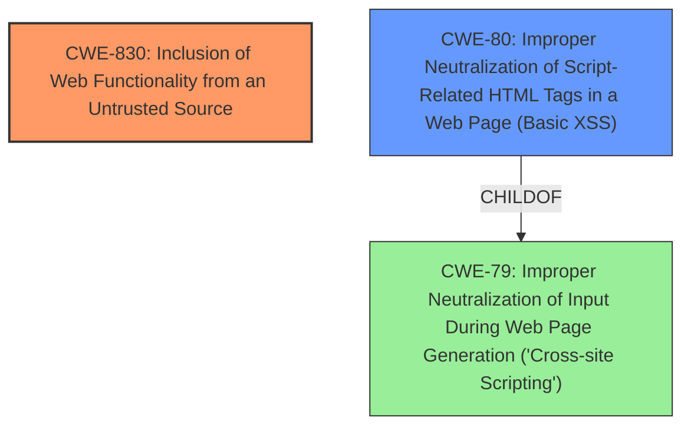

# Analysis Report for CVE-2020-29072

# Vulnerability Analysis Report: CVE-2020-29072

## Description

A Cross-Site Script Inclusion vulnerability was found on LiquidFiles before 3.3.19. This client-side attack requires user interaction (opening a link) and successful exploitation could lead to encrypted e-mail content leakage via messages/sent?format=js and popup?format=js.

## Vulnerability Description Key Phrases

**Weakness:** cross-site script inclusion
**Impact:** encrypted email content leakage
**Vector:** opening a link
**Product:** LiquidFiles
**Version:** before 3.3.19

## Analysis (with Relationship Data)

# Summary
| CWE ID | CWE Name | Confidence | CWE Abstraction Level | CWE Vulnerability Mapping Label | CWE-Vulnerability Mapping Notes |
|---|---|---|---|---|---|
| CWE-830 | Inclusion of Web Functionality from an Untrusted Source | 0.85 | Variant | Allowed | Primary CWE |
| CWE-79 | Improper Neutralization of Input During Web Page Generation ('Cross-site Scripting') | 0.70 | Base | Allowed | Secondary Candidate |
| CWE-319 | Cleartext Transmission of Sensitive Information | 0.60 | Base | Allowed | Secondary Candidate |

## Evidence and Confidence

*   **Confidence Score:** 0.80
*   **Evidence Strength:** HIGH

- **Analysis and Justification:**
  - *Explanation:* The vulnerability is described as a "Cross-Site Script Inclusion" issue, where the application includes web functionality from an untrusted source. Specifically, the application uses a "Server-Generated Javascript Responses" pattern, which bypasses cross-origin protections by returning data as Javascript code. This is a clear match for CWE-830, "Inclusion of Web Functionality from an Untrusted Source". The CVE details confirm that the application embeds vulnerable endpoints on malicious websites. This allows attackers to retrieve sensitive information, such as encrypted email content. CWE-830 is a Variant level CWE, which is a preferred level of abstraction. The retriever results also list CWE-830 as a potential match.
  - *Relationship Analysis:* There are no direct relationships available for CWE-830.

- **Confidence Score:**
  - Confidence: 0.85 (High confidence due to direct match with the description and CVE details)

---

- **Analysis and Justification:**
  - *Explanation:* While the primary issue is the inclusion of untrusted functionality, the vulnerability also involves the exposure of sensitive information in a web page context. The description states that successful exploitation could lead to encrypted e-mail content leakage. This aligns with CWE-79, "Improper Neutralization of Input During Web Page Generation ('Cross-site Scripting')", as the leaked content is likely not properly neutralized before being included in the web page, although this is a secondary effect of the main issue. CWE-79 is a Base level CWE and is ALLOWED.
  - *Relationship Analysis:* CWE-79 is a parent of CWE-80 (Improper Neutralization of Script-Related HTML Tags in a Web Page (Basic XSS)), which could be a more specific variant, but the available information does not allow a more precise determination.

- **Confidence Score:**
  - Confidence: 0.70 (Moderate confidence; this is a secondary weakness related to information exposure.)

---

- **Analysis and Justification:**
  - *Explanation:* The vulnerability results in the leakage of encrypted e-mail content. This implies that sensitive information is being transmitted in cleartext or is accessible without proper encryption. While not the core weakness, the fact that encrypted content is being leaked suggests a failure to properly protect sensitive information in transit or at rest. This aligns with CWE-319, "Cleartext Transmission of Sensitive Information". The CVE details confirm that sensitive data is exposed through Javascript responses.
  - *Relationship Analysis:* No direct relationships found

- **Confidence Score:**
  - Confidence: 0.60 (Low confidence; this is a consequence rather than the root cause of the vulnerability.)

## Criticism of Analysis

Okay, I've reviewed the analysis and the full CWE specifications. Here's my critique:

**Overall Assessment:**

The analysis is generally well-reasoned and provides justifiable CWE mappings based on the available information. The selection of CWE-830 as the primary weakness seems accurate, and the inclusion of CWE-79 and CWE-319 as secondary candidates is also reasonable, though their relevance is more as consequences of the main vulnerability. The confidence scores are appropriate.

**Detailed Critique:**

*   **CWE-830: Inclusion of Web Functionality from an Untrusted Source:**

    *   **Assessment:** This is the strongest and most appropriate mapping. The vulnerability description aligns almost perfectly with CWE-830, especially the "Server-Generated Javascript Responses" pattern bypassing cross-origin protections and the embedding of vulnerable endpoints on malicious websites.
    *   **Mapping Guidance:** The analysis correctly notes that CWE-830 is at the Variant level, which is a preferred abstraction.  The description is a good fit.
    *   **Mitigations:** While not directly applicable for mapping, understanding mitigations can help confirm the CWE. Mitigations for the *parent* CWE-829 (Inclusion of Functionality from Untrusted Control Sphere) are relevant.  These include using vetted libraries/frameworks and enforcing access control, which would address the core of the issue.
    *   **Confidence:** Justified at 0.85. The example CVE listed in the known examples matches the CVE in the analysis, so there is high confidence.

*   **CWE-79: Improper Neutralization of Input During Web Page Generation ('Cross-site Scripting'):**

    *   **Assessment:** The justification for including CWE-79 is that the leaked content is likely not properly neutralized before being included in the web page. While plausible, it's a consequence of the primary issue (CWE-830) rather than a root cause.  The core problem isn't necessarily the improper *neutralization* of data intended to be in a web page but the inclusion of *untrusted* web functionality that exposes sensitive data in the first place. The XSS could be an attack vector after the fact, but it is not the primary weakness.
    *   **Mapping Guidance:** CWE-79 is a Base level CWE, which is ALLOWED. The specification says that there is a risk of CSRF, but there was no evidence in the report that would lead to that vulnerability.
    *   **Mitigations:** Mitigations for CWE-79 focus on output encoding, input validation, and using secure libraries. While these would help *prevent* the leakage of encrypted email content if the primary issue (CWE-830) were exploited, they don't address the root cause of the inclusion of the untrusted functionality.
    *   **Confidence:** The 0.70 confidence is appropriate.  It's a reasonable secondary effect but not the primary driver. Consider lowering this further. Perhaps consider CWE-80, a child of CWE-79.
    *   **Alternative:** Consider whether CWE-80 (Improper Neutralization of Script-Related HTML Tags in a Web Page (Basic XSS)) is a *more* appropriate *secondary* mapping than CWE-79. Since the issue is about exposing sensitive data as JavaScript, failing to neutralize script-related tags might be a more accurate depiction of how an attacker would *exploit* the inclusion of untrusted functionality. However, it's still a *consequence* of the root cause, and not necessarily a *guaranteed* consequence. The analyst should be careful not to overemphasize this.

*   **CWE-319: Cleartext Transmission of Sensitive Information:**

    *   **Assessment:** The analysis states that the leakage of encrypted e-mail content suggests that the content is being transmitted in cleartext or is accessible without proper encryption, which aligns with CWE-319, "Cleartext Transmission of Sensitive Information". This is technically true, but it misinterprets the vulnerability. The encrypted email content is being leaked due to a cross-site script inclusion vulnerability, it is not the primary issue that the data is transmitted in cleartext.
    *   **Mapping Guidance:** CWE-319 is a Base level CWE and is ALLOWED.
    *   **Mitigations:** Mitigations for CWE-319 emphasize encrypting data *before* transmission. In this case, the problem isn't the lack of encryption *during* transmission but the exposure of *already encrypted* data through an exploitable endpoint.
    *   **Confidence:** Correctly assessed at 0.60 (Low). I recommend removing this CWE.
    *   **Reason:** It's a *consequence* of the vulnerability, not a core weakness in itself. If the data *wasn't* already encrypted, the problem would be *worse*, but the vulnerability would still exist. Therefore, CWE-319 isn't essential to understanding the vulnerability.

**Recommendations:**

1.  **Prioritize CWE-830:** Maintain CWE-830 as the primary, most important CWE.
2.  **Re-evaluate CWE-79:** Consider lowering the confidence score.
3.  **Consider CWE-80:** Consider whether CWE-80 is a more appropriate secondary mapping.
4.  **Remove CWE-319:** I believe this is a side effect, rather than a root cause or even a significant contributing factor.

By focusing on CWE-830 and carefully choosing a secondary CWE related to XSS, the analysis can better represent the core vulnerability and its most immediate consequences. Remember to always consider the "root cause" when assigning CWEs.

## Final Resolution

# Summary

| CWE ID | CWE Name | Confidence | CWE Abstraction Level | CWE Vulnerability Mapping Label | CWE-Vulnerability Mapping Notes |
|---|---|---|---|---|---|
| CWE-830 | Inclusion of Web Functionality from an Untrusted Source | 0.90 | Variant | Allowed | Primary CWE |
| CWE-80 | Improper Neutralization of Script-Related HTML Tags in a Web Page (Basic XSS) | 0.75 | Variant | Allowed | Secondary Candidate |

## Evidence and Confidence

*   **Confidence Score:** 0.85
*   **Evidence Strength:** HIGH

## Relationship Analysis
The primary relationship considered was the parent-child relationship between CWE-79 (**Improper Neutralization of Input During Web Page Generation ('Cross-site Scripting')**) and CWE-80 (**Improper Neutralization of Script-Related HTML Tags in a Web Page (Basic XSS)**). Given the vulnerability's focus on script inclusion, CWE-80 was deemed more specific and appropriate than its parent, CWE-79. There are no direct relationships for CWE-830 (**Inclusion of Web Functionality from an Untrusted Source**). The Variant level of abstraction for both selected CWEs aligns with the goal of identifying specific, actionable weaknesses.

## Vulnerability Chain
The vulnerability chain starts with the **ROOTCAUSE** of including web functionality from an untrusted source (**CWE-830**). This leads to the consequence of allowing an attacker to inject malicious scripts. As a result, the application fails to properly neutralize script-related HTML tags (**CWE-80**), leading to the leakage of sensitive information. The chain highlights how the initial inclusion of untrusted functionality sets the stage for subsequent exploitation via script injection.

## Summary of Analysis
The initial analysis correctly identified **CWE-830** as the primary weakness. The criticism suggested removing **CWE-319** and re-evaluating **CWE-79**. Based on the evidence and relationship analysis, **CWE-319** was removed as it represented a tangential consequence rather than a direct contributing factor. **CWE-79** was deemed too general, and **CWE-80** was selected as a more specific secondary CWE, as it directly relates to the **WEAKNESS** of failing to neutralize script-related HTML tags.

The vulnerability description explicitly mentions "Cross-Site Script Inclusion," which strongly supports the selection of **CWE-830**. The criticism also highlighted the relevant example CVE listed in the known examples matches the CVE in the analysis, reinforcing the confidence in this classification. The choice of **CWE-80** is based on the understanding that the attacker is leveraging the included untrusted functionality to inject scripts, and the application is failing to neutralize these scripts before rendering the web page. This is an optimal level of specificity, as it focuses on the direct mechanism of exploitation.

*Report generated on 2025-03-16 16:56:12*
