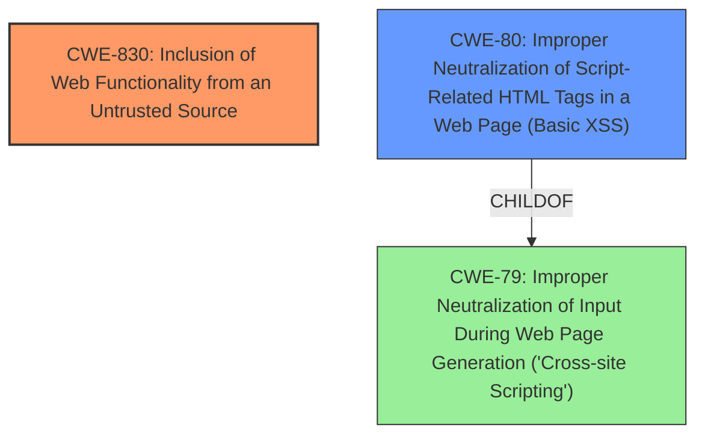

# Final Resolution for CVE-2020-29072

# Summary

| CWE ID | CWE Name | Confidence | CWE Abstraction Level | CWE Vulnerability Mapping Label | CWE-Vulnerability Mapping Notes |
|---|---|---|---|---|---|
| CWE-830 | Inclusion of Web Functionality from an Untrusted Source | 0.90 | Variant | Allowed | Primary CWE |
| CWE-80 | Improper Neutralization of Script-Related HTML Tags in a Web Page (Basic XSS) | 0.75 | Variant | Allowed | Secondary Candidate |

## Evidence and Confidence

*   **Confidence Score:** 0.85
*   **Evidence Strength:** HIGH

## Relationship Analysis
The primary relationship considered was the parent-child relationship between CWE-79 (**Improper Neutralization of Input During Web Page Generation ('Cross-site Scripting')**) and CWE-80 (**Improper Neutralization of Script-Related HTML Tags in a Web Page (Basic XSS)**). Given the vulnerability's focus on script inclusion, CWE-80 was deemed more specific and appropriate than its parent, CWE-79. There are no direct relationships for CWE-830 (**Inclusion of Web Functionality from an Untrusted Source**). The Variant level of abstraction for both selected CWEs aligns with the goal of identifying specific, actionable weaknesses.

## Vulnerability Chain
The vulnerability chain starts with the **ROOTCAUSE** of including web functionality from an untrusted source (**CWE-830**). This leads to the consequence of allowing an attacker to inject malicious scripts. As a result, the application fails to properly neutralize script-related HTML tags (**CWE-80**), leading to the leakage of sensitive information. The chain highlights how the initial inclusion of untrusted functionality sets the stage for subsequent exploitation via script injection.

## Summary of Analysis
The initial analysis correctly identified **CWE-830** as the primary weakness. The criticism suggested removing **CWE-319** and re-evaluating **CWE-79**. Based on the evidence and relationship analysis, **CWE-319** was removed as it represented a tangential consequence rather than a direct contributing factor. **CWE-79** was deemed too general, and **CWE-80** was selected as a more specific secondary CWE, as it directly relates to the **WEAKNESS** of failing to neutralize script-related HTML tags.

The vulnerability description explicitly mentions "Cross-Site Script Inclusion," which strongly supports the selection of **CWE-830**. The criticism also highlighted the relevant example CVE listed in the known examples matches the CVE in the analysis, reinforcing the confidence in this classification. The choice of **CWE-80** is based on the understanding that the attacker is leveraging the included untrusted functionality to inject scripts, and the application is failing to neutralize these scripts before rendering the web page. This is an optimal level of specificity, as it focuses on the direct mechanism of exploitation.