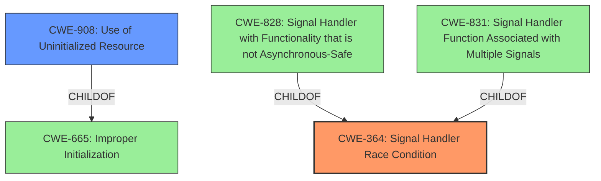

# Final Resolution for CVE-2020-35508

# Summary
| CWE ID | CWE Name | Confidence | CWE Abstraction Level | CWE Vulnerability Mapping Label | CWE-Vulnerability Mapping Notes |
|---|---|---|---|---|---|
| CWE-364 | Signal Handler Race Condition | 0.9 | Base | Allowed | Primary CWE |
| CWE-908 | Use of Uninitialized Resource | 0.7 | Base | Allowed | Secondary Candidate |

## Evidence and Confidence

*   **Confidence Score:** 0.85
*   **Evidence Strength:** HIGH

## Relationship Analysis
The primary relationship that impacts the decision is the parent-child relationship. While CWE-364 is a good fit, exploring its children like CWE-828 and CWE-831 is necessary. However, the provided information does not indicate that the signal handler is using non-reentrant functions (CWE-828) or the same handler used for multiple signals (CWE-831). Therefore, CWE-364 remains the more appropriate choice. For the secondary candidate, CWE-909, the analysis considered whether there were more specific base-level children but ultimately found CWE-908 to be more appropriate since it deals with the use of uninitialized resources.

## Vulnerability Chain
The vulnerability chain starts with a **missing initialization of the process ID** (CWE-908). This can lead to incorrect checks on process privileges. Simultaneously, a **race condition** (CWE-364) in the signal handler allows an attacker to manipulate the process ID during a check, bypassing security measures and allowing signals to be sent to privileged processes. The final impact is the ability to control privileged processes, leading to potential system compromise.

## Summary of Analysis
The initial analysis correctly identifies CWE-364 as the primary issue and CWE-909 as a secondary candidate. The criticism highlights the need for increased specificity and exploration of child CWEs. The final assessment incorporates this feedback by retaining CWE-364 as the primary **weakness** due to the **race condition** in signal handling. CWE-909 is replaced with CWE-908 as the more appropriate secondary **weakness**, as the issue is not just a missing initialization, but the **use of an uninitialized resource** (the process ID).

The evidence supporting this decision comes directly from the vulnerability description: "A flaw possibility of **race condition** and **incorrect initialization of the process id** was found in the Linux kernel child/parent process identification handling while filtering signal handlers."

The graph relationships influenced the selection by emphasizing the need to explore child CWEs of CWE-364 and CWE-909 for greater specificity. While CWE-828 and CWE-831 were considered, they did not fit the description as well as CWE-364. For CWE-909, CWE-908 offered a better fit.

The selected CWEs are at the optimal level of specificity because they directly address the root causes described in the vulnerability. CWE-364 captures the **race condition** in signal handling, while CWE-908 captures the **use of the uninitialized process ID**, leading to the ability to bypass checks.