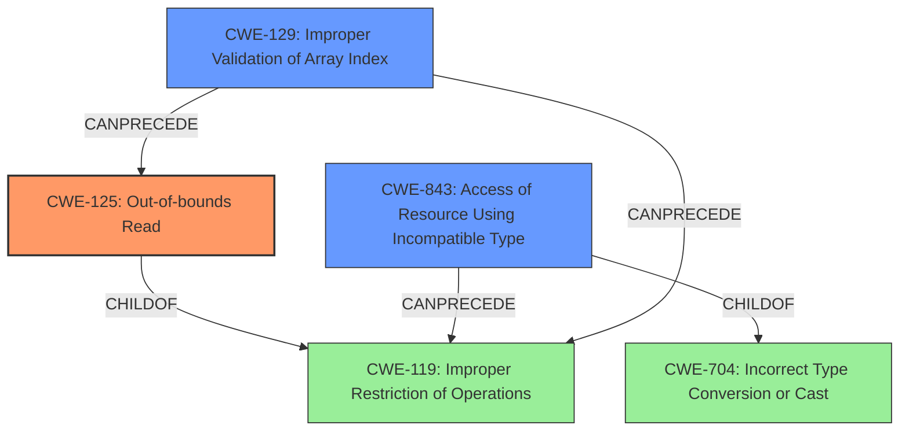

# Final Resolution for CVE-2020-35633

# Summary
| CWE ID | CWE Name | Confidence | CWE Abstraction Level | CWE Vulnerability Mapping Label | CWE-Vulnerability Mapping Notes |
|---|---|---|---|---|---|
| CWE-125 | Out-of-bounds Read | 0.95 | Base | Allowed | **Primary CWE**. Follows mitigation strategies of language selection and input validation. Can be caused by improper validation of array index, CWE-129 |
| CWE-843 | Access of Resource Using Incompatible Type ('Type Confusion') | 0.80 | Base | Allowed | Secondary Candidate |
| CWE-129 | Improper Validation of Array Index | 0.75 | Variant | Allowed | Secondary Candidate. Mitigation strategies include input validation frameworks and server-side checks. |

## Evidence and Confidence

*   **Confidence Score:** 0.95
*   **Evidence Strength:** HIGH

## Relationship Analysis
The primary weakness is **CWE-125 (Out-of-bounds Read)**, which is a base class and a child of **CWE-119 (Improper Restriction of Operations within the Bounds of a Memory Buffer)**. The secondary weakness, **CWE-843 (Access of Resource Using Incompatible Type ('Type Confusion'))**, is a Base level CWE and is ChildOf -> **CWE-704 (Incorrect Type Conversion or Cast)** and CanPrecede -> **CWE-119 (Improper Restriction of Operations within the Bounds of a Memory Buffer)**. **CWE-129 (Improper Validation of Array Index)** is a variant and CanPrecede -> **CWE-119 (Improper Restriction of Operations within the Bounds of a Memory Buffer)**. **CWE-129 (Improper Validation of Array Index)** can lead to **CWE-125 (Out-of-bounds Read)**.

## Vulnerability Chain
The vulnerability chain starts with **CWE-129 (Improper Validation of Array Index)**. The lack of proper validation leads to **CWE-125 (Out-of-bounds Read)**, which in turn leads to **CWE-843 (Access of Resource Using Incompatible Type ('Type Confusion'))**, potentially leading to code execution.

## Summary of Analysis
The initial analysis and criticism were both helpful in identifying the primary and secondary **WEAKNESSES**. The vulnerability description explicitly mentions an "**out-of-bounds read**" vulnerability, making **CWE-125 (Out-of-bounds Read)** the most appropriate primary **ROOTCAUSE**. The CVE reference summary reinforces this by stating, "The lack of bounds checking allows an attacker to supply a crafted file with arbitrary indices. This can lead to **out-of-bounds reads**, memory corruption, **type confusion** and ultimately arbitrary code execution." The mention of "**type confusion**" supports the inclusion of **CWE-843 (Access of Resource Using Incompatible Type ('Type Confusion'))** as a secondary **WEAKNESS**. Additionally, the root cause indicates a lack of proper bounds checking during index reading, aligning with **CWE-129 (Improper Validation of Array Index)**.

The graph relationships influenced the final selection by highlighting the connections between the **CWEs**. **CWE-125 (Out-of-bounds Read)** is a base class, which is the preferred level of abstraction. It is also a child of **CWE-119 (Improper Restriction of Operations within the Bounds of a Memory Buffer)**. **CWE-843 (Access of Resource Using Incompatible Type ('Type Confusion'))** is also a base class. **CWE-129 (Improper Validation of Array Index)** is a variant and can lead to **CWE-125 (Out-of-bounds Read)**.

The selected **CWEs** are at the optimal level of specificity because they accurately reflect the **ROOTCAUSE** and contributing factors to the vulnerability, based on the available evidence.