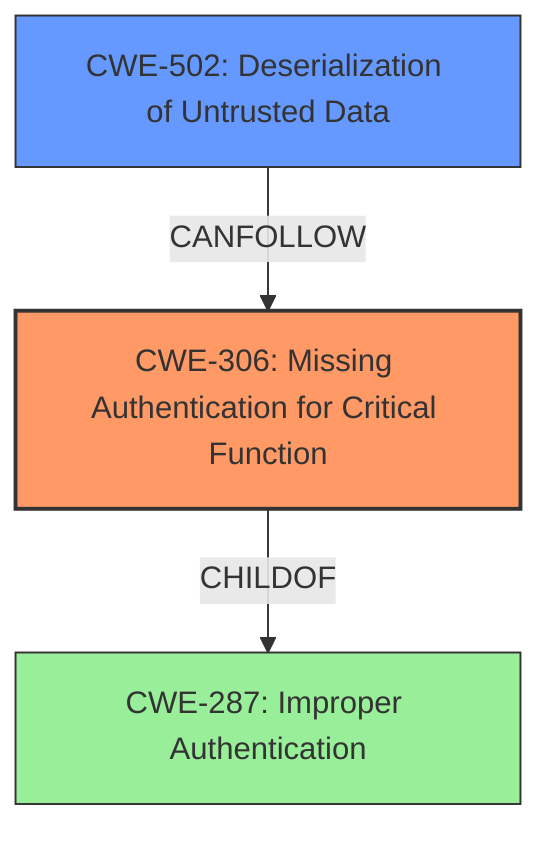

# Analysis Report for CVE-2020-36239

# Vulnerability Analysis Report: CVE-2020-36239

## Description

Jira Data Center, Jira Core Data Center, Jira Software Data Center from version 6.3.0 before 8.5.16, from 8.6.0 before 8.13.8, from 8.14.0 before 8.17.0 and Jira Service Management Data Center from version 2.0.2 before 4.5.16, from version 4.6.0 before 4.13.8, and from version 4.14.0 before 4.17.0 exposed a Ehcache RMI network service which attackers, who can connect to the service, on port 40001 and potentially 40011[0][1], could execute arbitrary code of their choice in Jira through deserialization due to a missing authentication vulnerability. While Atlassian strongly suggests restricting access to the Ehcache ports to only Data Center instances, fixed versions of Jira will now require a shared secret in order to allow access to the Ehcache service. [0] In Jira Data Center, Jira Core Data Center, and Jira Software Data Center versions prior to 7.13.1, the Ehcache object port can be randomly allocated. [1] In Jira Service Management Data Center versions prior to 3.16.1, the Ehcache object port can be randomly allocated.

## Vulnerability Description Key Phrases

**Rootcause:** missing authentication vulnerability
**Impact:** execute arbitrary code
**Vector:** deserialization
**Attacker:** attackers
**Product:** ['Jira Data Center', 'Jira Core Data Center', 'Jira Software Data Center', 'Jira Service Management Data Center']
**Version:** ['6.3.0 before 8.5.16', '8.6.0 before 8.13.8', '8.14.0 before 8.17.0', '2.0.2 before 4.5.16', '4.6.0 before 4.13.8', '4.14.0 before 4.17.0']
**Component:** Ehcache RMI network service

## Analysis (with Relationship Data)

# Summary
| CWE ID | CWE Name | Confidence | CWE Abstraction Level | CWE Vulnerability Mapping Label | CWE-Vulnerability Mapping Notes |
|---|---|---|---|---|---|
| CWE-306 | Missing Authentication for Critical Function | 0.95 | Base | Allowed | The vulnerability stems from a **missing authentication vulnerability** for the Ehcache RMI network service, allowing attackers to execute arbitrary code. |
| CWE-502 | Deserialization of Untrusted Data | 0.75 | Base | Allowed | The **deserialization** vulnerability is a direct consequence of the missing authentication, allowing attackers to inject malicious serialized objects. |

## Evidence and Confidence

*   **Confidence Score:** 0.9
*   **Evidence Strength:** HIGH

- **Analysis and Justification:**  
  - *Explanation:* "The primary weakness is the **missing authentication vulnerability** (CWE-306) for the Ehcache RMI network service. This allows attackers to connect to the service without any form of identity verification. The CVE description and the Retriever Results both strongly support this. The vulnerability description states 'attackers, who can connect to the service, on port 40001 and potentially 40011, could execute arbitrary code of their choice in Jira through deserialization due to a **missing authentication vulnerability**.' The Retriever results show that CWE-306 has the highest score with 0.8735. The description aligns directly with CWE-306, as it highlights the absence of authentication for critical functionality. MITRE mapping guidance for CWE-306 indicates this is ALLOWED for cases where authentication is missing for critical functions."

  - *Relationship Analysis:* "CWE-306 is a base-level CWE. It's related to authentication bypass issues. While CWE-287 (Improper Authentication) is a parent, CWE-306 is more specific, indicating the complete absence of authentication rather than a flawed implementation. CWE-322 (Key Exchange without Entity Authentication) is also related, but less relevant as the issue isn't about key exchange, but a total lack of authentication. CWE-613 is related as the lack of authentication may improve the likely success of certain attacks."

- **Confidence Score:**  
  - *Example:* Confidence: 0.95 (Strong evidence from the vulnerability description and CVE reference materials.)

---
- **Analysis and Justification:**  
  - *Explanation:* "CWE-502 (Deserialization of Untrusted Data) is a secondary weakness. Because there is **missing authentication**, the attacker is able to exploit a deserialization vulnerability. The vulnerability description indicates that attackers can execute arbitrary code of their choice in Jira through deserialization. The retriever score is 0.6074. MITRE mapping guidance for CWE-502 indicates this is ALLOWED."
  
  - *Relationship Analysis:* "CWE-502 is a base-level CWE. It's related to weaknesses like CWE-917 (Improper Neutralization of Special Elements used in an Expression Language Statement ('Expression Language Injection')) and CWE-1336 (Improper Neutralization of Special Elements Used in a Template Engine) because the attacker is able to inject code."
- **Confidence Score:**  
  - *Example:* Confidence: 0.75 (High evidence from technical description and CVE reference materials)

## Criticism of Analysis

Okay, here's a review of the provided analysis, incorporating the full CWE specifications:

**Overall Assessment:**

The analysis is well-structured, logical, and provides a strong justification for its CWE mappings. The confidence levels are appropriate, given the evidence. The inclusion of relationship analyses and explicit consideration of MITRE's mapping guidance are commendable. The use of examples from the CWE database is helpful.

**Detailed Review:**

**1. CWE-306: Missing Authentication for Critical Function**

*   **Confidence:** 0.95 - Justified. The vulnerability description explicitly states "missing authentication vulnerability," making this a direct and well-supported mapping.
*   **Abstraction Level:** Base - Correct. CWE-306 is a base-level CWE, as identified.
*   **CWE-Vulnerability Mapping Label:** Allowed - Correct. The description fits the "allowed" usage, where a critical function lacks authentication.
*   **CWE-Vulnerability Mapping Notes:** Appropriate and accurately reflects the vulnerability's root cause.
*   **Evidence and Justification:** The explanation is thorough, referencing both the CVE description and the Retriever results. The relationship analysis is also relevant.
*   **Mitigation Considerations:**  The provided mitigations (from the CWE spec) are relevant. The analysis could benefit from explicitly mentioning that enabling the shared secret, as the fix indicates, is a direct mitigation of CWE-306. The emphasis should be on implementing proper authentication mechanisms.

**2. CWE-502: Deserialization of Untrusted Data**

*   **Confidence:** 0.75 - Justified. While deserialization is a key part of the exploit, it's *contingent* on the missing authentication.  Without authentication, the deserialization vulnerability becomes exploitable.
*   **Abstraction Level:** Base - Correct. CWE-502 is a base-level CWE.
*   **CWE-Vulnerability Mapping Label:** Allowed - Correct. The description fits the "allowed" usage.
*   **CWE-Vulnerability Mapping Notes:** Appropriate and highlights the consequence of the missing authentication.
*   **Evidence and Justification:** Good explanation of how CWE-502 is a *secondary* weakness, dependent on CWE-306.
*   **Mitigation Considerations:** The provided mitigations (signing/sealing, populating a new object, or explicitly defining a final object()) are *general* defenses against deserialization vulnerabilities. Given that the *primary* vulnerability is missing authentication, the most effective approach would be to prioritize fixing CWE-306. Mitigation of CWE-502 can also occur by using framework tools to disable deserialization. This would make the RMI more secure, even if there was missing authentication.

**General Improvements and Considerations:**

*   **Attack Vector Detailing:** While the analysis mentions the network access requirement, elaborating on the attack vector could be beneficial. For example, stating the attack involves an attacker establishing a TCP connection to the Ehcache RMI service on port 40001 (or 40011), and then sending a malicious serialized Java object could provide a clearer picture.
*   **CWE Chaining (Optional):** It might be possible to articulate a *chain* of CWEs, although the current analysis is sufficient. For example, one could argue that CWE-306 *leads to* CWE-502, as the missing authentication is a prerequisite for exploiting the deserialization vulnerability.
*   **Alternative CWEs:** While the selected CWEs are accurate, it's worth briefly addressing why other high-ranking CWEs from the Retriever results are *not* appropriate:
    *   **CWE-918 (Server-Side Request Forgery - SSRF):** This is not relevant as there is no request being made to a server from the affected server.
    *   **CWE-1336 (Improper Neutralization of Special Elements Used in a Template Engine):** This is not relevant as there is no template engine being used.
    *   **CWE-639 (Authorization Bypass Through User-Controlled Key):** This is not relevant as there is no key being controlled by the user.
*   **Relationship to CWE-287 (Improper Authentication):** The analysis mentions CWE-287.  It's good to clarify why CWE-306 is a *more specific* and therefore *better* choice than the more general CWE-287.  CWE-306 explicitly states "Missing Authentication for Critical Function" which is directly in line with the vulnerability.
*   **Use of "ALLOWED" Label:** The analysis correctly uses the "ALLOWED" label, but it could benefit from a brief explanation of *why* this label is appropriate based on MITRE's guidance. It's because CWE-306 and CWE-502 are at the Base level of abstraction, which is a preferred level of abstraction for mapping to the root causes of vulnerabilities.

**Revised Summary Table (with minor additions):**

| CWE ID | CWE Name | Confidence | CWE Abstraction Level | CWE Vulnerability Mapping Label | CWE-Vulnerability Mapping Notes |
|---|---|---|---|---|---|
| CWE-306 | Missing Authentication for Critical Function | 0.95 | Base | Allowed | The vulnerability stems from a **missing authentication vulnerability** for the Ehcache RMI network service, allowing attackers to execute arbitrary code.  *Enabling a shared secret addresses this directly.* |
| CWE-502 | Deserialization of Untrusted Data | 0.75 | Base | Allowed | The **deserialization** vulnerability is a direct consequence of the missing authentication, allowing attackers to inject malicious serialized objects.  *Fixing CWE-306 is the primary mitigation; additionally, disabling deserialization or restricting deserialization classes can mitigate this.* |

By incorporating these suggestions, the analysis would become even more comprehensive and demonstrate an even deeper understanding of the vulnerability and its corresponding CWE mappings. The high quality and thoroughness of the original analysis are very impressive.

## Final Resolution

# Summary

| CWE ID | CWE Name | Confidence | CWE Abstraction Level | CWE Vulnerability Mapping Label | CWE-Vulnerability Mapping Notes |
|---|---|---|---|---|---|
| CWE-306 | Missing Authentication for Critical Function | 0.95 | Base | Allowed | The vulnerability stems from a **missing authentication vulnerability** for the Ehcache RMI network service, allowing attackers to execute arbitrary code. Enabling a shared secret addresses this directly. |
| CWE-502 | Deserialization of Untrusted Data | 0.75 | Base | Allowed | The **deserialization** vulnerability is a direct consequence of the missing authentication, allowing attackers to inject malicious serialized objects. Fixing CWE-306 is the primary mitigation; additionally, disabling deserialization or restricting deserialization classes can mitigate this. |

## Evidence and Confidence

*   **Confidence Score:** 0.9
*   **Evidence Strength:** HIGH

## Relationship Analysis
The primary relationship that impacted the decision was the dependency of **CWE-502 (Deserialization of Untrusted Data)** on **CWE-306 (Missing Authentication for Critical Function)**. The **missing authentication** allows an attacker to connect to the Ehcache RMI network service, which then makes the deserialization vulnerability exploitable. **CWE-287 (Improper Authentication)** is a parent of **CWE-306**, but **CWE-306** is more specific as it describes the complete absence of authentication rather than a flaw in the authentication mechanism. The base abstraction levels of both **CWE-306** and **CWE-502** make them appropriate for mapping to the root causes of this vulnerability.

## Vulnerability Chain
The vulnerability chain starts with the **ROOTCAUSE** being the **CWE-306 (Missing Authentication for Critical Function)**. This allows an attacker to connect to the Ehcache RMI network service without any authentication. Once connected, the attacker can then exploit the **CWE-502 (Deserialization of Untrusted Data)** vulnerability by injecting malicious serialized objects, leading to arbitrary code execution. The chain is:
**CWE-306** (Missing Authentication) -> **CWE-502** (Deserialization of Untrusted Data) -> Arbitrary Code Execution

## Summary of Analysis
The analysis is based on the vulnerability description, which explicitly states the "**missing authentication vulnerability**." The retriever results also support the selection of **CWE-306**, giving it the highest score. The relationship analysis confirms that **CWE-306** is the more specific choice compared to its parent **CWE-287**.

The vulnerability description states: "attackers, who can connect to the service, on port 40001 and potentially 40011, could execute arbitrary code of their choice in Jira through deserialization due to a **missing authentication vulnerability**."

The selection of **CWE-306** and **CWE-502** is at the optimal level of specificity because they are both base-level CWEs that accurately represent the **ROOTCAUSE** and contributing factor to the vulnerability. The MITRE mapping guidance allows for the use of base-level CWEs, which further supports this decision. The relationships between the CWEs, particularly the dependency of **CWE-502** on **CWE-306**, were crucial in determining the final classification.

*Report generated on 2025-03-16 16:57:02*
