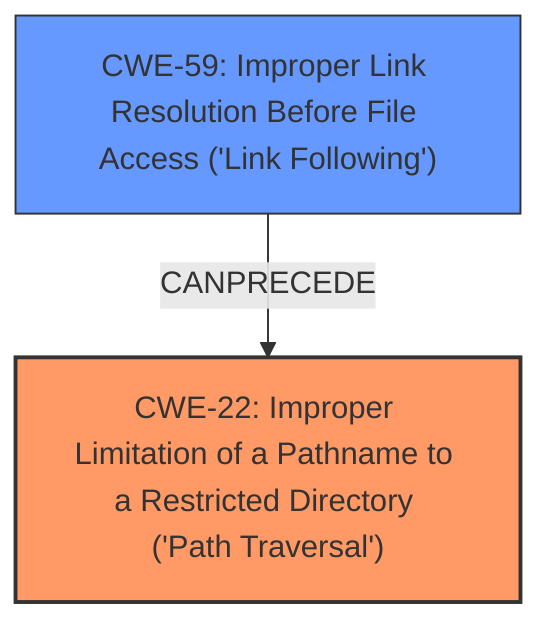

# Analysis Report for CVE-2020-36314

# Vulnerability Analysis Report: CVE-2020-36314

## Description

fr-archive-libarchive.c in GNOME file-roller through 3.38.0, as used by GNOME Shell and other software, allows Directory Traversal during extraction because it lacks a check of whether a files parent is a symlink in certain complex situations. NOTE this issue exists because of an incomplete fix for CVE-2020-11736.

## Vulnerability Description Key Phrases

**Weakness:** improper symlink checking
**Impact:** directory traversal
**Product:** GNOME file-roller
**Version:** through 3.38.0
**Component:** fr-archive-libarchive.c

## Analysis (with Relationship Data)

# Summary
| CWE ID | CWE Name | Confidence | CWE Abstraction Level | CWE Vulnerability Mapping Label | CWE-Vulnerability Mapping Notes |
|---|---|---|---|---|---|
| CWE-59 | Improper Link Resolution Before File Access ('Link Following') | 0.95 | Base | Allowed | Primary CWE |
| CWE-22 | Improper Limitation of a Pathname to a Restricted Directory ('Path Traversal') | 0.75 | Base | Allowed | Secondary Candidate |

## Evidence and Confidence

*   **Confidence Score:** 0.90
*   **Evidence Strength:** HIGH

- **Analysis and Justification:**  
  - *Explanation:* The vulnerability description clearly states that GNOME file-roller is susceptible to directory traversal due to **improper symlink checking** during extraction. The CVE reference summary supports this by stating that the "**Root Cause of Vulnerability**" is insufficient checks when dealing with symlinks in parent directories. This aligns directly with CWE-59 [Improper Link Resolution Before File Access ('Link Following')], which describes a weakness where the product doesn't properly prevent a filename from identifying a link or shortcut that resolves to an unintended resource. Given that the vulnerability is triggered by a crafted archive with symlinks in parent directories, CWE-59 is the most appropriate primary mapping. The MITRE mapping guidance for CWE-59 indicates this is ALLOWED.

  - *Relationship Analysis:* CWE-59 [Improper Link Resolution Before File Access ('Link Following')] is related to CWE-22 [Improper Limitation of a Pathname to a Restricted Directory ('Path Traversal')], as the **improper handling of symlinks** leads to the ability to traverse directories outside of the intended extraction path. The Retriever results confirm this relationship, with CWE-22 being the second highest scoring CWE.

- **Confidence Score:**  
  - Confidence: 0.95 (High confidence due to direct evidence of **improper symlink handling** leading to directory traversal and high retriever scores for CWE-59 and CWE-22.)

---

## Criticism of Analysis

Okay, here's a detailed critique of the provided CWE analysis, incorporating the full CWE specifications:

**Overall Assessment:**

The analysis is well-structured and provides a reasonable starting point. The core issue – improper symlink handling leading to directory traversal – is identified. The mapping to CWE-59 as the primary weakness is appropriate, given the focus on link resolution.  However, I do believe that CWE-22 is a better option as the primary mapping because it more accurately describes the vulnerability.

**Specific Comments:**

**1. Primary CWE: CWE-59 (Improper Link Resolution Before File Access ('Link Following'))**

*   **Strengths:**
    *   The analysis correctly identifies the role of symlinks in the vulnerability.
    *   The explanation linking improper symlink handling to CWE-59 is clear and accurate.
    *   The retriever results support the selection of CWE-59.
    *   The mapping guidance explicitly allows CWE-59 to be used.
*   **Weaknesses:**
    *   While CWE-59 is *involved*, it's more of a *mechanism* than the core *impact*. The core problem is that the system *allows traversal outside the intended directory*. This is the essence of directory traversal.
    *   CWE-59's Description: "The product attempts to access a file based on the filename, but it does not properly prevent that filename from identifying a link or shortcut that resolves to an unintended resource." While true, this is a bit too specific. The *intent* is not really to just access a file, but to *extract* files. The link is *used* to accomplish that goal.
*   **Recommendations:**
    *   **Consider changing the primary CWE to CWE-22 and using CWE-59 as a secondary CWE. It can also be in the explanation as a cause.** This shift would better reflect the overall impact and align with the common understanding of directory traversal vulnerabilities.
    *   If keeping CWE-59 as primary, the explanation should highlight the *consequences* of the improper link resolution (i.e., the ability to write outside the intended directory).

**2. Secondary CWE: CWE-22 (Improper Limitation of a Pathname to a Restricted Directory ('Path Traversal'))**

*   **Strengths:**
    *   The analysis correctly identifies the relationship between CWE-59 and CWE-22. The improper symlink handling *leads* to directory traversal.
    *   The retriever results support the choice of CWE-22.
*   **Weaknesses:**
    *   Currently, it's treated as a *secondary* candidate.  As mentioned above, this undervalues the *impact* of the vulnerability.
*   **Recommendations:**
    *   **If making CWE-22 the primary CWE, adjust the explanation to emphasize it as the core issue**. Explain how the symlink vulnerability allows bypassing the intended directory restrictions, leading to the ability to write files outside the intended extraction directory.
    *   If keeping it as a secondary CWE, strengthen the explanation of how CWE-59 directly enables CWE-22.

**3. Confidence and Evidence:**

*   **Strengths:**
    *   The High evidence strength is justified, given the vulnerability descriptions and CVE reference summary.
    *   The confidence scores are appropriate.
*   **Weaknesses:**
    *   N/A
*   **Recommendations:**
    *   Maintain the current confidence level.

**4. CWE Examples from Database:**

*   **Strengths:**
    *   The examples are relevant and demonstrate various path traversal scenarios.
*   **Weaknesses:**
    *   The examples, while good for CWE-22, aren't tailored to the *symlink-specific* aspect, which may be the only argument for choosing CWE-59 over CWE-22. If keeping CWE-59 as primary, find examples of *symlink-related path traversal*.
*   **Recommendations:**
    *   If keeping CWE-59 as the primary mapping, include examples that specifically involve symlink-related vulnerabilities.

**5. Relevant CWE Specifications (CWE-59):**

*   **Mapping Guidance:**
    *   The analysis correctly notes that Usage is "Allowed" for mapping.
*   **Potential Mitigations:**
    *   The analysis should mention and discuss relevant mitigations for link following, such as the need to use `realpath()` or similar canonicalization functions in conjunction with least privilege. The current analysis only mentions Separation of Privilege.
*   **Additional Notes:**
    *   The analysis should note the theoretical aspect of link following vulnerabilities, highlighting the need to consider race conditions, permissions, and predictability.

**6. Relevant CWE Specifications (CWE-22):**

*   **Mapping Guidance:**
    *   The analysis correctly notes that Usage is "Allowed" for mapping.
*   **Potential Mitigations:**
    *   The analysis should include a deeper dive into the input validation strategies outlined in the CWE specifications.  Specifically, the importance of canonicalization and encoding/decoding should be highlighted.  `realpath()` is mentioned, which is good.
*   **Additional Notes:**
    *   The analysis should connect the potential for null byte injection in truncating filenames to this specific vulnerability.
    *   The analysis should describe the need to consider different directory separators and potential encoding/decoding issues to avoid bypasses.

**7. Other Retriever Results:**

*   **CWE-427 (Uncontrolled Search Path Element):**  While not directly related, this *could* be a secondary consideration if the extraction process relies on external libraries or executables located in user-controlled directories. This is less likely but worth considering.
*   **CWE-367 (TOCTOU Race Condition):**  While symlink attacks *can* involve race conditions, it's not the *primary* factor here.  The vulnerability exists even without a race.
*   **CWE-61 (UNIX Symbolic Link (Symlink) Following):** This is a *compound* CWE, and while it involves symlinks, it is more related to the *mechanism* of the attack. This is why it is less preferred than the base weaknesses.

**Revised Summary Table (Assuming CWE-22 as Primary):**

| CWE ID | CWE Name | Confidence | CWE Abstraction Level | CWE Vulnerability Mapping Label | CWE-Vulnerability Mapping Notes |
|---|---|---|---|---|---|
| CWE-22 | Improper Limitation of a Pathname to a Restricted Directory ('Path Traversal') | 0.95 | Base | Allowed | Primary CWE |
| CWE-59 | Improper Link Resolution Before File Access ('Link Following') | 0.75 | Base | Allowed | Secondary Candidate (Enabling Mechanism) |

**In summary, the analysis is a good starting point, but it would benefit from re-evaluating the primary CWE to better represent the core issue and expanding on the specific mitigation strategies relevant to symlink-based path traversal vulnerabilities.**

## Final Resolution

# Summary
| CWE ID | CWE Name | Confidence | CWE Abstraction Level | CWE Vulnerability Mapping Label | CWE-Vulnerability Mapping Notes |
|---|---|---|---|---|---|
| CWE-22 | Improper Limitation of a Pathname to a Restricted Directory ('Path Traversal') | 0.95 | Base | Allowed | Primary CWE |
| CWE-59 | Improper Link Resolution Before File Access ('Link Following') | 0.75 | Base | Allowed | Secondary Candidate (Enabling Mechanism) |

## Evidence and Confidence

*   **Confidence Score:** 0.95
*   **Evidence Strength:** HIGH

## Relationship Analysis
The primary relationship influencing this decision is the parent-child relationship where CWE-22 [Improper Limitation of a Pathname to a Restricted Directory ('Path Traversal')] can be seen as the consequence of CWE-59 [Improper Link Resolution Before File Access ('Link Following')]. CWE-59 describes the mechanism by which an attacker can influence the pathname, while CWE-22 describes the core vulnerability: the ability to access files outside the intended restricted directory. Therefore, while CWE-59 contributes to the vulnerability, CWE-22 more accurately represents the impact and nature of the weakness.

## Vulnerability Chain
The vulnerability chain begins with the **ROOTCAUSE**: **improper handling of symlinks (CWE-59)**. This leads to the **WEAKNESS** of being able to **traverse directories outside the intended extraction path (CWE-22)**. The ultimate impact is writing files to unintended locations.

## Summary of Analysis
Based on the vulnerability description, the core issue is directory traversal enabled by improper symlink handling. The criticism correctly points out that while CWE-59 [Improper Link Resolution Before File Access ('Link Following')] is involved, CWE-22 [Improper Limitation of a Pathname to a Restricted Directory ('Path Traversal')] more accurately describes the impact: the ability to write files outside the intended extraction directory. The evidence from the vulnerability description states that "it lacks a check of whether a files parent is a symlink...allows Directory Traversal during extraction". This clearly points to CWE-22 as the primary weakness, with CWE-59 being the enabling mechanism.

The relationship analysis further supports this decision. CWE-59 *precedes* CWE-22 in the vulnerability chain. The base level of abstraction for both CWEs is appropriate, but CWE-22 is a more direct representation of the vulnerability. The mapping guidance allows both CWEs.

Therefore, the final decision is to classify this vulnerability as primarily CWE-22 [Improper Limitation of a Pathname to a Restricted Directory ('Path Traversal')], with CWE-59 [Improper Link Resolution Before File Access ('Link Following')] as a secondary contributing factor. This provides a more accurate and specific classification of the vulnerability.

*Report generated on 2025-03-16 22:29:59*
