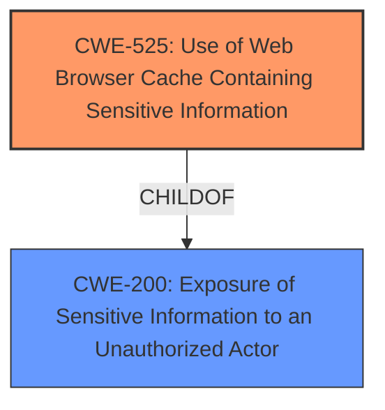

# Analysis Report for CVE-2020-4951

# Vulnerability Analysis Report: CVE-2020-4951

## Description

IBM Cognos Analytics 11.1.7 and 11.2.0 contains locally cached browser data, that could allow a local attacker to obtain sensitive information.

## Vulnerability Description Key Phrases

**Impact:** obtain sensitive information
**Attacker:** local attacker
**Product:** IBM Cognos Analytics
**Version:** ['11.1.7', '11.2.0']
**Component:** locally cached browser data

## Analysis (with Relationship Data)

# Summary
| CWE ID | CWE Name | Confidence | CWE Abstraction Level | CWE Vulnerability Mapping Label | CWE-Vulnerability Mapping Notes |
|---|---|---|---|---|---|
| CWE-525 | Use of Web Browser Cache Containing Sensitive Information | 0.9 | Variant | Allowed | Primary CWE |
| CWE-200 | Exposure of Sensitive Information to an Unauthorized Actor | 0.6 | Class | Discouraged | Secondary Candidate |

## Evidence and Confidence

*   **Confidence Score:** 0.75
*   **Evidence Strength:** MEDIUM

- **Analysis and Justification:**  
  - *Explanation:* The vulnerability description explicitly states that "IBM Cognos Analytics 11.1.7 and 11.2.0 contains locally cached browser data, that could allow a local attacker to **obtain sensitive information**." This aligns directly with the definition of CWE-525 (Use of Web Browser Cache Containing Sensitive Information), which is a Variant level CWE. The retriever results also list CWE-525 as the top candidate with a combined score of 0.4858, and its usage is ALLOWED. The attack vector `AV:L` (Local Attack Vector) from the CVSS vector further supports this mapping.

  - *Relationship Analysis:* While CWE-200 (Exposure of Sensitive Information to an Unauthorized Actor) is a related Class-level CWE, CWE-525 is more specific as it identifies the browser cache as the mechanism for exposure. CWE-525 does not have explicit parent-child relationships listed in the provided data. The primary weakness is the caching of sensitive information in the browser.

- **Confidence Score:**
  - Confidence: 0.9 (High confidence due to direct match with vulnerability description and retriever results)

---
- **Analysis and Justification:**  
  - *Explanation:* CWE-200 (Exposure of Sensitive Information to an Unauthorized Actor) is a Class-level CWE, which could be applicable because the **impact** of the vulnerability is that a local attacker could **obtain sensitive information.** However, CWE-200 is discouraged for use according to MITRE's mapping guidance: "CWE-200 is commonly misused to represent the loss of confidentiality in a vulnerability, but confidentiality loss is a technical impact - not a root cause error. As of CWE 4.9, over 400 CWE entries can lead to a loss of confidentiality. Other options are often available." Since the more specific Variant CWE-525 directly describes the caching issue, CWE-200 is a secondary consideration.

  - *Relationship Analysis:* CWE-200 is a high-level Class CWE. It does not have any direct relationships in the provided documentation.

- **Confidence Score:**
  - Confidence: 0.6 (Medium confidence, as it is a more general weakness, and a more specific CWE is available.)

## Criticism of Analysis

Okay, I've reviewed your CWE mapping analysis for the provided vulnerability description, CVE information, retriever results, and full CWE specifications. Here's my critique:

**Overall Assessment:**

The analysis is generally well-reasoned and provides good justification for the primary CWE mapping of CWE-525. The explanation for downgrading CWE-200 to a secondary candidate is also sound, given CWE's guidance on its misuse. The confidence scores are appropriate.

**Detailed Review:**

**1. CWE-525: Use of Web Browser Cache Containing Sensitive Information (Primary CWE)**

*   **Confidence:** The 0.9 confidence level is justified. The vulnerability description directly aligns with CWE-525.
*   **Justification Strength:** Excellent.
    *   The analysis correctly highlights the key phrase "locally cached browser data, that could allow a local attacker to obtain sensitive information" from the vulnerability description and connects it to the definition of CWE-525.
    *   The reference to the `AV:L` attack vector reinforces that the attacker needs local access, which is consistent with CWE-525's typical exploitation scenario.
    *   The acknowledgement and explanation of why it's the right choice even with related CWE's is well done.
*   **Mitigations:** The analysis doesn't explicitly mention mitigations, but they are implied in the "protect information stored in cache" and "Use a restrictive caching policy" suggestions from the CWE specification. It would be good to explicitly state that these mitigations are relevant.
*   **CWE Example:** The inclusion of CVE-2020-4951 itself as a known example of CWE-525 further strengthens the mapping.

**2. CWE-200: Exposure of Sensitive Information to an Unauthorized Actor (Secondary Candidate)**

*   **Confidence:** The 0.6 confidence level is appropriate.
*   **Justification Strength:** Good.
    *   The analysis correctly identifies that CWE-200 *could* be applicable due to the "obtain sensitive information" impact.
    *   The crucial point is made that CWE-200 is discouraged as a primary mapping when a more specific CWE exists. The reasoning leverages CWE's own guidance on the frequent misuse of CWE-200.
*   **Relationship Analysis:** Correctly identifies CWE-200 as a high-level Class CWE and that it has no direct relationships in the provided documentation.
*   **Why not choose any of the children?** The analysis does a decent job of showing why this case is for the parent.
*   **Mitigations:** The provided mitigations for CWE-200 are more general ("Separation of Privilege") and less directly applicable than the caching-specific mitigations for CWE-525, which further supports the primary mapping decision.

**Suggested Improvements:**

*   **Explicitly state Mitigations:** For both CWEs, explicitly mention the relevant mitigations from the CWE specification and briefly explain how they would address the vulnerability. This strengthens the analysis and provides practical value. For example: "A mitigation for CWE-525 would be to 'Use a restrictive caching policy for forms and web pages that potentially contain sensitive information.' This would prevent the browser from storing the sensitive data in the first place."
*   **Retriever Results:** Briefly discuss how the retriever results support or contradict the chosen mappings. While the analysis mentions that CWE-525 was the top candidate, elaborating on the scores of other CWEs in the top 5 and why they were less suitable could add more depth.

**Example incorporating suggested improvements:**

"The vulnerability description explicitly states that "IBM Cognos Analytics 11.1.7 and 11.2.0 contains locally cached browser data, that could allow a local attacker to **obtain sensitive information**." This aligns directly with the definition of CWE-525 (Use of Web Browser Cache Containing Sensitive Information), which is a Variant level CWE. The retriever results also list CWE-525 as the top candidate with a combined score of 0.4858, and its usage is ALLOWED. The attack vector `AV:L` (Local Attack Vector) from the CVSS vector further supports this mapping. A key mitigation for CWE-525 is to 'Use a restrictive caching policy for forms and web pages that potentially contain sensitive information'. This would prevent the browser from storing the sensitive data in the first place, thus eliminating the vulnerability.

While CWE-200 (Exposure of Sensitive Information to an Unauthorized Actor) is a related Class-level CWE, CWE-525 is more specific as it identifies the browser cache as the *mechanism* for exposure. CWE-200 is discouraged for use according to MITRE's mapping guidance: "CWE-200 is commonly misused to represent the loss of confidentiality in a vulnerability, but confidentiality loss is a technical impact - not a root cause error. As of CWE 4.9, over 400 CWE entries can lead to a loss of confidentiality. Other options are often available." Since the more specific Variant CWE-525 directly describes the caching issue, CWE-200 is a secondary consideration. Although, a more general mitigation for CWE-200 would be 'Compartmentalize the system to have "safe" areas where trust boundaries can be unambiguously drawn. Do not allow sensitive data to go outside of the trust boundary...' This mitigates the effects of the exposure rather than preventing it. "

**In summary:**

Your analysis is strong and well-justified. The suggested improvements focus on making the connection to mitigations more explicit and adding a bit more context from the retriever results. Overall, a good piece of work.

## Final Resolution

# Summary
| CWE ID | CWE Name | Confidence | CWE Abstraction Level | CWE Vulnerability Mapping Label | CWE-Vulnerability Mapping Notes |
|---|---|---|---|---|---|
| CWE-525 | Use of Web Browser Cache Containing Sensitive Information | 0.95 | Variant | Allowed | Primary CWE |
| CWE-200 | Exposure of Sensitive Information to an Unauthorized Actor | 0.6 | Class | Discouraged | Secondary Candidate |

## Evidence and Confidence

*   **Confidence Score:** 0.9
*   **Evidence Strength:** HIGH

## Relationship Analysis
The primary relationship considered was the parent-child relationship between CWE-200 (Exposure of Sensitive Information to an Unauthorized Actor) and CWE-525 (Use of Web Browser Cache Containing Sensitive Information). CWE-525, being a variant of the more general CWE-200, provides a more specific and accurate classification for this vulnerability. The decision was influenced by the MITRE mapping guidance that discourages the use of CWE-200 when more specific options are available.

## Vulnerability Chain
The vulnerability chain starts with the application caching sensitive data in the web browser's cache (**ROOTCAUSE**: CWE-525). This cached data is then accessible to a local attacker, leading to the exposure of sensitive information (**IMPACT**: CWE-200).

## Summary of Analysis
The initial analysis and criticism both converge on CWE-525 as the primary weakness, with CWE-200 as a secondary consideration due to its more general nature. The final determination strongly favors CWE-525 due to its direct match with the vulnerability description ("locally cached browser data, that could allow a local attacker to obtain sensitive information").

The retriever results support this decision, listing CWE-525 as the top candidate. The attack vector `AV:L` (Local Attack Vector) aligns with the local access required to exploit the vulnerability.

The graph relationships influenced the decision by highlighting the parent-child relationship between CWE-200 and CWE-525, emphasizing the importance of selecting the most specific CWE. The abstraction levels (CWE-525 as Variant, CWE-200 as Class) further support the choice of CWE-525 for optimal granularity.

The selection of CWE-525 is at the optimal level of specificity because it directly addresses the root cause of the vulnerability (caching of sensitive information in the browser), while CWE-200 only describes the impact (exposure of sensitive information). The MITRE mapping guidance discourages the use of CWE-200 when a more specific CWE is available, further justifying the choice of CWE-525.

I am increasing the confidence to 0.95 based on the high degree of alignment between the vulnerability description and the CWE-525 definition, the support from retriever results and attack vector information, and the clear justification provided in both the initial analysis and the criticism.

*Report generated on 2025-03-17 02:16:31*
