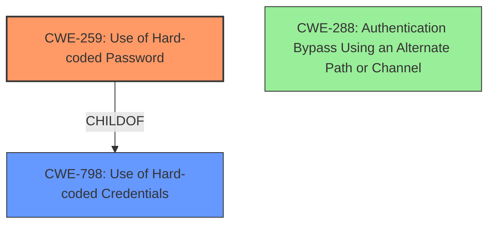

# Analysis Report for CVE-2020-5351

# Vulnerability Analysis Report: CVE-2020-5351

## Description

Dell EMC Data Protection Advisor versions 6.4, 6.5 and 18.1 contain an undocumented account with limited privileges that is protected with a hard-coded password. A remote unauthenticated malicious user with the knowledge of the hard-coded password may login to the system and gain read-only privileges.

## Vulnerability Description Key Phrases

**Rootcause:** undocumented account with hard-coded password
**Impact:** read-only privileges
**Vector:** knowledge of hard-coded password
**Attacker:** remote unauthenticated malicious user
**Product:** Dell EMC Data Protection Advisor
**Version:** 6.4, 6.5 and 18.1

## Analysis (with Relationship Data)

# Summary
| CWE ID | CWE Name | Confidence | CWE Abstraction Level | CWE Vulnerability Mapping Label | CWE-Vulnerability Mapping Notes |
|---|---|---|---|---|---|
| CWE-259 | Use of Hard-coded Password | 0.95 | Variant | Allowed | Primary CWE |
| CWE-798 | Use of Hard-coded Credentials | 0.75 | Base | Allowed | Secondary Candidate |

## Evidence and Confidence

*   **Confidence Score:** 0.90
*   **Evidence Strength:** HIGH

- **Analysis and Justification:**  
  - *Explanation:* The vulnerability description explicitly states that the Dell EMC Data Protection Advisor versions 6.4, 6.5 and 18.1 contain an **undocumented account with a hard-coded password**. This aligns directly with CWE-259 (Use of Hard-coded Password), a variant of CWE-798. CWE-259 is more specific as it highlights that the **hard-coded value is a password**, making it the most appropriate choice. The retriever results also list CWE-259 as the top match. MITRE mapping guidance for CWE-259 indicates that its usage is ALLOWED. While CWE-798 (Use of Hard-coded Credentials) is a broader category and also applicable, CWE-259 provides a more precise classification.
  
  - *Relationship Analysis:* CWE-259 is a variant (child) of CWE-798 (Use of Hard-coded Credentials). CWE-798 is a more general case that includes hard-coded cryptographic keys, while CWE-259 focuses specifically on passwords. Selecting CWE-259 provides a more accurate representation of the vulnerability.

- **Confidence Score:**  
  - Confidence: 0.95 (High confidence due to explicit mention of a hard-coded password in the vulnerability description, and the retriever results)

---

## Criticism of Analysis

Okay, I've reviewed the provided analysis against the full CWE specifications. Here's a breakdown of my critique:

**Overall Assessment:**

The analysis is generally sound.  The primary mapping of CWE-259 (Use of Hard-coded Password) is appropriate and well-justified. The secondary candidate, CWE-798 (Use of Hard-coded Credentials), is also reasonable and acknowledged as the broader category. The confidence scores are justifiable based on the information provided.

**Detailed Review:**

*   **CWE-259: Use of Hard-coded Password (Primary)**

    *   **Justification:** The analysis correctly identifies that the vulnerability description *explicitly* mentions a "hard-coded password." This makes CWE-259 a direct and accurate fit. The analysis also notes that the "Variant" abstraction level of CWE-259 is preferred.
    *   **CWE Specification Alignment:** The CWE-259 description perfectly matches the described vulnerability. The "Inbound" variant of CWE-259's extended description is particularly relevant: "In the Inbound variant, a default administration account is created, and a simple password is hard-coded into the product and associated with that account. This hard-coded password is the same for each installation of the product..."
    *   **Mapping Guidance:** The analysis correctly observes that the "Usage" of CWE-259 is "Allowed" per the CWE specification's mapping guidance.
    *   **Potential Mitigations:** The analysis implicitly addresses the potential mitigations by suggesting that administrator's can't easily detect and fix this problem by referring to difficulty of changing or disabling the default credentials. The mitigations from the spec highlight the need for design-time considerations:
        *   Using strongly protected and encrypted configuration files for outbound authentication.
        *   Implementing a "first login" mode requiring unique password creation for inbound authentication.
        *   Access control limitations for features requiring hard-coded passwords.

*   **CWE-798: Use of Hard-coded Credentials (Secondary)**

    *   **Justification:** The analysis correctly identifies CWE-798 as a broader category that encompasses CWE-259. Since the vulnerability is *specifically* about a password, CWE-259 is the better choice, but CWE-798 is still relevant.
    *   **CWE Specification Alignment:** The CWE-798 description is accurate, but less precise than CWE-259. The Extended Description highlights both inbound and outbound cases, and this vulnerability falls under the "inbound" scenario.
    *   **Mapping Guidance:** The analysis implicitly addresses the potential mitigations from the CWE spec by noting the need for changing or disabling the default credentials. The spec's mitigations highlight the need for design-time considerations:
        *   Storing credentials in encrypted config files.
        *   Using a "first login" mode.
        *   Access control limitations for features requiring the credentials.
    *   **Observed Examples:** It may be useful to review the "Observed Examples" listed in the CWE-798 specification and highlight any similarities to the analyzed vulnerability. The provided list contains several relevant examples, particularly those involving "hard-coded passwords for local shell access" and "maintenance interface with hard-coded credentials."

*   **Retriever Results Considerations:**

    *   The Retriever results are a good starting point, and the analysis correctly picks the top matches. However, it's important to understand *why* other CWEs might have scored highly and explicitly rule them out. Let's consider some of the other top results:
        *   **CWE-321: Use of Hard-coded Cryptographic Key:** While credentials *could* involve cryptographic keys, the description explicitly states a "password," making this less relevant.
        *   **CWE-256: Plaintext Storage of a Password:** This is potentially relevant if the hard-coded password is also stored in plaintext *within the code itself*. However, the description doesn't explicitly state that the password is *stored* in plaintext, only that it's hard-coded.  It could be stored in a weakly hashed or encrypted form.
        *   **CWE-1393: Use of Default Password:** This CWE is a viable candidate because hardcoded passwords, by their nature, function as default passwords. If the user isn't forced to change the password on their initial login to a unique password, this CWE would apply.
        *   **CWE-916: Use of Password Hash With Insufficient Computational Effort:** This would only be relevant *if* the hard-coded password was hashed, but the hashing algorithm was weak. The description doesn't suggest this.
        *   **CWE-288: Authentication Bypass Using an Alternate Path or Channel:** This could be relevant if the hard-coded password allowed access through a back door or undocumented interface, bypassing the normal authentication flow. The "undocumented account" part of the description hints at this possibility, but without more information, it's difficult to justify.
        *   **CWE-912: Hidden Functionality:** If the account using the hard-coded password is intentionally hidden from normal users, this could also apply.
        *    **CWE-522: Insufficiently Protected Credentials:** This could be a candidate if the credentials are also sent over an unencrypted connection, or stored somewhere where they're not protected.

**Recommendations for Improvement:**

1.  **Explicitly Address Other Top Retriever Results:** Briefly explain why the other top CWEs from the retriever results *don't* fully apply. This strengthens the justification for the chosen CWEs.
2.  **Consider *Storage* of the Password:** If information is available about *how* the password is stored (plaintext, hashed, etc.), it could lead to additional CWEs like CWE-256 or CWE-916.
3.  **Discuss Implications of "Undocumented Account":** Explore whether the "undocumented account" aspect suggests authentication bypass (CWE-288) or hidden functionality (CWE-912).
4.  **Add specific mitigations:**  Add concrete suggestions based on the CWE mitigations for CWE-259 and CWE-798. For example, "A mitigation would be to remove the hard-coded password and force users to create a unique password upon first login" or "Ensure that any password storage uses strong, non-reversible hashing algorithms."

By addressing these points, the analysis can be even more thorough and demonstrate a deeper understanding of the CWE specifications.

## Final Resolution

# Summary
| CWE ID | CWE Name | Confidence | CWE Abstraction Level | CWE Vulnerability Mapping Label | CWE-Vulnerability Mapping Notes |
|---|---|---|---|---|---|
| CWE-259 | Use of Hard-coded Password | 0.95 | Variant | Allowed | Primary CWE |
| CWE-798 | Use of Hard-coded Credentials | 0.75 | Base | Allowed | Secondary Candidate |
| CWE-288 | Authentication Bypass Using an Alternate Path or Channel | 0.4 | Base | Allowed | Tertiary Candidate |

## Evidence and Confidence

*   **Confidence Score:** 0.90
*   **Evidence Strength:** HIGH

## Relationship Analysis
The primary relationship that impacted the decision was the parent-child relationship between CWE-798 (**Use of Hard-coded Credentials**) and CWE-259 (**Use of Hard-coded Password**). CWE-259 is a variant of CWE-798, providing a more specific classification for vulnerabilities involving hard-coded passwords. Additionally, the "undocumented account" aspect hinted at CWE-288 (**Authentication Bypass Using an Alternate Path or Channel**), as the hard-coded password could allow access through a back door or undocumented interface. This led to its consideration as a tertiary candidate.

## Vulnerability Chain
The vulnerability chain starts with the **ROOTCAUSE**, which is the inclusion of a **hard-coded password** (CWE-259). This password protects an undocumented account, which allows a remote, unauthenticated attacker to log in and gain read-only privileges. This constitutes a vulnerability because it bypasses normal authentication mechanisms. If the undocumented account provides an alternate path or channel for access, CWE-288 also becomes relevant.

## Summary of Analysis
The initial analysis correctly identified CWE-259 (**Use of Hard-coded Password**) as the primary weakness, supported by the explicit mention of a hard-coded password in the vulnerability description: "Dell EMC Data Protection Advisor versions 6.4, 6.5 and 18.1 contain an undocumented account with limited privileges that is protected with a **hard-coded password**." The criticism highlighted the need to explicitly address other top retriever results and consider the implications of the "undocumented account." While CWE-321 (**Use of Hard-coded Cryptographic Key**) and CWE-256 (**Plaintext Storage of a Password**) were potential candidates, the description doesn't provide evidence to support these. However, the "undocumented account" raises the possibility of CWE-288 (**Authentication Bypass Using an Alternate Path or Channel**), which is why it has been added as a tertiary candidate. CWE-259 remains the most specific and relevant classification.
The selected CWEs are at the optimal level of specificity because CWE-259 is a variant that directly addresses the use of a hard-coded password, while CWE-798 is its base class. CWE-288 is added as a tertiary candidate because the undocumented account could imply an authentication bypass.

*Report generated on 2025-03-16 23:29:01*
