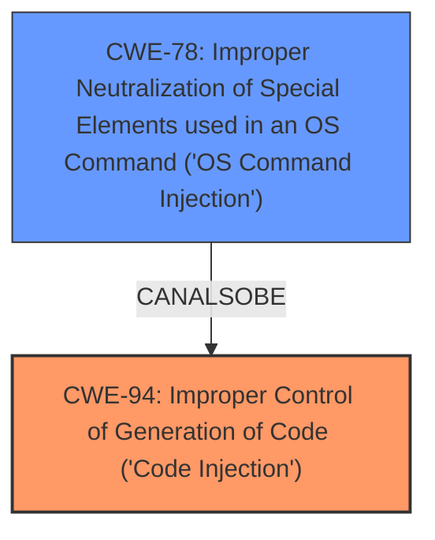

# Final Resolution for CVE-2020-5847

# Summary

| CWE ID | CWE Name | Confidence | CWE Abstraction Level | CWE Vulnerability Mapping Label | CWE-Vulnerability Mapping Notes |
|---|---|---|---|---|---|
| CWE-94 | Improper Control of Generation of Code ('Code Injection') | 0.65 | Base | Allowed-with-Review | Primary CWE |
| CWE-78 | Improper Neutralization of Special Elements used in an OS Command ('OS Command Injection') | 0.60 | Base | Allowed | Secondary Candidate |

## Evidence and Confidence

*   **Confidence Score:** 0.63
*   **Evidence Strength:** LOW

## Relationship Analysis
The primary weakness identified is **CWE-94 (Improper Control of Generation of Code ('Code Injection'))**, which is a Base level CWE. While initially considered a strong candidate due to the "Remote Code Execution" impact, the analysis acknowledges the "Allowed-with-Review" mapping guidance and the potential for more specific CWEs. The criticism suggests considering other injection vectors. **CWE-78 (Improper Neutralization of Special Elements used in an OS Command ('OS Command Injection'))** is proposed as a relevant alternative, given Unraid likely runs on Linux. There are no direct relationships found in the provided data, but based on the description, **CWE-78** can be considered a peer of **CWE-94**.

## Vulnerability Chain
The vulnerability chain begins with an unspecified point where external input influences the generation of code. This leads to **CWE-94 (Improper Control of Generation of Code ('Code Injection'))** or **CWE-78 (Improper Neutralization of Special Elements used in an OS Command ('OS Command Injection'))**, resulting in Remote Code Execution. Due to the lack of information, the full chain cannot be completely mapped. A missing link is the specific method of injection; is it through a web interface, configuration file, or some other means? A weakness such as **CWE-20 (Improper Input Validation)** could precede either **CWE-94** or **CWE-78**, but this is speculative without further evidence.

## Summary of Analysis
Based on the initial analysis and the criticism, the classification remains CWE-94 as the primary weakness, but with lower confidence (0.65). The evidence is still based on the vulnerability description stating "Remote Code Execution," which suggests **Code Injection**. However, the criticism highlights the relevance of other injection vectors, particularly **CWE-78 (Improper Neutralization of Special Elements used in an OS Command ('OS Command Injection'))**, given the Linux-based nature of Unraid. Since there's no information to definitively rule out **CWE-78** and it is a plausible alternative, it is added as a secondary candidate with confidence 0.60. Both CWEs are Base level, which is preferred.

The decision is heavily based on the limited evidence available: "Unraid through 6.8.0 allows Remote Code Execution."

The graph relationship influenced the selection by highlighting **CWE-78** as a potential alternative classification, showcasing a peer relationship with **CWE-94**.

The selected CWEs represent a reasonable level of specificity given the available evidence. While more specific variants might exist, they cannot be confidently selected without further information on the specific attack vector.