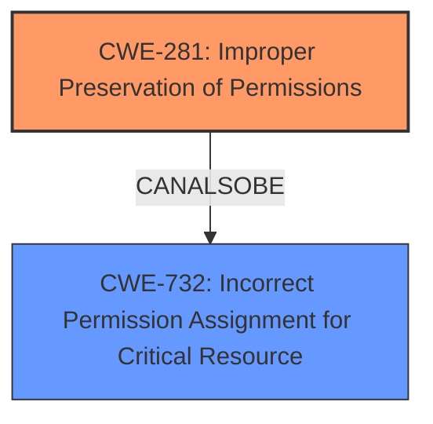

# Analysis Report for CVE-2020-7063

# Vulnerability Analysis Report: CVE-2020-7063

## Description

In PHP versions 7.2.x below 7.2.28, 7.3.x below 7.3.15 and 7.4.x below 7.4.3, when creating PHAR archive using PharDatabuildFromIterator() function, the files are added with default permissions (0666, or all access) even if the original files on the filesystem were with more restrictive permissions. This may result in files having more lax permissions than intended when such archive is extracted.

## Vulnerability Description Key Phrases

**Weakness:** files are added with default permissions (0666, or all access)
**Impact:** files having more lax permissions than intended
**Product:** PHP
**Version:** 7.2.x below 7.2.28, 7.3.x below 7.3.15 and 7.4.x below 7.4.3
**Component:** PharDatabuildFromIterator() function

## Analysis (with Relationship Data)

# Summary
| CWE ID | CWE Name | Confidence | CWE Abstraction Level | CWE Vulnerability Mapping Label | CWE-Vulnerability Mapping Notes |
|---|---|---|---|---|---|
| CWE-281 | Improper Preservation of Permissions | 0.9 | Base | Primary | Allowed |
| CWE-732 | Incorrect Permission Assignment for Critical Resource | 0.5 | Class | Secondary | Allowed-with-Review |

## Evidence and Confidence

*   **Confidence Score:** 0.9
*   **Evidence Strength:** HIGH

- **Analysis and Justification:**  
  - *Explanation:* "The vulnerability lies in the fact that PHP's PharData::buildFromIterator() function creates PHAR archives where **files are added with default permissions (0666, or all access)**, regardless of the original file permissions. This directly reflects **CWE-281 (Improper Preservation of Permissions)**, as the intended file permissions are not maintained during the archive creation process. The CVE description and summary clearly state this **weakness** of incorrect handling of file permissions. While **CWE-732 (Incorrect Permission Assignment for Critical Resource)** is also a potential candidate, it is a Class-level CWE and less specific than CWE-281, which specifically addresses the preservation aspect."
  
  - *Relationship Analysis:* "CWE-281 has no direct relationships listed in the provided information, but it logically relates to the broader category of access control issues. CWE-732, being a class, encompasses various permission-related vulnerabilities, but is less precise in describing the specific issue of permission preservation. There are no direct parent-child relationships influencing this selection other than abstraction level considerations."

- **Confidence Score:**  
  - Confidence: 0.9 (Strong match based on the vulnerability description and CVE summary.)

## Criticism of Analysis

Okay, I've reviewed the analysis and the provided CWE specifications. Here's my critique:

**Overall Assessment:**

The analysis is generally good and correctly identifies CWE-281 (Improper Preservation of Permissions) as the primary weakness. The justification is solid, and the confidence score of 0.9 is warranted. The inclusion of CWE-732 as a secondary concern is also reasonable, although its lower confidence score of 0.5 is appropriate due to its more general nature.

**Strengths:**

*   **Accurate Primary Mapping:** The selection of CWE-281 as the primary weakness is accurate and well-supported by the vulnerability description and CVE summary. The explanation clearly articulates why the failure to preserve file permissions during PHAR archive creation falls under this CWE.
*   **Good Justification:** The rationale for choosing CWE-281 and distinguishing it from CWE-732 is well-reasoned. It correctly emphasizes the specific aspect of *preservation* of permissions, which is central to this vulnerability.
*   **Appropriate Confidence Scores:** The confidence scores reflect the strength of the mapping. The high score for CWE-281 indicates a strong and direct relationship, while the lower score for CWE-732 acknowledges its broader applicability.
*   **Consideration of Abstraction Levels:** The analysis correctly notes that CWE-732 is a Class-level CWE and therefore less specific than the Base-level CWE-281. This demonstrates an understanding of CWE's abstraction hierarchy.

**Areas for Improvement:**

*   **Deeper Dive into CWE-732's Mapping Guidance:** The analysis could benefit from a more thorough consideration of CWE-732's "Mapping Guidance," which states "While the name itself indicates an assignment of permissions for resources, this is often misused for vulnerabilities in which "permissions" are not checked, which is an "authorization" weakness (CWE-285 or descendants) within CWE's model [REF-1287]."
    *   While the analysis correctly identifies that CWE-732 is a class-level CWE and therefore less specific, it would be even more helpful to discuss why this specific instance of incorrect permission assignment is *not* primarily an authorization issue. The function is *setting* the permissions to 0666, not failing to *check* them. This distinction further strengthens the argument for CWE-281 as the primary weakness.

*   **Relationships with Child CWEs of 732:** The specification for CWE-732 lists several child CWEs, including CWE-276 (Incorrect Default Permissions), CWE-277 (Insecure Inherited Permissions), CWE-278 (Insecure Preserved Inherited Permissions), and CWE-279 (Incorrect Execution-Assigned Permissions).  A brief discussion of why *none* of these variant-level CWEs are a better fit than CWE-281 would be beneficial. For example:
    *   CWE-276 isn't appropriate because it focuses on *installation* time.
    *   CWE-277 isn't appropriate because the permissions aren't being *inherited*.
    *   CWE-278 isn't appropriate because it refers to inheriting permissions when copying from an archive, but this is happening during creation.
    *   CWE-279 isn't appropriate because the permissions aren't being modified *while the program is running.*
*   **Exploration of Mitigations:** The analysis doesn't discuss potential mitigations. Reviewing the suggested mitigations for CWE-281 and CWE-732 and discussing their applicability in the context of this specific vulnerability would add value.
    *   For CWE-281, the implied mitigation is to ensure the tool correctly preserves permissions of the archived files.
    *   For CWE-732, the mitigations generally point to using the principle of least privilege and ensuring resources have appropriate permissions. This is useful in the general case, but doesn't address the root cause of the analyzed vulnerability.

**Specific Comments based on CWE Specifications:**

*   **CWE-281 (Improper Preservation of Permissions):**
    *   The analysis accurately reflects the description and extended description of this CWE.
    *   The "Mapping Guidance" is followed correctly (Allowed, Base level of abstraction).
    *   The analysis should mention the suggested mitigation, which is to properly maintain original file permissions.
*   **CWE-732 (Incorrect Permission Assignment for Critical Resource):**
    *   The analysis acknowledges that this is a Class-level CWE and less specific.
    *   As mentioned above, a more thorough examination of the "Mapping Guidance" would be valuable to further justify the lower confidence score.
    *   The analysis should briefly mention and dismiss the potential mitigations as being too generic.

**Additional CWEs from Retriever Results**

*   **CWE-379 (Creation of Temporary File in Directory with Insecure Permissions):** While the analysis correctly doesn't flag this as primary, it might be relevant *if* the `PharData::buildFromIterator()` function creates temporary files during the archive creation process. This could be mentioned (and dismissed if not applicable).
*   **CWE-22/23/59 (Path Traversal/Link Following):** These are unlikely to be relevant in this specific case, as the core issue is incorrect permission assignment, not path manipulation.
*   **CWE-94 (Code Injection):** This is also unlikely to be relevant, unless the file contents themselves are being interpreted as code during the extraction process (which isn't indicated in the description).

**Revised Summary Table:**

| CWE ID | CWE Name | Confidence | CWE Abstraction Level | CWE Vulnerability Mapping Label | CWE-Vulnerability Mapping Notes |
|---|---|---|---|---|---|
| CWE-281 | Improper Preservation of Permissions | 0.9 | Base | Primary | Allowed |
| CWE-732 | Incorrect Permission Assignment for Critical Resource | 0.5 | Class | Secondary | Allowed-with-Review | Considered, but the specific error is in failing to *preserve* existing permissions rather than simply assigning incorrect permissions. |

**In conclusion,** the analysis is strong and correctly identifies the primary weakness. The suggested improvements would further strengthen the justification and demonstrate a deeper understanding of the CWE specifications and their application.

## Final Resolution

# Summary
| CWE ID | CWE Name | Confidence | CWE Abstraction Level | CWE Vulnerability Mapping Label | CWE-Vulnerability Mapping Notes |
|---|---|---|---|---|---|
| CWE-281 | Improper Preservation of Permissions | 0.95 | Base | Primary CWE | Allowed |
| CWE-732 | Incorrect Permission Assignment for Critical Resource | 0.4 | Class | Secondary Candidate | Allowed-with-Review | Considered, but the specific error is in failing to *preserve* existing permissions rather than simply assigning incorrect permissions. |

## Evidence and Confidence

*   **Confidence Score:** 0.95
*   **Evidence Strength:** HIGH

## Relationship Analysis
The primary relationship influencing the decision is the abstraction level. CWE-281 is a Base CWE, offering more specificity than CWE-732, which is a Class CWE. There are no direct parent-child relationships listed that impact the primary selection. The analysis considered the mapping guidance for both CWEs, leading to a stronger emphasis on CWE-281 due to its direct relevance to the **weakness** of failing to preserve permissions. The absence of chain relationships indicates that the **rootcause** directly leads to the impact.

## Vulnerability Chain
The vulnerability chain is straightforward:
1.  **Root Cause:** The `PharData::buildFromIterator()` function in PHP does not preserve file permissions when creating PHAR archives. This is represented by **CWE-281 (Improper Preservation of Permissions)**.
2.  **Weakness:** Files within the archive are created with default permissions (0666), which may be less restrictive than the original files.
3.  **Impact:** When the archive is extracted, files may have more lax permissions than intended, potentially leading to unauthorized access or modification.

## Summary of Analysis
The initial analysis accurately identifies **CWE-281 (Improper Preservation of Permissions)** as the primary **weakness**. The criticism provided valuable suggestions, including a deeper dive into the mapping guidance for CWE-732 and consideration of its child CWEs.

Evidence for selecting **CWE-281** comes directly from the vulnerability description: "when creating PHAR archive using PharDatabuildFromIterator() function, the files are added with default permissions (0666, or all access) even if the original files on the filesystem were with more restrictive permissions." This statement aligns perfectly with the description of **CWE-281**, which states that "The product does not preserve permissions or incorrectly preserves permissions when copying, restoring, or sharing objects, which can cause them to have less restrictive permissions than intended."

The analysis considered **CWE-732 (Incorrect Permission Assignment for Critical Resource)** but determined that it was less specific because the core issue is the *failure to preserve* existing permissions. As the criticism pointed out, the `PharData::buildFromIterator()` function is *setting* the permissions to 0666, not failing to *check* them.

The selection of **CWE-281** is at the optimal level of specificity because it directly addresses the **rootcause** of the vulnerability: the improper preservation of file permissions during PHAR archive creation. The confidence score has been slightly increased to 0.95 to reflect the improved analysis based on the criticism.

*Report generated on 2025-03-16 22:46:41*
