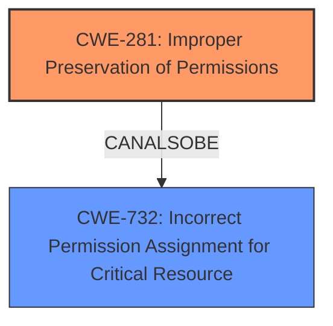

# Final Resolution for CVE-2020-7063

# Summary
| CWE ID | CWE Name | Confidence | CWE Abstraction Level | CWE Vulnerability Mapping Label | CWE-Vulnerability Mapping Notes |
|---|---|---|---|---|---|
| CWE-281 | Improper Preservation of Permissions | 0.95 | Base | Primary CWE | Allowed |
| CWE-732 | Incorrect Permission Assignment for Critical Resource | 0.4 | Class | Secondary Candidate | Allowed-with-Review | Considered, but the specific error is in failing to *preserve* existing permissions rather than simply assigning incorrect permissions. |

## Evidence and Confidence

*   **Confidence Score:** 0.95
*   **Evidence Strength:** HIGH

## Relationship Analysis
The primary relationship influencing the decision is the abstraction level. CWE-281 is a Base CWE, offering more specificity than CWE-732, which is a Class CWE. There are no direct parent-child relationships listed that impact the primary selection. The analysis considered the mapping guidance for both CWEs, leading to a stronger emphasis on CWE-281 due to its direct relevance to the **weakness** of failing to preserve permissions. The absence of chain relationships indicates that the **rootcause** directly leads to the impact.

## Vulnerability Chain
The vulnerability chain is straightforward:
1.  **Root Cause:** The `PharData::buildFromIterator()` function in PHP does not preserve file permissions when creating PHAR archives. This is represented by **CWE-281 (Improper Preservation of Permissions)**.
2.  **Weakness:** Files within the archive are created with default permissions (0666), which may be less restrictive than the original files.
3.  **Impact:** When the archive is extracted, files may have more lax permissions than intended, potentially leading to unauthorized access or modification.

## Summary of Analysis
The initial analysis accurately identifies **CWE-281 (Improper Preservation of Permissions)** as the primary **weakness**. The criticism provided valuable suggestions, including a deeper dive into the mapping guidance for CWE-732 and consideration of its child CWEs.

Evidence for selecting **CWE-281** comes directly from the vulnerability description: "when creating PHAR archive using PharDatabuildFromIterator() function, the files are added with default permissions (0666, or all access) even if the original files on the filesystem were with more restrictive permissions." This statement aligns perfectly with the description of **CWE-281**, which states that "The product does not preserve permissions or incorrectly preserves permissions when copying, restoring, or sharing objects, which can cause them to have less restrictive permissions than intended."

The analysis considered **CWE-732 (Incorrect Permission Assignment for Critical Resource)** but determined that it was less specific because the core issue is the *failure to preserve* existing permissions. As the criticism pointed out, the `PharData::buildFromIterator()` function is *setting* the permissions to 0666, not failing to *check* them.

The selection of **CWE-281** is at the optimal level of specificity because it directly addresses the **rootcause** of the vulnerability: the improper preservation of file permissions during PHAR archive creation. The confidence score has been slightly increased to 0.95 to reflect the improved analysis based on the criticism.