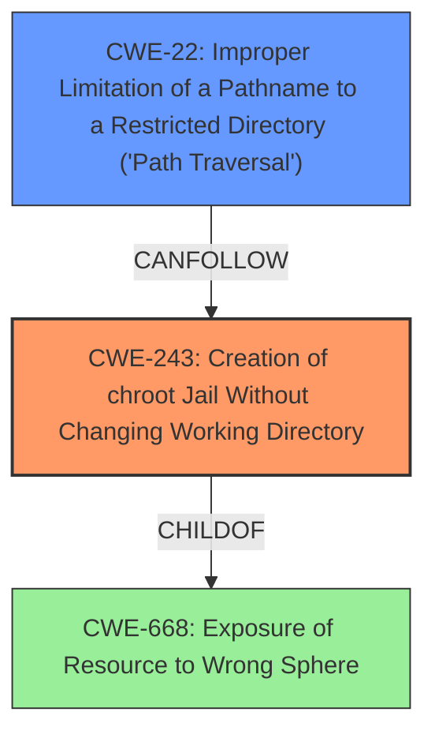

# Final Resolution for CVE-2020-7468

# Summary
| CWE ID | CWE Name | Confidence | CWE Abstraction Level | CWE Vulnerability Mapping Label | CWE-Vulnerability Mapping Notes |
|---|---|---|---|---|---|
| CWE-243 | Creation of chroot Jail Without Changing Working Directory | 0.85 | Variant | Allowed | Primary CWE. The vulnerability specifically involves a failure to properly implement a **`chroot`** jail, which is directly addressed by this CWE. The `ftpd(8)` implementation uses **`chroot`** to create a restricted environment, but a flaw allows users to bypass this restriction. |
| CWE-22 | Improper Limitation of a Pathname to a Restricted Directory ('Path Traversal') | 0.75 | Base | Allowed | Secondary CWE. Since the attacker can escape the file system restriction, this implies they could potentially access files outside the restricted **`chroot`** environment via path traversal. This is a consequence of the primary vulnerability. |

## Evidence and Confidence

*   **Confidence Score:** 0.83
*   **Evidence Strength:** HIGH

## Relationship Analysis
The primary relationship influencing the classification is the hierarchical relationship between CWE-668 (the parent class) and CWE-243 (the variant). CWE-243 is a specific type of **incorrect privilege management** where the **`chroot`** jail is not properly configured. While CWE-22 is not directly related hierarchically, it represents a potential consequence of a failed **`chroot`**, where an attacker could traverse the file system outside the intended boundaries. The abstraction levels are appropriate, with the variant CWE-243 pinpointing the specific **implementation flaw** and the base CWE-22 describing a potential impact.

## Vulnerability Chain
The chain of events is as follows:
1.  The **root cause** is the **misconfigured `chroot` jail** (CWE-243).
2.  This allows an attacker to **escape the intended file system restrictions**.
3.  As a consequence, the attacker *may* be able to perform **path traversal** (CWE-22) to access unauthorized files and directories.
4.  The ultimate impact is **potential privilege escalation** to root.

There are no missing links, but the path traversal is not guaranteed; it's a potential consequence depending on further actions taken by the attacker after escaping the **`chroot`**.

## Summary of Analysis
The initial analysis and criticism both converge on the selection of CWE-243 as the primary **weakness** due to the vulnerability description explicitly mentioning the `ftpchroot(5)` implementation failure. The criticism's suggestion to provide justification for rejecting other CWEs from the retriever results was helpful. The choice of CWE-243 is strongly supported by the evidence: "In FreeBSD ... a ftpd(8) bug in the implementation of the file system sandbox, combined with capabilities available to an authenticated FTP user, can be used to escape the file system restriction configured in ftpchroot(5)."

The graph relationships reinforce this decision, with CWE-243 being a more specific variant of the broader **privilege management issues**. CWE-22 is retained as a secondary CWE to highlight the potential for path traversal after the **`chroot`** escape. Both CWEs are at an optimal level of specificity, with CWE-243 addressing the **root cause** and CWE-22 describing a potential consequence. The confidence score is high because the provided vulnerability description explicitly refers to the **`chroot`** implementation.