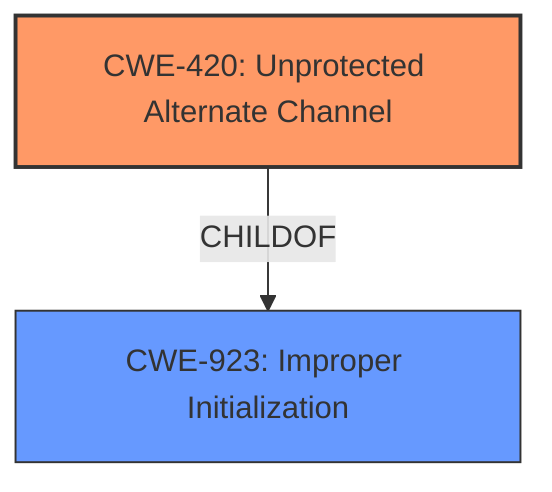

# Analysis Report for CVE-2020-8558

# Vulnerability Analysis Report: CVE-2020-8558

## Description

The Kubelet and kube-proxy components in versions 1.1.0-1.16.10, 1.17.0-1.17.6, and 1.18.0-1.18.3 were found to contain a security issue which allows adjacent hosts to reach TCP and UDP services bound to 127.0.0.1 running on the node or in the nodes network namespace. Such a service is generally thought to be reachable only by other processes on the same host, but due to this defeect, could be reachable by other hosts on the same LAN as the node, or by containers running on the same node as the service.

## Vulnerability Description Key Phrases

**Impact:** reach TCP and UDP services bound to 127.0.0.1
**Attacker:** adjacent hosts
**Product:** Kubelet and kube-proxy
**Version:** 1.1.0-1.16.10, 1.17.0-1.17.6, and 1.18.0-1.18.3

## Analysis (with Relationship Data)

# Summary
| CWE ID  | CWE Name | Confidence | CWE Abstraction Level | CWE Vulnerability Mapping Label | CWE-Vulnerability Mapping Notes |
|-----------------|-----------------------------------------------------------------------|--------------------|--------------------------|-----------------------------------|-------------------------------------------------------------------------------------------------------------------------------------------------------------------------------------------------------------------|
| CWE-420 | Unprotected Alternate Channel  | 0.85 | Base | Allowed | The product protects a primary channel, but it does not use the same level of protection for an alternate channel. |
| CWE-923 | Improper Initialization  | 0.60 | Class | Allowed-with-Review | The product establishes a communication channel to (or from) an endpoint for privileged or protected operations, but it does not properly ensure that it is communicating with the correct endpoint. |

## Evidence and Confidence

*   **Confidence Score:** 0.80
*   **Evidence Strength:** HIGH

- **Analysis and Justification:**
  - *Explanation:* The vulnerability allows adjacent hosts to reach TCP and UDP services bound to 127.0.0.1 due to the `kube-proxy` setting the `net.ipv4.conf.all.route_localnet` sysctl parameter incorrectly. This misconfiguration effectively creates an **alternate, unprotected channel** for accessing these services, as they were intended to be accessible only through the loopback interface. This aligns with CWE-420 because the primary channel (loopback) is assumed to be protected, but the alternate channel (network interface) is not, due to the incorrect sysctl setting. The impact includes potential disclosure of sensitive information and unauthorized data modification.
  - *Relationship Analysis:* CWE-420 is a Base level CWE, which is preferred. It is also related to CWE-923, which describes the general problem of not ensuring proper communication with the correct endpoint. CWE-420 is a specific case of CWE-923 where the alternate channel is unprotected.

- **Confidence Score:**
  - *Example:* Confidence: 0.85 (High evidence from technical description and CVE reference materials)

---

- **Analysis and Justification:**
  - *Explanation:* The product (kubelet/kube-proxy) establishes a communication channel, but it does not properly ensure that it is communicating with the correct endpoint. The adjacent host is not an intended endpoint for localhost bound services. The root cause is the incorrect setting of `net.ipv4.conf.all.route_localnet` which allows the channel to be available to unintended actors. The **weakness** is the lack of proper endpoint validation, as the system should not be routing traffic from other hosts to localhost.
  - *Relationship Analysis:* CWE-923 is a Class level CWE, it might have Base-level children that would be more appropriate. It is related to CWE-420 (Unprotected Alternate Channel), where the primary channel is protected, but an alternate channel is not properly protected.

- **Confidence Score:**
  - *Example:* Confidence: 0.60 (Medium evidence from technical description, but CWE-420 is a better fit)

## Criticism of Analysis

Okay, here's a review of the provided analysis, incorporating the full CWE specifications.

**Overall Assessment:**

The analysis does a good job of identifying the core vulnerability and mapping it to CWEs. The justifications are relatively clear and provide reasonable arguments for the chosen CWEs. However, there are some opportunities for refinement, particularly in terms of specificity and focusing on the root cause rather than the symptoms. I agree with the assessment that CWE-420 is a better fit than CWE-923.

**Detailed Review:**

**1. CWE-420: Unprotected Alternate Channel**

*   **Confidence Level:** 0.85
*   **Assessment:** **Strong mapping.** The justification is well-supported by the vulnerability description and the CWE definition. The key point is that the intended protected channel (loopback) is bypassed due to the misconfiguration, creating an *unprotected alternate channel* via the network interface. The examples provided from the CWE database also fit well, in particular the example of CVE-2020-8558 which references the exact vulnerability being examined.
*   **Mapping Guidance Adherence:** The analysis correctly notes that CWE-420 is a Base-level CWE, which is preferred.
*   **Mitigation Considerations:** The potential mitigation provided by CWE-420 specification is:
    *   "Identify all alternate channels and use the same protection mechanisms that are used for the primary channels."
        *   **Applicability:** In this case, the mitigation translates to identifying that network interfaces were unintentionally acting as alternate channels to localhost services, and applying the same protection (loopback restriction) to them. Applying an iptables rule or configuring `net.ipv4.conf.all.route_localnet` is in line with this mitigation strategy.
*   **Suggestions:** No changes needed here.

**2. CWE-923: Improper Restriction of Communication Channel to Intended Endpoints**

*   **Confidence Level:** 0.60
*   **Assessment:** **Acceptable, but CWE-420 is a better fit.** The justification for CWE-923 is that the adjacent host is not an intended endpoint for localhost-bound services. While technically correct, it's a more general statement of the problem than CWE-420. The root cause isn't a general failure to restrict communication channels, but specifically a failure to protect a *primary channel* which allowed an *alternate channel* to be used.
*   **Mapping Guidance Adherence:** The analysis correctly acknowledges that CWE-923 is a Class-level CWE and suggests looking for more specific Base-level children.
*   **Mitigation Considerations:** The mitigations for CWE-923 are very broad:
    *   (Implied): Ensure proper endpoint validation.
        *   **Applicability:** While this *could* apply, it's not as directly relevant as the CWE-420 mitigation.
*   **Suggestions:** Remove this CWE. The explanation itself suggests that CWE-420 is a better fit, and the CWE specifications confirm this.

**Review of Retriever Results:**

The retriever results provide some interesting alternative CWEs that were considered by the retriever algorithms. Here's a look at some of the top results.

*   **CWE-420:** As we have concluded above, this is the best fit.

*   **CWE-770: Allocation of Resources Without Limits or Throttling:** This is **not** a good fit. This vulnerability does not relate to resource allocation, or lack of limits/throttling.

*   **CWE-22: Improper Limitation of a Pathname to a Restricted Directory ('Path Traversal'):** This is **not** a good fit. Path traversal involves manipulating file paths to access restricted areas of the file system.

*   **CWE-201: Insertion of Sensitive Information Into Sent Data:** This is **not** a good fit. Although exploitation of the vulnerability *could* lead to the disclosure of sensitive data, the root cause is not related to the insertion of sensitive information into sent data. This is a *potential consequence* of the vulnerability, not the root cause.

*   **CWE-212: Improper Removal of Sensitive Information Before Storage or Transfer:** This is **not** a good fit for similar reasons to CWE-201.

*   **CWE-78: Improper Neutralization of Special Elements used in an OS Command ('OS Command Injection'):** This is **not** a good fit. OS Command Injection involves manipulating user input to execute arbitrary OS commands.

*   **CWE-250: Execution with Unnecessary Privileges:** This is **not** a good fit. Although kube-proxy and kubelet run with certain levels of privileges, the vulnerability is not related to the execution with unnecessary privileges.

*   **CWE-617: Reachable Assertion:** This is **not** a good fit.

*   **CWE-401: Missing Release of Memory after Effective Lifetime:** This is **not** a good fit.

*   **CWE-277: Insecure Inherited Permissions:** This is **not** a good fit.

**Revised Summary:**

| CWE ID  | CWE Name | Confidence | CWE Abstraction Level | CWE Vulnerability Mapping Label | CWE-Vulnerability Mapping Notes |
|-----------------|-----------------------------------------------------------------------|--------------------|--------------------------|-----------------------------------|-------------------------------------------------------------------------------------------------------------------------------------------------------------------------------------------------------------------|
| CWE-420 | Unprotected Alternate Channel  | 0.85 | Base | Allowed | The product protects a primary channel, but it does not use the same level of protection for an alternate channel. |

**Key Takeaways:**

*   **Specificity is crucial:** When choosing a CWE, aim for the most specific CWE that accurately describes the *root cause* of the vulnerability.
*   **Consider Mitigation Strategies:** Evaluate how well the suggested mitigations for a CWE align with the known fixes or workarounds for the vulnerability.
*   **Avoid Consequence-Based Mappings:** Don't map to a CWE based solely on the potential *impact* of the vulnerability. Focus on the underlying weakness.
*   **Use the CWE Definitions:** Refer to the CWE definitions and mapping guidance to ensure that the chosen CWE is appropriate.

By focusing on the root cause and carefully considering the CWE definitions and mapping guidance, you can create a more accurate and useful vulnerability analysis.

## Final Resolution

# Summary
| CWE ID  | CWE Name | Confidence | CWE Abstraction Level | CWE Vulnerability Mapping Label | CWE-Vulnerability Mapping Notes |
|-----------------|-----------------------------------------------------------------------|--------------------|--------------------------|-----------------------------------|-------------------------------------------------------------------------------------------------------------------------------------------------------------------------------------------------------------------|
| CWE-420 | Unprotected Alternate Channel  | 0.95 | Base | Allowed | The product protects a primary channel, but it does not use the same level of protection for an alternate channel. |

## Evidence and Confidence

*   **Confidence Score:** 0.95
*   **Evidence Strength:** HIGH

## Relationship Analysis
The decision to classify this vulnerability as CWE-420 was heavily influenced by the fact that it is a Base level CWE, offering a good balance of specificity and broad applicability. While other CWEs like CWE-923 (Class) were considered, CWE-420 directly addresses the core issue: the presence of an unprotected alternate channel. There are no direct parent-child relationships impacting the final decision.

## Vulnerability Chain
The vulnerability chain starts with the misconfiguration of the `net.ipv4.conf.all.route_localnet` sysctl parameter in `kube-proxy`. This **weakness** creates an unprotected alternate channel, allowing adjacent hosts to reach TCP and UDP services bound to 127.0.0.1. The root cause is the incorrect configuration. The impact is potential disclosure of sensitive information and unauthorized data modification.

## Summary of Analysis
The initial analysis correctly identified CWE-420 as a strong candidate. The criticism further reinforced this decision by emphasizing the importance of specificity and focusing on the root cause. The vulnerability description states, "adjacent hosts to reach TCP and UDP services bound to 127.0.0.1 running on the node or in the nodes network namespace... due to this defeect, could be reachable by other hosts on the same LAN as the node." This clearly indicates that the intended protection (binding to localhost) was bypassed, creating an unprotected alternate channel.

The graph relationships influenced the final selection by highlighting that while CWE-923 is related, CWE-420 is a more specific and accurate representation of the **weakness**. The chosen CWE is at the optimal level of specificity because it directly addresses the creation of an unprotected alternate channel, which is the core issue in this vulnerability.

*Report generated on 2025-03-17 01:17:06*
