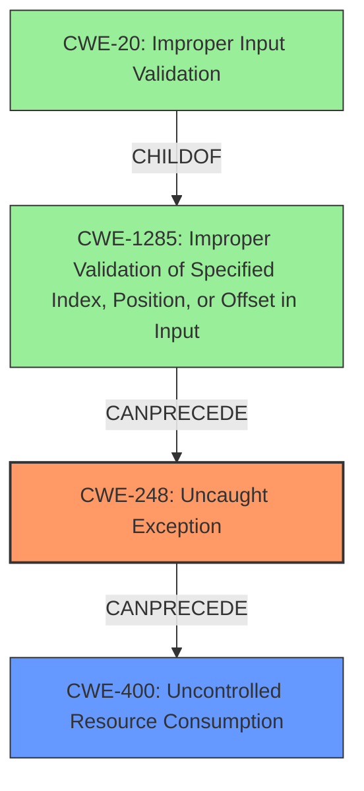

# Final Resolution for CVE-2021-0005

# Summary
| CWE ID  | CWE Name              | Confidence | CWE Abstraction Level | CWE Vulnerability Mapping Label | CWE-Vulnerability Mapping Notes |
| :-------- | :-------------------- | :--------- | :-------------------- | :------------------------------ | :------------------------------ |
| **CWE-248** | **Uncaught Exception** | 0.85      | Base                 | Allowed                        | Primary CWE                    |
| **CWE-400** | **Uncontrolled Resource Consumption** | 0.50      | Class                  | Allowed-with-Review                     | Secondary Candidate - Impact |
| **CWE-1285** | **Improper Validation of Specified Index, Position, or Offset in Input**  | 0.30       | Base                 | Allowed                     | Tertiary Candidate - Root Cause Investigation Needed |

## Evidence and Confidence

*   **Confidence Score:** 0.8
*   **Evidence Strength:** MEDIUM

## Relationship Analysis
The selection of CWE-248 as the primary weakness is based on its direct match with the vulnerability description which mentions "**uncaught exception**". CWE-248 is at the Base level, making it preferable over the more general Class-level CWE-755.

The relationship analysis considered the possibility of a vulnerability chain. The criticism suggested including CWE-400 (**Uncontrolled Resource Consumption**) as a secondary CWE since the **uncaught exception** could lead to a resource leak and DoS. Additionally, it suggested investigating whether improper input validation (CWE-20) or improper index validation (CWE-1285) could have led to the exception.

The graph below visualizes these relationships:

## Vulnerability Chain
The vulnerability chain starts with a potential **improper validation of input** (CWE-20) which leads to an **improper validation of an index, position, or offset** (CWE-1285). This then causes an exception that is not caught (**CWE-248**), which results in **uncontrolled resource consumption** and a denial-of-service (**CWE-400**).

Missing links in the chain: The exact cause of the exception is not clear from the provided information. Further investigation is needed to confirm the role of CWE-20 and CWE-1285.

## Summary of Analysis
The initial analysis correctly identified CWE-248 as the primary weakness based on the explicit mention of "**uncaught exception**" in the vulnerability description. The criticism highlighted the potential for a vulnerability chain and suggested considering CWE-400 and CWE-20/CWE-1285.

The inclusion of CWE-400 is justified by the denial-of-service impact mentioned in the description. The addition of CWE-1285 and CWE-20 is more speculative and requires further investigation to determine whether improper input validation or index validation contributed to the exception.

The final decision is to include CWE-400 as a secondary CWE and CWE-1285 as a tertiary candidate, with the understanding that further investigation is needed to confirm the role of CWE-1285 and CWE-20. This decision reflects a more comprehensive understanding of the potential vulnerability chain, while also acknowledging the limitations of the available evidence.

The selected CWEs are at the optimal level of specificity. CWE-248 is a base-level CWE that directly describes the **uncaught exception**. CWE-400 is a class-level CWE that describes the impact of the vulnerability (DoS). CWE-1285 is a base-level CWE, and CWE-20 is a class-level CWE related to a potential root cause.

The confidence score remains at 0.8 because while the chain analysis adds value, the evidence supporting the inclusion of CWE-1285 and CWE-20 is still weak.