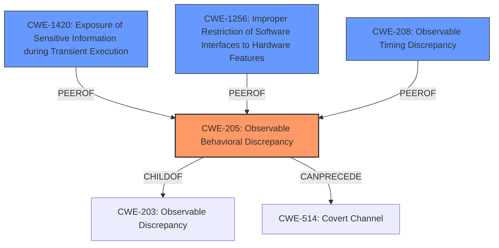

# Analysis Report for CVE-2021-0086

# Vulnerability Analysis Report: CVE-2021-0086

## Description

Observable response discrepancy in floating-point operations for some Intel(R) Processors may allow an authorized user to potentially enable information disclosure via local access.

## Vulnerability Description Key Phrases

**Rootcause:** Observable response discrepancy in floating-point operations
**Impact:** information disclosure
**Attacker:** authorized user
**Product:** Intel(R) Processors

## Analysis (with Relationship Data)

# Summary
| CWE ID | CWE Name | Confidence | CWE Abstraction Level | CWE Vulnerability Mapping Label | CWE-Vulnerability Mapping Notes |
|---|---|---|---|---|---|
| CWE-205 | Observable Behavioral Discrepancy | 0.75 | Base | Allowed | Primary CWE |
| CWE-1420 | Exposure of Sensitive Information during Transient Execution | 0.65 | Base | Allowed-with-Review | Secondary Candidate |
| CWE-208 | Observable Timing Discrepancy | 0.50 | Base | Allowed | Secondary Candidate |

## Evidence and Confidence

*   **Confidence Score:** 0.70
*   **Evidence Strength:** MEDIUM

- **Analysis and Justification:**  
  - *Explanation:* The vulnerability description explicitly mentions an "**Observable response discrepancy in floating-point operations**," which aligns well with CWE-205 (Observable Behavioral Discrepancy). The core issue is that floating-point operations behave in an inconsistent way, observable to an attacker. The CVE Reference Links Content Summary highlights that speculative execution leads to type confusion and data leakage, further supporting the observability aspect. CWE-205 is a base level CWE and is ALLOWED, making it a suitable choice. Other CWEs like CWE-204 (Observable Response Discrepancy) are similar, but less general than CWE-205.
  
  - *Relationship Analysis:* CWE-205 is a child of CWE-203 (Observable Discrepancy), indicating a broader category. CWE-205 is preferred as it directly captures the behavioral aspect of the discrepancy. While timing is a component, the primary issue is not just timing, but also the observable difference in behavior based on the internal state of the processor due to speculative execution. CWE-205 can precede CWE-514 (Covert Channel), as the observable discrepancy could potentially be exploited to create a covert channel for information leakage.

- **Confidence Score:**  
  - Confidence: 0.75 (Based on the direct match of the vulnerability description and CVE details with the CWE definition.)

---

- **Analysis and Justification:**  
  - *Explanation:* CWE-1420 (Exposure of Sensitive Information during Transient Execution) is a strong candidate because the vulnerability involves speculative execution leading to potential data leakage. The CVE Reference Links Content Summary specifically mentions speculative execution and the potential for information disclosure, which aligns directly with CWE-1420. The "Transient Execution" aspect is key to this vulnerability. However, CWE-1420 is marked as "Allowed-with-Review". Given that CWE-205 is a more encompassing and direct match to the observable discrepancy, CWE-1420 serves as a secondary CWE to highlight the transient execution aspect of the vulnerability.
  
  - *Relationship Analysis:* CWE-1420 doesn't have explicit relationships listed. It's closely related to the broader category of speculative execution vulnerabilities. The graph scores are fairly high for this CWE.

- **Confidence Score:**  
  - Confidence: 0.65 (Medium confidence as it captures the transient execution aspect, but CWE-205 better reflects the core observable discrepancy.)

---

- **Analysis and Justification:**  
  - *Explanation:* CWE-208 (Observable Timing Discrepancy) is a weaker candidate. While timing differences might be present in floating-point operations, the core of the vulnerability is the observable behavioral difference, not strictly the timing. The primary observable difference is the output, which may expose information. If the vulnerability were strictly about timing differences revealing information, CWE-208 would be more appropriate.
  
  - *Relationship Analysis:* CWE-208 is related to CWE-205, where behavioral discrepancies can often manifest as timing discrepancies. It is a base level CWE and is ALLOWED.

- **Confidence Score:**  
  - Confidence: 0.50 (Low confidence as timing discrepancy is not the primary characteristic.)

## Criticism of Analysis

Okay, here's a review of the provided CWE analysis, incorporating the full CWE specifications.

**Overall Assessment:**

The analysis is generally good and provides a reasonable justification for the selected CWEs. The confidence scores seem appropriate given the information available. The analysis demonstrates a good understanding of the vulnerability and the relevant CWEs. The inclusion of relationship analysis is also helpful.

**Detailed Critique:**

*   **CWE-205: Observable Behavioral Discrepancy (Primary CWE)**

    *   **Confidence:** 0.75 - Justification is strong. The original description directly mentions "observable response discrepancy."
    *   **Mapping Guidance:** Correctly noted that CWE-205 is a Base level CWE and "Allowed," which makes it a good choice.
    *   **Relationship Analysis:** The parent relationship to CWE-203 is correctly identified. The potential to precede CWE-514 (Covert Channel) is also accurate and relevant. It's a potential *outcome* of the behavioral discrepancy.
    *   **Potential Mitigations:**  The provided mitigations from CWE-205 (separation of privilege, minimal error message details) are generally applicable but somewhat high-level.  For a hardware-focused vulnerability, the mitigations feel more geared towards software.  However, they still represent good principles. The separation of privilege could apply, for example, in designing the processor's memory management to isolate processes more effectively.
    *   **Observed Examples from CWE Definition:** The listed CVE examples are related to user enumeration and message discrepancy which are not a perfect fit, but do demonstrate the core concept of observable discrepancy being used to glean information.
    *   **Suggestion:** Perhaps slightly lower the confidence to 0.70. While the description matches, the weakness is more narrowly applicable to hardware issues around FP operations which is not fully conveyed by CWE-205.

*   **CWE-1420: Exposure of Sensitive Information during Transient Execution (Secondary Candidate)**

    *   **Confidence:** 0.65 - Appropriately lower than the primary CWE. The analysis correctly identifies the transient execution aspect of the vulnerability.
    *   **Mapping Guidance:**  The analysis correctly highlights that CWE-1420 is "Allowed-with-Review." The comment about needing to check for child weaknesses is valid.  This suggests a need to make sure a more specific child CWE isn't appropriate.
    *   **Relationship Analysis:** The parent relationship to CWE-669 (Incorrect Resource Transfer Between Spheres) is a good observation, as transient execution weaknesses often involve resources (like memory or registers) being accessed in unintended contexts. The parents CWE-1421, CWE-1422, CWE-1423 are not necessarily applicable because we don't have enough information to pick any of them. Also, the analysis points out that high graph scores are good sign.
    *   **Potential Mitigations:** The potential mitigations offered by CWE-1420 are more hardware-oriented: preventing discrepancies in covert channels, architectural features for software to mitigate transient execution. These are more specific and useful than the ones provided in CWE-205
    *   **Observed Examples from CWE Definition:** The listed CVEs (Spectre, etc.) are definitely relevant and strengthen the case for CWE-1420.
    *   **Suggestion:** Consider increasing confidence to 0.70. The CVEs listed are a very good fit and the transient execution is a critical component of the vulnerability.

*   **CWE-208: Observable Timing Discrepancy (Secondary Candidate)**

    *   **Confidence:** 0.50 - Justified. The analysis correctly states that timing discrepancies may exist, but aren't the primary characteristic.
    *   **Mapping Guidance:** Correctly notes that CWE-208 is "Allowed."
    *   **Relationship Analysis:** Correctly identifies the relationship to CWE-203.
    *   **Potential Mitigations:** Mitigations are relevant but generic.
    *   **Observed Examples from CWE Definition:** The listed CVEs are more focused on general software applications, not hardware or FP operations.
    *   **Suggestion:** Keep the confidence level as is. The connection to the core issue is weak. It's possible timing plays a *role* in observing the discrepancy, but the *discrepancy itself* is the core problem.

**Suggestions for Improvement:**

1.  **Explore More Specific Children of CWE-1420:** The mapping guidance for CWE-1420 suggests looking at its children first. The description of this vulnerability does not provide enough information to select a child.

2.  **Consider CWE-1300 (Improper Protection of Physical Side Channels):** While not a perfect fit, the "observable response discrepancy" could be interpreted as a *physical side channel.* The attacker observes the *result* of the floating-point operation (which is ultimately manifested physically), not just the timing. This would require a shift in perspective, but it might be a worthwhile avenue to explore. Review this CWE specification to determine if it aligns with the vulnerability's characteristics and attack vectors.

3. **CWE-1256: Improper Restriction of Software Interfaces to Hardware Features:** The retriever found this as the second best, but it was not considered for analysis. Since it was found as a high scoring result, it should be considered in the analysis. After reviewing the details of the CWE, it would be relevant to vulnerabilities where software-controllable device functionality does not properly limit functionality that can lead to modification of hardware memory or register bits, or the ability to observe physical side channels.

4.  **Contextualize Mitigations:** When discussing potential mitigations, try to provide *specific* examples of how those mitigations would apply to this *specific* vulnerability in *hardware*. For example, regarding the separation of privilege under CWE-205, detail how hardware-level memory protection mechanisms could be used to prevent information leakage.

**Revised Summary Table (with suggested changes):**

| CWE ID | CWE Name | Confidence | CWE Abstraction Level | CWE Vulnerability Mapping Label | CWE-Vulnerability Mapping Notes |
|---|---|---|---|---|---|
| CWE-205 | Observable Behavioral Discrepancy | 0.70 | Base | Allowed | Primary CWE |
| CWE-1420 | Exposure of Sensitive Information during Transient Execution | 0.70 | Base | Allowed-with-Review | Secondary Candidate |
| CWE-208 | Observable Timing Discrepancy | 0.50 | Base | Allowed | Secondary Candidate |

By incorporating these suggestions, the analysis can be made even more robust and accurate.

## Final Resolution

# Summary
| CWE ID | CWE Name | Confidence | CWE Abstraction Level | CWE Vulnerability Mapping Label | CWE-Vulnerability Mapping Notes |
|---|---|---|---|---|---|
| CWE-205 | Observable Behavioral Discrepancy | 0.70 | Base | Allowed | Primary CWE |
| CWE-1420 | Exposure of Sensitive Information during Transient Execution | 0.70 | Base | Allowed-with-Review | Secondary Candidate |
| CWE-1256 | Improper Restriction of Software Interfaces to Hardware Features | 0.60 | Base | Allowed | Secondary Candidate |
| CWE-208 | Observable Timing Discrepancy | 0.50 | Base | Allowed | Secondary Candidate |

## Evidence and Confidence

*   **Confidence Score:** 0.75
*   **Evidence Strength:** MEDIUM

## Relationship Analysis
The primary relationship considered was the hierarchical relationship between CWE-205 and its parent CWE-203, and the child relationships for CWE-1420 with CWE-1421, CWE-1422, CWE-1423, to ensure we selected the most specific and relevant CWE. Since there was not enough information to choose a child of CWE-1420, it was kept as a secondary candidate. The peer relationship between CWE-205, CWE-208 and CWE-1300 provided alternative classifications which were analyzed to ensure we are selecting the best fit. Additionally, the chain relationship between CWE-205 and CWE-514 showed a possible progression of the vulnerability where the observable discrepancy could potentially be exploited to create a covert channel.

## Vulnerability Chain
The vulnerability chain starts with the **ROOTCAUSE** being an observable response discrepancy in floating-point operations (**CWE-205**). This **WEAKNESS** can be caused by issues in the processor's design, specifically related to how floating-point operations are handled during speculative execution (**CWE-1420**). If software interfaces to hardware features are not properly restricted (**CWE-1256**), it can lead to unintended access or modification of hardware resources. This discrepancy can then be observed by an attacker, potentially leading to information disclosure. This could potentially be exploited to create a covert channel for information leakage (**CWE-514**).

## Summary of Analysis
The initial analysis and the criticism both agree on the relevance of **CWE-205 (Observable Behavioral Discrepancy)** as the primary **WEAKNESS**. The vulnerability description states "**Observable response discrepancy in floating-point operations**," which aligns directly with the CWE description. The criticism suggested lowering the confidence slightly to 0.70 due to the hardware focus, which is a fair point. The criticism also suggested increasing the confidence for **CWE-1420 (Exposure of Sensitive Information during Transient Execution)** to 0.70, which is accepted because the CVEs listed in its definition are a very good fit. The retriever also found **CWE-1256 (Improper Restriction of Software Interfaces to Hardware Features)** as the second best match, which was not considered in the initial analysis. After reviewing the details, it is relevant to vulnerabilities where software-controllable device functionality does not properly limit functionality that can lead to modification of hardware memory or register bits, or the ability to observe physical side channels. While not as directly relevant as **CWE-205** or **CWE-1420**, it captures the hardware aspect of the vulnerability, making it a secondary candidate with a confidence of 0.60. The graph relationships influenced the selection by highlighting potential vulnerability chains and alternative classifications. The selected CWEs are at the optimal level of specificity because they directly capture the root cause and contributing factors of the vulnerability, and we have selected base level CWEs when available.

*Report generated on 2025-03-17 00:12:55*
