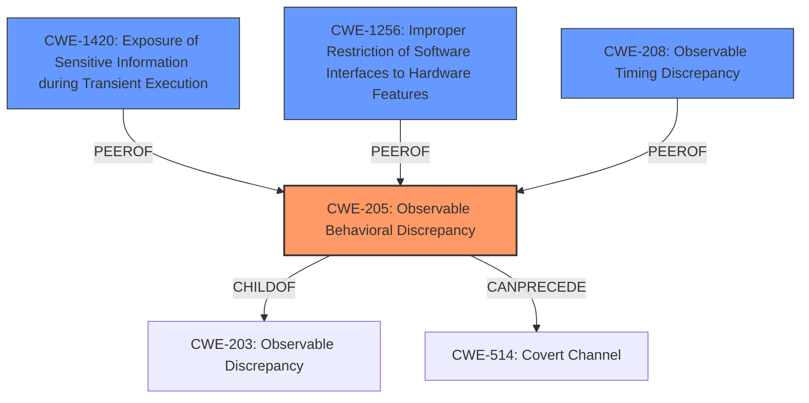

# Final Resolution for CVE-2021-0086

# Summary
| CWE ID | CWE Name | Confidence | CWE Abstraction Level | CWE Vulnerability Mapping Label | CWE-Vulnerability Mapping Notes |
|---|---|---|---|---|---|
| CWE-205 | Observable Behavioral Discrepancy | 0.70 | Base | Allowed | Primary CWE |
| CWE-1420 | Exposure of Sensitive Information during Transient Execution | 0.70 | Base | Allowed-with-Review | Secondary Candidate |
| CWE-1256 | Improper Restriction of Software Interfaces to Hardware Features | 0.60 | Base | Allowed | Secondary Candidate |
| CWE-208 | Observable Timing Discrepancy | 0.50 | Base | Allowed | Secondary Candidate |

## Evidence and Confidence

*   **Confidence Score:** 0.75
*   **Evidence Strength:** MEDIUM

## Relationship Analysis
The primary relationship considered was the hierarchical relationship between CWE-205 and its parent CWE-203, and the child relationships for CWE-1420 with CWE-1421, CWE-1422, CWE-1423, to ensure we selected the most specific and relevant CWE. Since there was not enough information to choose a child of CWE-1420, it was kept as a secondary candidate. The peer relationship between CWE-205, CWE-208 and CWE-1300 provided alternative classifications which were analyzed to ensure we are selecting the best fit. Additionally, the chain relationship between CWE-205 and CWE-514 showed a possible progression of the vulnerability where the observable discrepancy could potentially be exploited to create a covert channel.

## Vulnerability Chain
The vulnerability chain starts with the **ROOTCAUSE** being an observable response discrepancy in floating-point operations (**CWE-205**). This **WEAKNESS** can be caused by issues in the processor's design, specifically related to how floating-point operations are handled during speculative execution (**CWE-1420**). If software interfaces to hardware features are not properly restricted (**CWE-1256**), it can lead to unintended access or modification of hardware resources. This discrepancy can then be observed by an attacker, potentially leading to information disclosure. This could potentially be exploited to create a covert channel for information leakage (**CWE-514**).

## Summary of Analysis
The initial analysis and the criticism both agree on the relevance of **CWE-205 (Observable Behavioral Discrepancy)** as the primary **WEAKNESS**. The vulnerability description states "**Observable response discrepancy in floating-point operations**," which aligns directly with the CWE description. The criticism suggested lowering the confidence slightly to 0.70 due to the hardware focus, which is a fair point. The criticism also suggested increasing the confidence for **CWE-1420 (Exposure of Sensitive Information during Transient Execution)** to 0.70, which is accepted because the CVEs listed in its definition are a very good fit. The retriever also found **CWE-1256 (Improper Restriction of Software Interfaces to Hardware Features)** as the second best match, which was not considered in the initial analysis. After reviewing the details, it is relevant to vulnerabilities where software-controllable device functionality does not properly limit functionality that can lead to modification of hardware memory or register bits, or the ability to observe physical side channels. While not as directly relevant as **CWE-205** or **CWE-1420**, it captures the hardware aspect of the vulnerability, making it a secondary candidate with a confidence of 0.60. The graph relationships influenced the selection by highlighting potential vulnerability chains and alternative classifications. The selected CWEs are at the optimal level of specificity because they directly capture the root cause and contributing factors of the vulnerability, and we have selected base level CWEs when available.