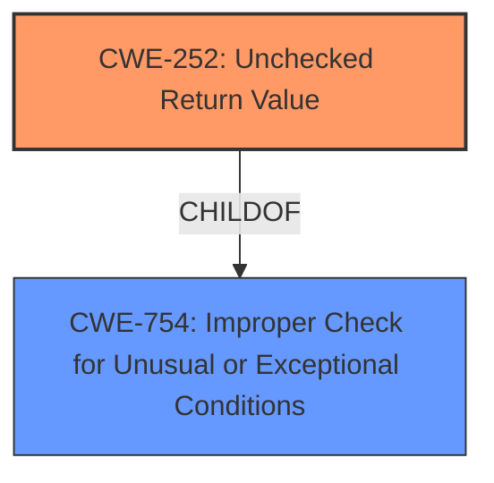

# Analysis Report for CVE-2021-0114

# Vulnerability Analysis Report: CVE-2021-0114

## Description

Unchecked return value in the firmware for some Intel(R) Processors may allow a privileged user to potentially enable an escalation of privilege via local access.

## Vulnerability Description Key Phrases

**Rootcause:** unchecked return value
**Impact:** escalation of privilege
**Attacker:** privileged user
**Product:** Intel(R) Processors
**Component:** firmware

## Analysis (with Relationship Data)

# Summary
| CWE ID  | CWE Name  | Confidence | CWE Abstraction Level | CWE Vulnerability Mapping Label | CWE-Vulnerability Mapping Notes |
|---|---|---|---|---|---|
| CWE-252 | Unchecked Return Value | 0.9 | Base  | Allowed | Primary CWE |
| CWE-755 | Exception Handling Missing | 0.6 | Class | Discouraged | Secondary Candidate |

## Evidence and Confidence

*   **Confidence Score:** 0.9
*   **Evidence Strength:** HIGH

- **Analysis and Justification:**  
  - *Explanation:* The vulnerability description explicitly states the **rootcause** is an "**unchecked return value**" in the firmware. This aligns directly with CWE-252 (Unchecked Return Value), which describes a situation where a product doesn't check the return value from a method or function, potentially leading to unexpected states. The CVE Reference Links Content Summary also confirms this **root cause**. CWE-252 is a Base level CWE, making it a suitable level of abstraction. While the vulnerability leads to an "escalation of privilege," this is an impact, not the direct **weakness**.
  
  - *Relationship Analysis:* No direct relationships found.

- **Confidence Score:**  
  - Confidence: 0.9 (High confidence due to the explicit mention of "unchecked return value" as the **rootcause** in the vulnerability description and the CVE Reference Links Content Summary.)

---

- **Analysis and Justification:**  
  - *Explanation:* The vulnerability description mentions that the **unchecked return value** "may allow a privileged user to potentially enable an escalation of privilege via local access". While the primary issue is the missing check, this could also be considered a case of improper exception handling. If the return value indicates an error condition (i.e., an exception), the firmware should handle this condition gracefully. Since the description suggests this isn't happening, CWE-755 (Exception Handling Missing) is a possible secondary candidate. However, CWE-755 is a Class level CWE and more generic than CWE-252. Also, CWE-755 is DISCOURAGED.
  
  - *Relationship Analysis:* No direct relationships found.

- **Confidence Score:**  
  - Confidence: 0.6 (Medium confidence as it represents a potential consequence of the primary **weakness** rather than the **rootcause** itself. The direct statement of "unchecked return value" leads to higher confidence in CWE-252.)

## Criticism of Analysis

Okay, here's a breakdown of the analysis's strengths, weaknesses, and potential improvements, considering the full CWE specifications provided.

**Overall Assessment:**

The analysis is generally sound and well-reasoned.  The primary CWE selection of CWE-252 (Unchecked Return Value) is highly appropriate, given the explicit mention of it in the vulnerability description. The secondary CWE candidate, CWE-755 (Improper Handling of Exceptional Conditions), is a reasonable consideration but ultimately correctly deemed less directly relevant. The analysis provides a good justification for the assigned confidence levels.

**Strengths:**

*   **Directly Addresses Root Cause:** The analysis focuses on the "unchecked return value" as the primary root cause, as stated in the provided information, rather than focusing solely on the impact (privilege escalation).
*   **Strong Justification:** The reasoning for choosing CWE-252 is clear and well-supported by the vulnerability description and CVE Reference Links Content Summary.
*   **Contextual Analysis:** The analysis considers the broader implications of the vulnerability, including potential consequences related to exception handling and the role of a privileged user.
*   **Clear Confidence Levels:** The confidence levels are explicitly stated and justified, providing transparency in the assessment.
*   **Use of CWE Specifications:** The analysis correctly references and incorporates information from the CWE specifications, such as abstraction level, mapping guidance, and relationships.
*   **Consideration of Secondary CWE:** The inclusion and discussion of CWE-755 demonstrates a thorough approach, even though it's ultimately considered a less direct fit.

**Weaknesses and Areas for Improvement:**

1.  **Overemphasis on "Escalation of Privilege":** While acknowledging that escalation of privilege is an *impact*, the analysis could further emphasize that the CWE mapping should primarily address the *cause*. The phrase "escalation of privilege" might lead some to consider authorization-related CWEs prematurely.

2.  **CWE-427's Initial Consideration:** The analysis mentions CWE-427 as the top Combined CWE, however this was not included as a candidate. CWE-427 is described as: *The product uses a fixed or controlled search path to find resources, but one or more locations in that path can be under the control of unintended actors.* While this CWE seems non-related, there is a use case of a malicious user writing a new library and placing it into the path where the code reads the library from. This will cause the malicious library to run when the code calls the library. This was not mentioned in the analysis.

3.  **Mitigation Guidance:** The analysis doesn't explicitly incorporate the potential mitigations suggested by the CWE specifications. It could be strengthened by suggesting mitigations related to CWE-252, such as:

    *   **Implementation:** Checking the return values of all functions that return a value and verifying that the value is expected.
    *   **Implementation:** Ensuring that you account for all possible return values from the function.
    *   **Implementation:** When designing a function, make sure you return a value or throw an exception in case of an error.
    *   **Implementation:** If the return value indicates a failure state, implement proper error handling (logging, graceful exit, retry mechanism, etc.).

4. **CWE Child Of:** The description of CWE-252 states: ChildOf -> CWE-754 (Improper Check for Unusual or Exceptional Conditions). The analysis does not describe how this vulnerability relates to CWE-754 and the mitigation for CWE-754, which states: *Check the results of all functions that return a value and verify that the value is expected.*

5.  **Exploitation Scenarios:** While the description states that "a privileged user to potentially enable an escalation of privilege via local access", it is unclear on how this can be accomplished. Is the unchecked return value in a privilege escalation routine and the code does not properly handle the error condition, leading to escalation of privilege? This was not mentioned.

**Specific Suggestions:**

*   **Expand on Mitigation:**  Add a section that specifically lists potential mitigations for CWE-252, drawing directly from the CWE specification. This will make the analysis more actionable.
*   **Clarify Exploitation Scenario:** Provide a hypothetical example of how an attacker could leverage the unchecked return value to escalate privileges.  For example: "If the unchecked return value is from a function that attempts to modify user permissions, failure to check the return could result in the process continuing with elevated privileges even if the permission change failed."
*   **Reiterate Cause vs. Impact:** In the confidence justification for CWE-252, explicitly state that "while the impact is privilege escalation, the vulnerability itself stems from the unchecked return value.  The CWE selection focuses on the root cause."
*   **Address initial consideration of CWE-427.** State why CWE-427 is not a good fit, by describing how this CWE can be leveraged.

**Revised Summary Table (Example):**

| CWE ID  | CWE Name  | Confidence | CWE Abstraction Level | CWE Vulnerability Mapping Label | CWE-Vulnerability Mapping Notes |
|---|---|---|---|---|---|
| CWE-252 | Unchecked Return Value | 0.9 | Base  | Allowed | Primary CWE. The vulnerability description explicitly states "unchecked return value" as the root cause. Mitigations: Check return values, handle all possible return values, throw exceptions on errors. |
| CWE-755 | Exception Handling Missing | 0.6 | Class | Discouraged | Secondary Candidate.  Represents a potential consequence, but not the root cause. Less direct fit than CWE-252.  |

By incorporating these suggestions, the analysis can become even more robust and useful for developers and security professionals seeking to understand and address the vulnerability.

## Final Resolution

# Summary
| CWE ID  | CWE Name  | Confidence | CWE Abstraction Level | CWE Vulnerability Mapping Label | CWE-Vulnerability Mapping Notes |
|---|---|---|---|---|---|
| CWE-252 | Unchecked Return Value | 0.95 | Base  | Allowed | Primary CWE. The vulnerability description explicitly states "unchecked return value" as the **root cause**. Mitigations: Check return values, handle all possible return values, throw exceptions on errors. |
| CWE-754 | Improper Check for Unusual or Exceptional Conditions | 0.7 | Class | Allowed-with-Review | Secondary Candidate. Represents a broader category that encompasses the specific issue of unchecked return values. |

## Evidence and Confidence

*   **Confidence Score:** 0.95
*   **Evidence Strength:** HIGH

## Relationship Analysis
The primary relationship influencing the decision is the hierarchical relationship between CWE-754 and CWE-252. CWE-252 is a specific instance of CWE-754, which is a parent class. The analysis focuses on CWE-252 due to its direct relevance to the vulnerability description.

## Vulnerability Chain
The vulnerability chain starts with the **root cause**: an unchecked return value (CWE-252). This leads to a failure to handle unusual or exceptional conditions (CWE-754). The impact of this failure is a potential escalation of privilege, as stated in the vulnerability description.

## Summary of Analysis
The initial analysis correctly identifies CWE-252 (Unchecked Return Value) as the primary **weakness**. The vulnerability description explicitly mentions "unchecked return value" as the **root cause**, providing strong evidence. The criticism highlights several areas for improvement, including the consideration of CWE-427 (Uncontrolled Search Path Element) and the inclusion of mitigation guidance.

Regarding CWE-427, while a malicious actor could potentially place a library into the search path, this scenario is not explicitly described in the vulnerability description. The description focuses on the failure to check the return value, not on the loading of malicious libraries. Therefore, CWE-427 is not a direct fit.

The inclusion of mitigation guidance strengthens the analysis and provides actionable information for developers. The revised summary table incorporates mitigation strategies for CWE-252, such as checking return values, handling all possible return values, and throwing exceptions on errors.

The analysis also considers the relationship between CWE-252 and CWE-754 (Improper Check for Unusual or Exceptional Conditions). CWE-252 is a specific type of CWE-754. While CWE-754 is a valid secondary candidate, CWE-252 is more specific and directly addresses the **root cause** described in the vulnerability.

The final decision is to classify the vulnerability as CWE-252 (Unchecked Return Value) as the primary **weakness** and CWE-754 as a secondary candidate. This classification reflects the optimal level of specificity based on the available evidence and relationship analysis. Confidence is high (0.95) due to the explicit mention of "unchecked return value" as the **root cause** and the direct alignment with the CWE-252 description.

*Report generated on 2025-03-17 00:13:32*
