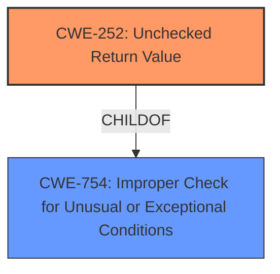

# Final Resolution for CVE-2021-0114

# Summary
| CWE ID  | CWE Name  | Confidence | CWE Abstraction Level | CWE Vulnerability Mapping Label | CWE-Vulnerability Mapping Notes |
|---|---|---|---|---|---|
| CWE-252 | Unchecked Return Value | 0.95 | Base  | Allowed | Primary CWE. The vulnerability description explicitly states "unchecked return value" as the **root cause**. Mitigations: Check return values, handle all possible return values, throw exceptions on errors. |
| CWE-754 | Improper Check for Unusual or Exceptional Conditions | 0.7 | Class | Allowed-with-Review | Secondary Candidate. Represents a broader category that encompasses the specific issue of unchecked return values. |

## Evidence and Confidence

*   **Confidence Score:** 0.95
*   **Evidence Strength:** HIGH

## Relationship Analysis
The primary relationship influencing the decision is the hierarchical relationship between CWE-754 and CWE-252. CWE-252 is a specific instance of CWE-754, which is a parent class. The analysis focuses on CWE-252 due to its direct relevance to the vulnerability description.

## Vulnerability Chain
The vulnerability chain starts with the **root cause**: an unchecked return value (CWE-252). This leads to a failure to handle unusual or exceptional conditions (CWE-754). The impact of this failure is a potential escalation of privilege, as stated in the vulnerability description.

## Summary of Analysis
The initial analysis correctly identifies CWE-252 (Unchecked Return Value) as the primary **weakness**. The vulnerability description explicitly mentions "unchecked return value" as the **root cause**, providing strong evidence. The criticism highlights several areas for improvement, including the consideration of CWE-427 (Uncontrolled Search Path Element) and the inclusion of mitigation guidance.

Regarding CWE-427, while a malicious actor could potentially place a library into the search path, this scenario is not explicitly described in the vulnerability description. The description focuses on the failure to check the return value, not on the loading of malicious libraries. Therefore, CWE-427 is not a direct fit.

The inclusion of mitigation guidance strengthens the analysis and provides actionable information for developers. The revised summary table incorporates mitigation strategies for CWE-252, such as checking return values, handling all possible return values, and throwing exceptions on errors.

The analysis also considers the relationship between CWE-252 and CWE-754 (Improper Check for Unusual or Exceptional Conditions). CWE-252 is a specific type of CWE-754. While CWE-754 is a valid secondary candidate, CWE-252 is more specific and directly addresses the **root cause** described in the vulnerability.

The final decision is to classify the vulnerability as CWE-252 (Unchecked Return Value) as the primary **weakness** and CWE-754 as a secondary candidate. This classification reflects the optimal level of specificity based on the available evidence and relationship analysis. Confidence is high (0.95) due to the explicit mention of "unchecked return value" as the **root cause** and the direct alignment with the CWE-252 description.