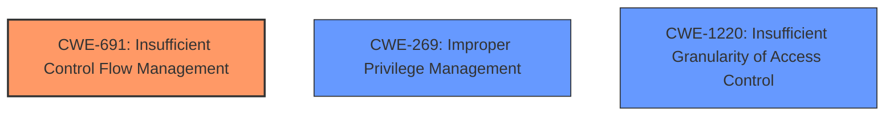

# Final Resolution for CVE-2021-0157

# Summary
| CWE ID | CWE Name | Confidence | CWE Abstraction Level | CWE Vulnerability Mapping Label | CWE-Vulnerability Mapping Notes |
|---|---|---|---|---|---|
| CWE-691 | Insufficient Control Flow Management | 0.6 | Pillar | Primary | Discouraged |
| CWE-269 | Improper Privilege Management | 0.3 | Class | Secondary Candidate | Discouraged |
| CWE-1220 | Insufficient Granularity of Access Control | 0.2 | Base | Secondary Candidate | Allowed |

## Evidence and Confidence

*   **Confidence Score:** 0.6
*   **Evidence Strength:** MEDIUM

## Relationship Analysis
The primary challenge is the high-level nature of CWE-691. There are no explicit relationships defined in the CWE database for CWE-691 or the other candidate CWEs, but there are implied hierarchical relationships. While more specific children of CWE-691 might exist, the provided evidence does not allow for a more granular classification.

## Vulnerability Chain
The vulnerability chain starts with **insufficient control flow management** (**CWE-691**) in the BIOS firmware, which allows a privileged user to escalate their privileges. The lack of proper privilege management (**CWE-269**) and insufficient granularity of access control (**CWE-1220**) contribute to the overall impact, but they are consequences rather than the **root cause**.

## Summary of Analysis
The initial analysis correctly identifies CWE-691 as the primary candidate due to the explicit mention of "**Insufficient control flow management**" in the vulnerability description. However, the criticism correctly points out the need to justify why a more specific CWE is not applicable. While CWE-691 is a Pillar, the available information does not allow for a more precise classification.
> The vulnerability description explicitly states "**Insufficient control flow management**" as the root cause in the BIOS firmware

The initial analysis also identifies CWE-269 and CWE-1220 as secondary candidates. However, both are less directly supported by the evidence. The "escalation of privilege" impact is more a consequence of the control flow issue rather than a direct flaw in privilege management or access control granularity.
> The vulnerability leads to an "**escalation of privilege**," indicating a potential flaw in privilege management.

The graph relationships, while limited in this case, highlight the need for a more specific CWE if possible. The absence of explicit relationships for CWE-691 suggests that the classification is at a high level of abstraction. The choice of CWE-691 is made because it is the most descriptive **root cause** identified in the vulnerability description, but the lack of detail prevents a more precise classification.

Given the available evidence, the final decision is to retain CWE-691 as the primary classification, but with a reduced confidence score of 0.6 due to its high-level nature. CWE-269 and CWE-1220 are retained as secondary candidates with even lower confidence scores (0.3 and 0.2 respectively) due to their indirect relevance.