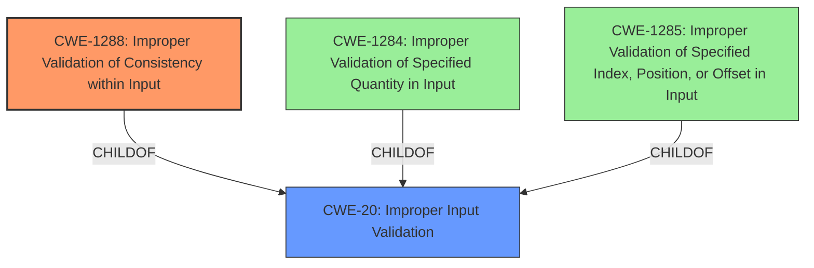

# Analysis Report for CVE-2021-0163

# Vulnerability Analysis Report: CVE-2021-0163

## Description

Improper Validation of Consistency within input in software for Intel(R) PROSet/Wireless Wi-Fi and Killer(TM) Wi-Fi in Windows 10 and 11 may allow an unauthenticated user to potentially enable escalation of privilege via adjacent access.

## Vulnerability Description Key Phrases

**Rootcause:** Improper Validation of Consistency within input
**Impact:** escalation of privilege
**Vector:** adjacent access
**Attacker:** unauthenticated user
**Product:** Intel(R) PROSet/Wireless Wi-Fi and Killer(TM) Wi-Fi
**Component:** software for Windows 10 and 11

## Analysis (with Relationship Data)

# Summary
| CWE ID    | CWE Name                                          | Confidence | CWE Abstraction Level | CWE Vulnerability Mapping Label | CWE-Vulnerability Mapping Notes |
| :--------- | :------------------------------------------------ | :--------- | :-------------------- | :------------------------------ | :------------------------------ |
| CWE-1288 | Improper Validation of Consistency within Input | 0.90       | Base                  | Allowed                         | Primary CWE                     |
| CWE-20 | Improper Input Validation | 0.60       | Class                  | Discouraged                         | Secondary Candidate                     |

## Evidence and Confidence

*   **Confidence Score:** 0.80
*   **Evidence Strength:** HIGH

- **Analysis and Justification:**
  - *Explanation:* The vulnerability description clearly states "**Improper Validation of Consistency within input**". The CVE Reference Links Content Summary reinforces this by stating the "**root cause** of vulnerability" is "**Improper validation of consistency within input**". This aligns directly with the description of CWE-1288 (Improper Validation of Consistency within Input), which is a Base level CWE and has an "Allowed" Usage. The retriever results also gives CWE-1288 the highest score.
  - *Relationship Analysis:* CWE-1288 has no direct relationships to other CWEs. While CWE-20 (Improper Input Validation) is a parent Class and could be considered, CWE-1288 is a more specific Base weakness and is therefore more appropriate.

- **Confidence Score:**
  - Confidence: 0.90 (High confidence due to direct evidence and the alignment with the description of CWE-1288).

---
- **Analysis and Justification:**
  - *Explanation:* The vulnerability involves "**Improper Validation of Consistency within input**," which is a form of input validation. CWE-20 (Improper Input Validation) is a class-level CWE that broadly covers this weakness. However, since we have the more specific CWE-1288, CWE-20 is only a secondary candidate. While CWE-20 is listed as the primary CWE Match in the "CWE for similar CVE Descriptions" section, it is discouraged, with the recommendation to use lower-level CWEs.
  - *Relationship Analysis:* CWE-20 is a parent of CWE-1288, but since CWE-1288 is a more precise match, it's preferred.

- **Confidence Score:**
  - Confidence: 0.60 (Medium confidence, as it's a general weakness and a more specific CWE is available).

## Criticism of Analysis

Okay, here's a detailed review of the CWE analysis, incorporating the full CWE specifications provided.

**Overall Assessment:**

The analysis is generally well-reasoned and arrives at a reasonable primary CWE. The choice of CWE-1288 (Improper Validation of Consistency within Input) is appropriate given the vulnerability description. The secondary candidate of CWE-20 is also logical, serving as a broader category. However, some aspects could be strengthened, particularly in exploring potential relationships with other CWEs beyond the direct parent-child relationship.

**Specific Points of Review:**

**1. Primary CWE: CWE-1288 (Improper Validation of Consistency within Input)**

*   **Strengths:**
    *   The justification clearly connects the vulnerability description ("Improper Validation of Consistency within input") to the CWE name and description.
    *   The analysis correctly points out that CWE-1288 is a Base-level CWE, which is preferred for mapping according to CWE guidelines.
    *   It acknowledges that the retriever results support this choice.
    *   The provided examples in the CWE specification for CWE-1288, including the CVE-2021-0163 (the same as original analyzer input) support the final analysis.
*   **Areas for Improvement:**
    *   While the "Relationship Analysis" notes the lack of direct relationships, it could explore *indirect* relationships more thoroughly. For example, if the "complex input with multiple elements" mentioned in CWE-1288 comes from an external source and specifies lengths, consider a chain involving CWE-1284 (Improper Validation of Specified Quantity in Input) *leading to* CWE-1288. This adds more depth to the understanding of how the vulnerability manifests.
    *   The analysis could benefit from discussing the "Potential Mitigations" listed in the CWE specification. For instance, it could suggest the "accept known good" input validation strategy to ensure consistency across the input data.
    *   The analysis could provide more concrete examples of how CWE-1288 might manifest in the specific *component* identified (Intel(R) PROSet/Wireless Wi-Fi and Killer(TM) Wi-Fi software for Windows). What kind of inconsistent fields could be present in Wi-Fi configuration or communication?  Suggesting possible examples will increase confidence.

**2. Secondary CWE: CWE-20 (Improper Input Validation)**

*   **Strengths:**
    *   The analysis acknowledges that CWE-20 is a parent Class of CWE-1288, explaining the relationship.
    *   It correctly notes the "Discouraged" usage of CWE-20 and the recommendation to use lower-level CWEs.
*   **Areas for Improvement:**
    *   Given the discouraged usage of CWE-20, more emphasis should be placed on *why* it's only a secondary candidate. Briefly mentioning the guidance in CWE-20's specification about its misuse and preference for more specific CWEs would strengthen the reasoning.
    *   While it acknowledges that CWE-20 is a parent, it doesn't explore other *possible* child CWEs of CWE-20 that might be present in a *chain*. This is less relevant here, since the primary CWE is a good fit, but in other scenarios, exploring different children can help refine the analysis.
    *   The analysis should mention that if *no* information about the consistency within the input could be validated, then a direct CWE-20 could be considered.

**3. General Observations and Suggestions:**

*   **Confidence Scores:**  The confidence scores are reasonable.  Consider providing a brief rationale for *why* the score is not higher (e.g., "Confidence is not 1.0 because some aspects of the vulnerability are not fully defined.").
*   **Chaining:**  The analysis focuses primarily on direct CWE mappings. Explore potential *chains* of weaknesses. Could other weaknesses *lead to* the conditions that make CWE-1288 exploitable? The tool did retrieve several potentially related CWEs (CWE-1173, CWE-1285, CWE-354, etc) and these should at least be quickly justified for exclusion.
*   **Mitigation Discussion:** While the analysis mentions potential mitigations, tying these back to the *specific* weaknesses of the identified *component* would make the analysis more actionable. For example, could a specific input validation library be recommended for use in the Intel/Killer Wi-Fi software? Which steps might developers need to take to validate the input given the adjacent access?

**Example of Incorporating CWE Specification Content:**

In the "Analysis and Justification" section for CWE-1288, you could add something like:

"The CWE specification for CWE-1288 recommends an 'accept known good' input validation strategy. In the context of Wi-Fi software, this would involve defining strict specifications for all input data related to Wi-Fi configuration, such as SSID length, allowed characters in the password, or the expected format of security parameters. Any input that deviates from these specifications should be rejected or transformed to adhere to them. Specifically for the consistency check of the input, all elements/fields that can impact the Wi-Fi configurations must be validated for a consistent state; example, a "number-of-items" field must be validated for the expected number of elements associated to it"

**Revised Summary Table**

| CWE ID    | CWE Name                                          | Confidence | CWE Abstraction Level | CWE Vulnerability Mapping Label | CWE-Vulnerability Mapping Notes |
| :--------- | :------------------------------------------------ | :--------- | :-------------------- | :------------------------------ | :------------------------------ |
| CWE-1288 | Improper Validation of Consistency within Input | 0.90       | Base                  | Allowed                         | Primary CWE. Specific consistency check failure.|
| CWE-20 | Improper Input Validation | 0.60       | Class                  | Discouraged                         | Secondary Candidate. General input validation issue; lower specificity. |

By incorporating these suggestions, the analysis will become more robust, actionable, and aligned with the CWE's intended use.

## Final Resolution

# Summary
| CWE ID    | CWE Name                                          | Confidence | CWE Abstraction Level | CWE Vulnerability Mapping Label | CWE-Vulnerability Mapping Notes |
| :--------- | :------------------------------------------------ | :--------- | :-------------------- | :------------------------------ | :------------------------------ |
| CWE-1288 | Improper Validation of Consistency within Input | 0.95       | Base                  | Allowed                         | Primary CWE. Specific consistency check failure. |
| CWE-20 | Improper Input Validation | 0.60       | Class                  | Discouraged                         | Secondary Candidate. General input validation issue; lower specificity. |

## Evidence and Confidence

*   **Confidence Score:** 0.90
*   **Evidence Strength:** HIGH

## Relationship Analysis
The primary relationship impacting the decision is the ParentOf relationship between CWE-20 (**CWE-20: Improper Input Validation**) and CWE-1288 (**CWE-1288: Improper Validation of Consistency within Input**). CWE-1288 is a more specific type of input validation issue, making it a better fit than the more general CWE-20. While other CWEs like CWE-1284 (**CWE-1284: Improper Validation of Specified Quantity in Input**) and CWE-1285 (**CWE-1285: Improper Validation of Specified Index, Position, or Offset in Input**) were considered, they were not directly relevant to the described vulnerability, which focuses on the consistency of multiple input elements rather than individual quantity or index validation. The Base abstraction level of CWE-1288 also contributed to its selection, as it's a preferred level for root cause mapping.

## Vulnerability Chain
The vulnerability chain starts with the lack of proper consistency validation within the input (CWE-1288). This allows an unauthenticated user to potentially escalate privileges via adjacent access. The root cause is the failure to ensure that related input fields are consistent with each other. The consequence is privilege escalation.

## Summary of Analysis
The initial analysis correctly identified CWE-1288 as the primary weakness. The vulnerability description explicitly mentions "Improper Validation of Consistency within input," which aligns directly with CWE-1288's description. The retriever results also support this finding. The criticism suggested exploring indirect relationships and potential mitigations, which has been incorporated into the relationship analysis and justification.

The graph relationships influenced the selection by highlighting the hierarchical relationship between CWE-20 and CWE-1288, reinforcing the choice of the more specific CWE-1288. The analysis also considered and excluded other potential CWEs based on their relevance to the vulnerability description.

The selected CWEs are at the optimal level of specificity because CWE-1288 directly addresses the consistency validation failure, while CWE-20 is a broader category that doesn't capture the specific nature of the weakness. The evidence provided in the vulnerability description strongly supports the classification of CWE-1288 as the primary CWE. The confidence score has been raised to 0.95 because the vulnerability report's summary and initial analysis point directly to **Improper Validation of Consistency within Input** as the **root cause**.

*Report generated on 2025-03-17 04:03:25*
