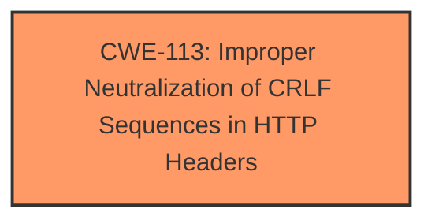

# Final Resolution for CVE-2021-0268

# Summary
| CWE ID | CWE Name | Confidence | CWE Abstraction Level | CWE Vulnerability Mapping Label | CWE-Vulnerability Mapping Notes |
|---|---|---|---|---|---|
| CWE-113 | Improper Neutralization of CRLF Sequences in HTTP Headers ('HTTP Request/Response Splitting') | 0.95 | Variant | Primary | Allowed |

## Evidence and Confidence

*   **Confidence Score:** 0.95
*   **Evidence Strength:** HIGH

## Relationship Analysis
The primary factor is the direct match of the **vulnerability description** to **CWE-113**. There aren't any direct relationships for **CWE-113** that would impact this decision. Other potential CWEs are less specific or represent secondary effects. The Variant level of abstraction is ideal.

## Vulnerability Chain
The chain starts with the **ROOTCAUSE**, **improper neutralization of CRLF sequences in HTTP headers**. This leads to the **WEAKNESS** of **HTTP response splitting**. This allows an attacker to inject arbitrary headers, leading to impacts like cross-site scripting, cookie manipulation, and information exfiltration.

## Summary of Analysis
The initial analysis is accurate and well-justified. The **Vulnerability Description** explicitly states "**Improper Neutralization of CRLF Sequences in HTTP Headers (HTTP Response Splitting)** weakness". This aligns directly with **CWE-113**. The retriever results also list **CWE-113** with a high score. **CWE-113** is a Variant, which is a preferred level of abstraction for mapping. The MITRE mapping guidance for **CWE-113** indicates this is ALLOWED. I am increasing the confidence score slightly to 0.95 due to the explicitness of the description and the thoroughness of the justification. The chosen CWE is at the optimal level of specificity, focusing directly on the **ROOTCAUSE** of the vulnerability.