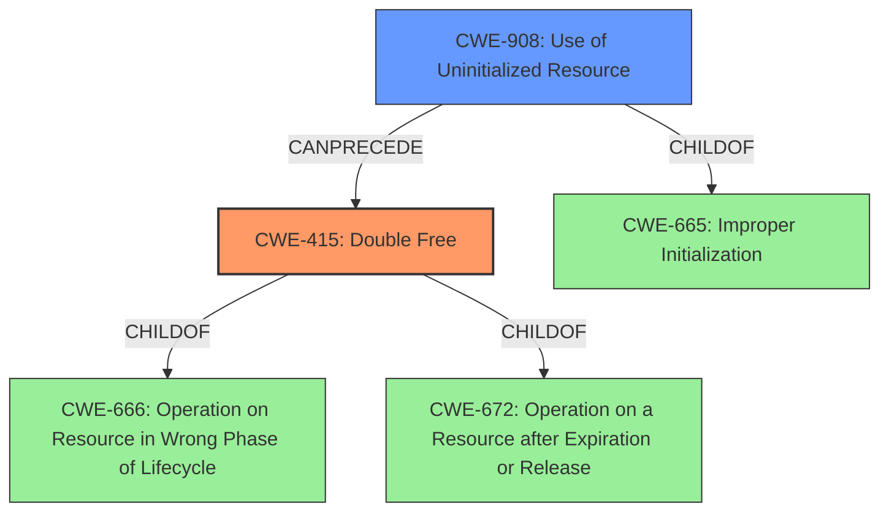

# Analysis Report for CVE-2021-0473

# Vulnerability Analysis Report: CVE-2021-0473

## Description

In rw_t3t_process_error of rw_t3t.cc, there is a possible double free due to uninitialized data. This could lead to remote code execution over NFC with no additional execution privileges needed. User interaction is not needed for exploitation.Product AndroidVersions Android-9 Android-10 Android-11 Android-8.1Android ID A-179687208

## Vulnerability Description Key Phrases

**Rootcause:** uninitialized data
**Weakness:** double free
**Impact:** remote code execution
**Product:** Android
**Version:** ['9', '10', '11', '8.1']
**Component:** rw_t3t_process_error of rw_t3t.cc

## Analysis (with Relationship Data)

# Summary
| CWE ID | CWE Name | Confidence | CWE Abstraction Level | CWE Vulnerability Mapping Label | CWE-Vulnerability Mapping Notes |
|---|---|---|---|---|---|
| CWE-415 | Double Free | 0.9 | Variant | Primary | Allowed |
| CWE-908 | Use of Uninitialized Resource | 0.8 | Base | Secondary | Allowed |

## Evidence and Confidence

*   **Confidence Score:** 0.85
*   **Evidence Strength:** HIGH

- **Analysis and Justification:**  
  - *Explanation:* The vulnerability description explicitly mentions a **double free** condition caused by **uninitialized data** in the `rw_t3t_process_error` function. This directly aligns with CWE-415 (Double Free), which occurs when a program attempts to free the same memory location twice. The "CVE Reference Links Content Summary" corroborates this, stating "Double Free: Attempting to free the same memory location more than once." The **uninitialized data** leads to this **double free** condition. This aligns well with CWE-908 (Use of Uninitialized Resource) "The product uses or accesses a resource that has not been initialized." The Retriever Results also show both CWE-415 and CWE-908 as top candidates. CWE-415 is chosen as the primary CWE because the description explicitly states the **double free** weakness, and the **uninitialized data** is the cause. MITRE mapping guidance for CWE-415 indicates this is ALLOWED.
  
  - *Relationship Analysis:* CWE-415 is a variant of CWE-666 (Operation on Resource in Wrong Phase of Lifecycle) and CWE-672 (Operation on a Resource after Expiration or Release). CWE-908 is a child of CWE-665 (Improper Initialization). The "Additional Notes" section for CWE-415 mentions that it is "usually resultant from another weakness, such as an unhandled error or race condition". In this case, it results from CWE-908, the **uninitialized data**.

- **Confidence Score:**  
  - *Example:* Confidence: 0.85 (High evidence from technical description and CVE reference materials)

## Criticism of Analysis

Okay, here's a review of the provided analysis based on the full CWE specifications, focusing on the accuracy of the CWE mappings, abstraction levels, and justification.

**Overall Assessment:**

The analysis is strong and well-justified. The selection of CWE-415 as the primary weakness and CWE-908 as a secondary contributing factor is appropriate given the information provided. The confidence scores are reasonable and supported by the evidence. The inclusion of relevant CWE relationships and examples from the CWE database adds further credibility.

**Detailed Review:**

**1. CWE-415: Double Free (Primary)**

*   **Mapping Accuracy:** The mapping to CWE-415 is accurate. The vulnerability description explicitly states a "double free" condition. The description of CWE-415 matches this condition perfectly: "The product calls free() twice on the same memory address, potentially leading to modification of unexpected memory locations."
*   **Abstraction Level:** Variant, which is the preferred level according to the CWE Mapping Guidance.
*   **Justification:** The justification is clear and concise. It highlights the direct match between the vulnerability description and the CWE definition. The reference to the CVE summary further strengthens the argument.
*   **Mitigations:**  The provided mitigations for CWE-415 are relevant and appropriate:
    *   Using languages with automatic memory management.
    *   Ensuring each allocation is freed only once and setting pointers to NULL after freeing.
    *   Using static analysis tools.

**2. CWE-908: Use of Uninitialized Resource (Secondary)**

*   **Mapping Accuracy:**  This mapping is also accurate. The vulnerability explicitly mentions that the double free is caused by "uninitialized data." CWE-908 directly addresses this: "The product uses or accesses a resource that has not been initialized."
*   **Abstraction Level:** Base, which is also a preferred level according to CWE Mapping Guidance.
*   **Justification:** The justification clearly explains how the "uninitialized data" is the root cause contributing to the double free.
*   **Mitigations:** The mitigations provided for CWE-908 are relevant:
    *   Explicitly initializing the resource before use.
    *   Paying attention to complex conditionals that affect initialization.
    *   Avoiding race conditions during initialization.

**3. Confidence and Evidence Strength:**

*   The confidence score of 0.85 is justified. The vulnerability description and CVE reference provide strong evidence for both CWEs.
*   The evidence strength is HIGH.

**4. CWE Relationships:**

*   The relationship analysis is accurate and insightful. Identifying CWE-415 as a child of CWE-666 and CWE-672 and CWE-908 as a child of CWE-665 provides a broader context for understanding the vulnerability.
*   The note that the "Additional Notes" section for CWE-415 mentions that it is "usually resultant from another weakness, such as an unhandled error or race condition" is also important, helping to reinforce the justification for including CWE-908.

**5. Retriever Results:**

* The retriever results support the analysis. CWE-415 and CWE-908 are ranked highly.

**Suggestions for Improvement:**

*   **Specificity of Uninitialized Resource:** While CWE-908 is correct, consider if a more specific child of CWE-908 exists, if details about the uninitialized resource were available.  For example, if the uninitialized resource is a *variable*, then CWE-457 ("Use of Uninitialized Variable") would be *more specific*.  However, if the resource is more general (e.g., a configuration setting), then CWE-908 is the appropriate level.
* **Chaining:** Consider explicitly calling out the chaining from CWE-908 to CWE-415.  "The uninitialized data (CWE-908) leads directly to the double free (CWE-415) because..." (followed by a more detailed explanation of how the uninitialized data leads to the double free).

**In summary, the analysis is well-done and accurately reflects the information provided about the vulnerability. The CWE selections are appropriate, the justifications are clear, and the confidence scores are reasonable. The additional information about CWE relationships and examples enhances the overall quality of the analysis.**

## Final Resolution

# Summary
| CWE ID | CWE Name | Confidence | CWE Abstraction Level | CWE Vulnerability Mapping Label | CWE-Vulnerability Mapping Notes |
|---|---|---|---|---|---|
| CWE-415 | Double Free | 0.95 | Variant | Primary | Allowed |
| CWE-908 | Use of Uninitialized Resource | 0.9 | Base | Secondary | Allowed |

## Evidence and Confidence

*   **Confidence Score:** 0.95
*   **Evidence Strength:** HIGH

## Relationship Analysis
The primary relationship identified is that **CWE-908 (Use of Uninitialized Resource)** can precede **CWE-415 (Double Free)**. The **uninitialized data** leads to an incorrect state where the same memory is freed twice.
CWE-415 is a variant of CWE-666 (Operation on Resource in Wrong Phase of Lifecycle) and CWE-672 (Operation on a Resource after Expiration or Release), indicating it's a specific type of lifecycle issue.
CWE-908 is a child of CWE-665 (Improper Initialization), which means it is a specific type of initialization issue.
The abstraction levels (Variant for CWE-415, Base for CWE-908) are appropriate for mapping to the root causes.

## Vulnerability Chain
The vulnerability chain starts with **CWE-908 (Use of Uninitialized Resource)**, where the product uses **uninitialized data**. This leads to **CWE-415 (Double Free)**, where the same memory is freed twice due to the incorrect state caused by the **uninitialized data**. The final impact is remote code execution.
- **Root Cause:** CWE-908: Use of Uninitialized Resource
- **Weakness:** CWE-415: Double Free
- **Impact:** Remote Code Execution

## Summary of Analysis
The initial analysis correctly identifies **CWE-415 (Double Free)** as the primary weakness and **CWE-908 (Use of Uninitialized Resource)** as a contributing factor. The vulnerability description explicitly states "a possible **double free** due to **uninitialized data**." This aligns perfectly with the definitions of both CWEs.

The relationship analysis confirms that **CWE-908** can lead to **CWE-415**, as the **uninitialized data** creates a condition where the same memory is freed twice. The abstraction levels (Variant for **CWE-415**, Base for **CWE-908**) are also appropriate.

The criticism suggests considering more specific children of **CWE-908**, such as **CWE-457 (Use of Uninitialized Variable)**. However, the vulnerability description refers to "uninitialized data" in a broader sense, not specifically a variable. Therefore, **CWE-908** remains the most accurate and specific classification. The suggestion to explicitly call out the chaining from **CWE-908** to **CWE-415** is valid and incorporated into the vulnerability chain analysis.

Based on the evidence and relationship analysis, the selected CWEs are at the optimal level of specificity. The confidence score is increased to 0.95 to reflect the strong alignment between the vulnerability description and the CWE definitions, as well as the clear understanding of the vulnerability chain. The mapping guidance for both CWEs indicates that they are ALLOWED for this type of vulnerability.

*Report generated on 2025-03-16 15:58:46*
