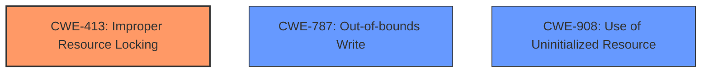

# Final Resolution for CVE-2021-0529

# Summary
| CWE ID | CWE Name | Confidence | CWE Abstraction Level | CWE Vulnerability Mapping Label | CWE-Vulnerability Mapping Notes |
|---|---|---|---|---|---|
| CWE-413 | Improper Resource Locking | 0.85 | Base | Allowed | Primary CWE |
| CWE-787 | Out-of-bounds Write | 0.55 | Base | Allowed | Secondary Candidate |
| CWE-908 | Use of Uninitialized Resource | 0.55 | Base | Allowed | Secondary Candidate |

## Evidence and Confidence

*   **Confidence Score:** 0.80
*   **Evidence Strength:** HIGH

## Relationship Analysis
The primary CWE is CWE-413 (**Improper Resource Locking**), which directly stems from the description mentioning "improper locking". The secondary candidates, CWE-787 (**Out-of-bounds Write**) and CWE-908 (**Use of Uninitialized Resource**), are considered because they represent potential consequences of memory corruption, but are less directly supported by the initial description. There is no direct parent or child relationships between the selected CWEs.

## Vulnerability Chain
The vulnerability chain starts with **improper locking** (CWE-413), leading to potential **memory corruption**. This corruption can manifest as an **out-of-bounds write** (CWE-787) or the **use of an uninitialized resource** (CWE-908). The initial flaw is the locking issue, while the **memory corruption** is a symptom.

## Summary of Analysis
The initial analysis and criticism were well-reasoned. The primary CWE, CWE-413, is strongly supported by the direct mention of "improper locking" in the vulnerability description. The confidence in CWE-413 remains high at 0.85. The criticism correctly pointed out that the confidence levels for secondary candidates should be adjusted based on direct evidence. Based on this, the confidence score for CWE-787 and CWE-908 are lowered to 0.55, as these are potential causes of memory corruption but not explicitly stated in the vulnerability description. The decision to keep them as secondary candidates is based on the fact that **memory corruption** is mentioned and these are common causes of it.

The graph relationships influenced the decision by highlighting the lack of direct connections between the selected CWEs, emphasizing that the secondary candidates are potential consequences of the primary weakness rather than directly related causes. The selection of Base level CWEs (CWE-413, CWE-787, CWE-908) ensures optimal specificity, as recommended by MITRE's mapping guidance.