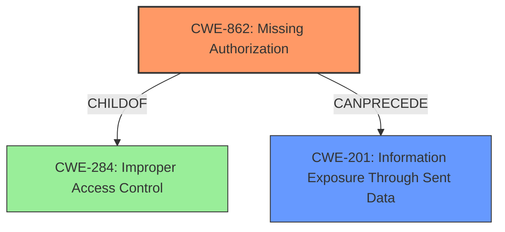

# Final Resolution for CVE-2021-0590

# Summary
| CWE ID | CWE Name | Confidence | CWE Abstraction Level | CWE Vulnerability Mapping Label | CWE-Vulnerability Mapping Notes |
|---|---|---|---|---|---|
| **CWE-862** | **Missing Authorization** | 0.75 | Class | Primary CWE | Allowed-with-Review |
| **CWE-201** | **Information Exposure Through Sent Data** | 0.6 | Base | Secondary Candidate | Allowed |

## Evidence and Confidence

*   **Confidence Score:** 0.75
*   **Evidence Strength:** HIGH

## Relationship Analysis
The primary relationship is between CWE-284 (Improper Access Control), which is a Pillar, and CWE-862 (**Missing Authorization**), which is a child Class of CWE-284. The analysis correctly identifies CWE-862 as the more specific and appropriate choice. CWE-201 (**Information Exposure Through Sent Data**) represents the impact of the **missing authorization**, forming a chain where the absence of authorization leads to the exposure of sensitive information. The abstraction levels influenced the decision to move from the high-level CWE-284 to the more specific CWE-862.

## Vulnerability Chain
The vulnerability chain starts with the **ROOTCAUSE**, a **missing permission check** (CWE-862), which leads to the **WEAKNESS** of sensitive data (WiFi BSSID and SSID) being transmitted without proper authorization. This results in the **IMPACT** of local information disclosure (CWE-201). The chain highlights how the absence of a permission check directly enables the unauthorized access and transmission of sensitive data.

## Summary of Analysis
The initial analysis and criticism both correctly identify that the **missing permission check** is the core issue. The vulnerability description states "a possible way for a privileged app to receive WiFi BSSID and SSID without location permissions due to a **missing permission check**." This is direct evidence supporting the choice of CWE-862 (**Missing Authorization**) as the primary CWE. The graph relationships confirm that CWE-862 is a more specific child of the broader CWE-284, making it a better fit. The selection of CWE-862 is at the optimal level of specificity, accurately reflecting the root cause of the vulnerability. The retriever results are not useful and need to be retrained.