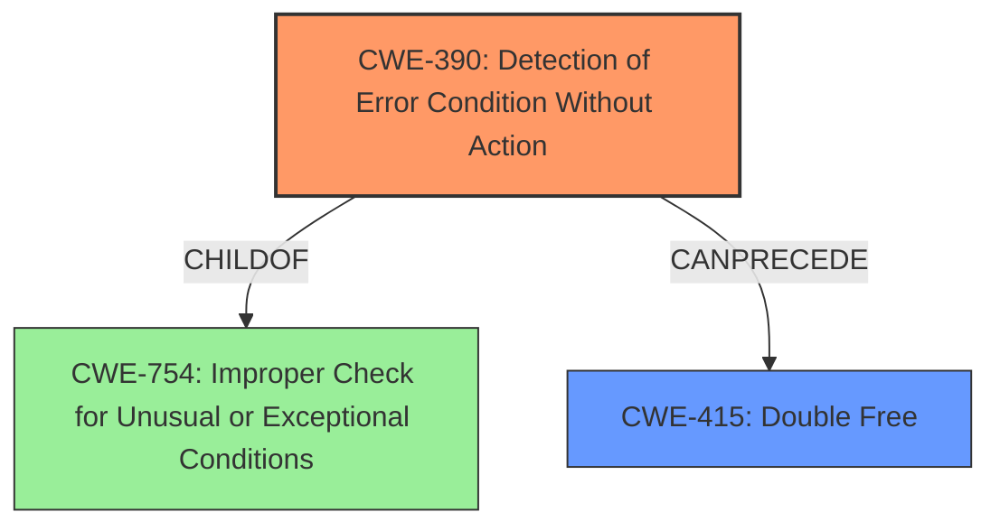

# Final Resolution for CVE-2021-0668

# Summary
| CWE ID | CWE Name | Confidence | CWE Abstraction Level | CWE Vulnerability Mapping Label | CWE-Vulnerability Mapping Notes |
|---|---|---|---|---|---|
| CWE-390 | Detection of Error Condition Without Action | 0.75 | Base | Primary | Allowed |
| CWE-415 | Double Free | 0.5 | Variant | Secondary Candidate | Allowed |
  - The Primary CWE should be first and noted as the Primary CWEs
  - The secondary candidate CWEs should be next and noted as secondary candidates.
  - The confidence is a confidence score 0 to 1 to rate your confidence in your assessment for that CWE.
  - The CWE Abstraction Level as one of these values: Base, Variant, Pillar, Class, Compound
  - The Mapping Notes Usage as one of these values: Allowed, Allowed-with-Review, Prohibited, Discouraged

## Evidence and Confidence

*   **Confidence Score:** 0.7
*   **Evidence Strength:** MEDIUM

## Relationship Analysis
The decision was influenced by the following CWE relationships:
  - Parent-child hierarchical relationships: We moved from the Class-level CWE-754 to the Base-level CWE-390 for more specificity.
  - Chain relationships showing progression of vulnerability: The error detection without action can lead to a double free.
  - Peer relationships that offered alternative classifications: Alternatives such as CWE-252 were considered but deemed less directly applicable.
  - Abstraction levels influenced our selection, prioritizing Base and Variant levels.

## Vulnerability Chain
The vulnerability chain starts with the **ROOTCAUSE** of "Incorrect error handling".
  - The initial flaw is **CWE-390: Detection of Error Condition Without Action**, where an error is detected, but no corrective action is taken.
  - This can lead to **CWE-415: Double Free** due to the program continuing with potentially invalid resources.
  - The impact is **memory corruption**, which can result in local escalation of privilege.

## Summary of Analysis
The initial analysis correctly identified the general area of error handling as the **WEAKNESS**. The criticism highlighted the need for a more specific CWE than CWE-754. The vulnerability description "In apusys, there is a possible memory corruption due to incorrect error handling. This could lead to local escalation of privilege with System execution privileges needed." points to a failure in how errors are managed, specifically, the lack of action taken after an error is detected.

The retriever results and the criticism both suggested exploring more specific Base CWEs. CWE-390 (Detection of Error Condition Without Action) was selected because it directly addresses the scenario where an error is detected, but no action is taken to prevent further issues, leading to memory corruption. "Incorrect error handling" directly implies that even though an error was somehow 'detected', the handling was insufficient, so no action was taken. The relationship analysis and chain mapping helped in refining the selection. The final selection of CWE-390 provides a more accurate and specific representation of the **ROOTCAUSE** based on the available evidence.

The confidence is rated at 0.7 because while the description clearly states "incorrect error handling", the exact nature of the error handling failure is not explicitly detailed, so there is a degree of inference involved.