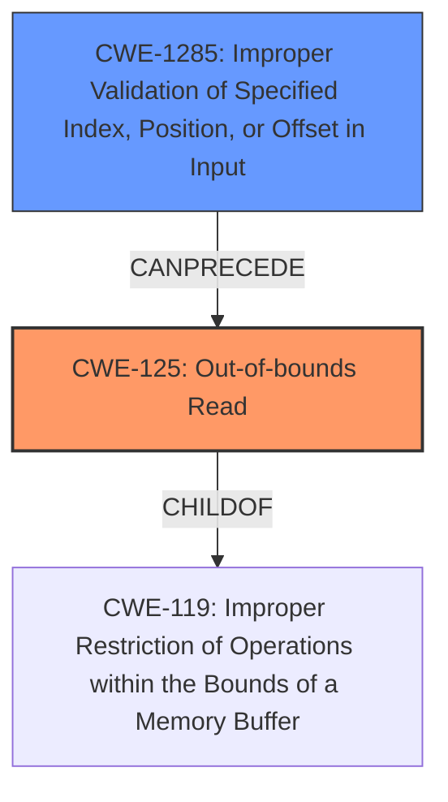

# Final Resolution for CVE-2021-0676

# Summary
| CWE ID | CWE Name | Confidence | CWE Abstraction Level | CWE Vulnerability Mapping Label | CWE-Vulnerability Mapping Notes |
|---|---|---|---|---|---|
| CWE-125 | Out-of-bounds Read | 1.0 | Base | Allowed | Primary CWE |
| CWE-1285 | Improper Validation of Specified Index, Position, or Offset in Input | 0.7 | Base | Allowed | Secondary Candidate |

## Evidence and Confidence

*   **Confidence Score:** 0.9
*   **Evidence Strength:** HIGH

## Relationship Analysis
The primary relationship impacting the decision is the chain relationship between CWE-1285 and CWE-125. CWE-1285 (Improper Validation of Specified Index, Position, or Offset in Input) *CanPrecede* CWE-125 (Out-of-bounds Read). The analysis also considered CWE-119 (Improper Restriction of Operations within the Bounds of a Memory Buffer), but correctly determined that CWE-125 is a more specific and appropriate classification. The abstraction levels of Base for both CWE-125 and CWE-1285 provide the right level of granularity for mapping the root cause of this vulnerability.

## Vulnerability Chain
The vulnerability chain starts with **CWE-1285 (Improper Validation of Specified Index, Position, or Offset in Input)**, where the index/position/offset is not correctly validated. This leads to **CWE-125 (Out-of-bounds Read)**, where the product reads data past the end, or before the beginning, of the intended buffer. The final impact is local information disclosure.

## Summary of Analysis
The initial analysis and criticism both agree that CWE-125 and CWE-1285 are appropriate. The vulnerability description states "there is a possible **out of bounds read** due to an **incorrect bounds check**." This clearly indicates both the **out of bounds read** (CWE-125) and the **incorrect bounds check** (CWE-1285). The criticism suggests explicitly addressing why CWE-119 is not the best fit, which is valid, as CWE-119 is a more general class. The chain relationship between CWE-1285 and CWE-125 is also a key factor in confirming this classification. The selected CWEs are at the optimal level of specificity, providing a clear and accurate representation of the **rootcause** and weakness. The retriever scores also support the selection of these CWEs. I'm confident in this assessment as the direct match to the vulnerability description and the relationship analysis both strongly support this classification.