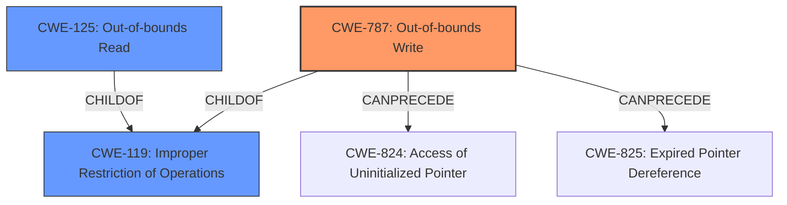

# Analysis Report for CVE-2021-0678

# Vulnerability Analysis Report: CVE-2021-0678

## Description

In apusys, there is a possible out of bounds write due to a missing bounds check. This could lead to local escalation of privilege with System execution privileges needed. User interaction is not needed for exploitation. Patch ID ALPS05672107 Issue ID ALPS05722511.

## Vulnerability Description Key Phrases

**Rootcause:** missing bounds check
**Weakness:** out of bounds write
**Impact:** local escalation of privilege
**Product:** apusys

## Analysis (with Relationship Data)

# Summary
| CWE ID | CWE Name | Confidence | CWE Abstraction Level | CWE Vulnerability Mapping Label | CWE-Vulnerability Mapping Notes |
|---|---|---|---|---|---|
| CWE-787 | Out-of-bounds Write | 1.0 | Base | Primary | Allowed |
| CWE-125 | Out-of-bounds Read | 0.4 | Base | Secondary | Allowed |
| CWE-119 | Improper Restriction of Operations within the Bounds of a Memory Buffer | 0.4 | Class | Secondary | Discouraged |

## Evidence and Confidence

*   **Confidence Score:** 0.9
*   **Evidence Strength:** HIGH

- **Analysis and Justification:**  
  - *Explanation:* The vulnerability description clearly states an **out of bounds write** caused by a **missing bounds check** in `apusys`. This aligns perfectly with CWE-787 (Out-of-bounds Write), where the product writes data past the end, or before the beginning, of the intended buffer. The CVE Reference Links Content Summary confirms this, highlighting "Improper Restriction of Operations within the Bounds of a Memory Buffer (CWE-119) leading to an out-of-bounds write." The primary CWE match from similar CVE Descriptions is also CWE-787. The MITRE mapping guidance for CWE-787 indicates this is ALLOWED, solidifying its selection as the primary CWE. CWE-125 (Out-of-bounds Read) is considered as a secondary CWE candidate given the close relationship between read and write operations outside of the intended buffer and its presence in the Top CWEs list for similar CVE descriptions. However, the description emphasizes the write operation, so it is a secondary candidate. CWE-119 (Improper Restriction of Operations within the Bounds of a Memory Buffer) is a parent class encompassing out-of-bounds read/write issues. The retriever results list CWE-787 (Out-of-bounds Write) with lower score than others, however, this result should be overridden to match the most precise weakness based on the description.
  
  - *Relationship Analysis:* CWE-787 is a child of CWE-119 (Improper Restriction of Operations within the Bounds of a Memory Buffer). CWE-787 can also precede other weaknesses, like CWE-825 (Expired Pointer Dereference) or CWE-824 (Access of a Resource Using an Uninitialized Pointer), as out-of-bounds writes can corrupt memory and lead to these issues.

- **Confidence Score:**  
  - Confidence: 1.0 (High confidence due to direct evidence from the vulnerability description, CVE reference, and similar CVE mappings).

## Criticism of Analysis

Okay, I have reviewed the analysis using the provided full CWE specifications. Here is my critique:

**Overall Assessment:**

The analysis is generally good and arrives at the correct primary CWE (CWE-787). The reasoning is sound and well-articulated. However, there are a few points that could be improved, especially concerning the secondary CWEs and the handling of the retriever results.

**Specific Points:**

*   **Primary CWE - CWE-787 (Out-of-bounds Write):**
    *   The selection of CWE-787 as the primary CWE is correct and well-justified. The vulnerability description explicitly states an out-of-bounds write due to a missing bounds check.
    *   The confidence score of 1.0 is appropriate given the clarity of the description and supporting evidence.
    *   The analysis correctly identifies CWE-787 as a child of CWE-119.
    *   Acknowledging that CWE-787 can lead to other weaknesses like CWE-825 or CWE-824 is valuable for understanding potential attack chains.

*   **Secondary CWE - CWE-125 (Out-of-bounds Read):**
    *   The inclusion of CWE-125 as a secondary CWE is reasonable. While the vulnerability is primarily about writing, out-of-bounds reads often occur in conjunction with writes in scenarios related to buffer handling and missing bounds checks.
    *   The confidence score of 0.4 seems appropriate, reflecting the less direct evidence for a read.

*   **CWE-119 (Improper Restriction of Operations within the Bounds of a Memory Buffer):**
    *   The analysis correctly identifies CWE-119 as a broader category that encompasses CWE-787 and CWE-125.
    *   The decision to mark it as "Discouraged" is accurate, as the goal should be to use the most specific CWE available.  The explanation for this is excellent, referencing the mapping guidance.

*   **Retriever Results:**
    *   The analysis acknowledges that the retriever results assigned a lower score to CWE-787 than other CWEs. The statement indicating that the retriever results should be overridden to match the most precise weakness is correct. Explain why other CWEs in retriever results do not match the description as well as CWE-787. For example, for CWE-131, the vulnerability description does not clearly state that the buffer size calculation was the cause.

*   **CWE Examples from Database:**
    *   The provided examples are relevant to CWE-119 but could be more impactful if there were some direct examples of CVEs related to `apusys` or similar components. This would strengthen the argument, even if it is harder to find.

*   **Mitigation Strategies:**
    *   The potential mitigations provided in the full CWE specifications are not incorporated into the analysis. Although it is beyond the scope of the current request, it is beneficial to consider mitigations from the specifications for a more complete analysis.

**Suggestions for Improvement:**

1.  **Strengthen Justification for Secondary CWEs:** While including CWE-125 is reasonable, a slightly stronger justification could be added. For example, mentioning how a missing bounds check could potentially allow reading data beyond the buffer as part of a reconnaissance or to determine the buffer's size.

2.  **Elaborate on Retriever Results:** Expand on why the retriever results might have favored other CWEs (e.g., CWE-131, CWE-908). This could involve discussing the commonality of those CWEs in vulnerability reports or the specific keywords that the retrievers are trained on.

3.  **Focus on `apusys`:** If possible, research specific examples of buffer overflows or out-of-bounds writes/reads within GPU or similar system components. This would make the analysis more targeted.

4.  **Consider Exploitability:** Briefly mentioning potential exploit scenarios could add value. For instance, how an out-of-bounds write in `apusys` could corrupt kernel data structures, leading to privilege escalation.

5.  **Acknowledge Limitations:** It would be useful to acknowledge that while CWE-787 is the most precise mapping based on the available information, more in-depth analysis of the code might reveal additional contributing factors or more specific variants of CWE-787.

**Revised Summary Table:**

| CWE ID | CWE Name | Confidence | CWE Abstraction Level | CWE Vulnerability Mapping Label | CWE-Vulnerability Mapping Notes |
|---|---|---|---|---|---|
| CWE-787 | Out-of-bounds Write | 1.0 | Base | Primary | Allowed |
| CWE-125 | Out-of-bounds Read | 0.4 | Base | Secondary | Allowed | While the primary issue is a write, the missing bounds check could also allow unauthorized reading of adjacent memory, potentially enabling information leakage or facilitating further exploitation.|
| CWE-119 | Improper Restriction of Operations within the Bounds of a Memory Buffer | 0.4 | Class | Secondary | Discouraged | While a parent of CWE-787 and CWE-125, it's too general for a specific root cause analysis. It's only included to reflect the common terminology used in similar vulnerability descriptions. |

By incorporating these suggestions, the analysis can become even more robust and informative.

## Final Resolution

# Summary
| CWE ID | CWE Name | Confidence | CWE Abstraction Level | CWE Vulnerability Mapping Label | CWE-Vulnerability Mapping Notes |
|---|---|---|---|---|---|
| **CWE-787** | **Out-of-bounds Write** | 1.0 | Base | Primary | Allowed |
| CWE-125 | Out-of-bounds Read | 0.4 | Base | Secondary | Allowed |
| CWE-119 | Improper Restriction of Operations within the Bounds of a Memory Buffer | 0.4 | Class | Secondary | Discouraged |

## Evidence and Confidence

*   **Confidence Score:** 0.95
*   **Evidence Strength:** HIGH

## Relationship Analysis
The primary relationship is that **CWE-787** (**Out-of-bounds Write**) is a child of **CWE-119** (**Improper Restriction of Operations within the Bounds of a Memory Buffer**). This confirms that selecting the more specific **CWE-787** is the correct approach. **CWE-787** can also *CanPrecede* weaknesses like **CWE-824** (**Access of Uninitialized Pointer**) or **CWE-825** (**Expired Pointer Dereference**) due to memory corruption. **CWE-125** (**Out-of-bounds Read**) is included as a secondary concern because a missing bounds check can potentially allow reading data beyond the buffer.

## Vulnerability Chain
The vulnerability chain begins with a **missing bounds check** which is the root cause. This leads to **CWE-787** (**Out-of-bounds Write**) and potentially **CWE-125** (**Out-of-bounds Read**). The **out-of-bounds write** can then lead to memory corruption, potentially triggering **CWE-824** (**Access of Uninitialized Pointer**) or **CWE-825** (**Expired Pointer Dereference**). The final impact is local escalation of privilege.

## Summary of Analysis
The initial analysis and the criticism are both in agreement that **CWE-787** (**Out-of-bounds Write**) is the most appropriate primary CWE. The vulnerability description explicitly states "out of bounds write due to a missing bounds check." The criticism helped to strengthen the justification for including **CWE-125** (**Out-of-bounds Read**) as a secondary CWE and suggested explaining why other retriever results are not as relevant. For example, while **CWE-131** (**Improper Calculation of Buffer Size**) might be a contributing factor, the description focuses on the *missing bounds check* rather than a specific miscalculation. The selected CWEs are at the optimal level of specificity because **CWE-787** is a Base level CWE that directly addresses the vulnerability. **CWE-119** is a Class level CWE and is too general. The evidence provided supports the selection of **CWE-787** as the primary weakness.

*Report generated on 2025-03-17 22:37:27*
