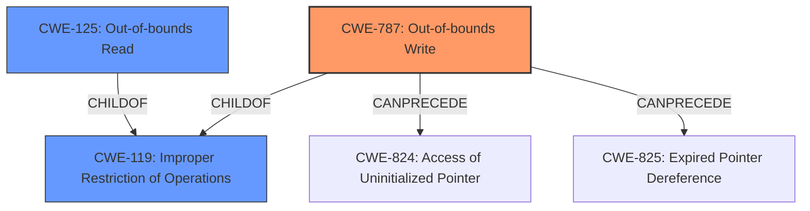

# Final Resolution for CVE-2021-0678

# Summary
| CWE ID | CWE Name | Confidence | CWE Abstraction Level | CWE Vulnerability Mapping Label | CWE-Vulnerability Mapping Notes |
|---|---|---|---|---|---|
| **CWE-787** | **Out-of-bounds Write** | 1.0 | Base | Primary | Allowed |
| CWE-125 | Out-of-bounds Read | 0.4 | Base | Secondary | Allowed |
| CWE-119 | Improper Restriction of Operations within the Bounds of a Memory Buffer | 0.4 | Class | Secondary | Discouraged |

## Evidence and Confidence

*   **Confidence Score:** 0.95
*   **Evidence Strength:** HIGH

## Relationship Analysis
The primary relationship is that **CWE-787** (**Out-of-bounds Write**) is a child of **CWE-119** (**Improper Restriction of Operations within the Bounds of a Memory Buffer**). This confirms that selecting the more specific **CWE-787** is the correct approach. **CWE-787** can also *CanPrecede* weaknesses like **CWE-824** (**Access of Uninitialized Pointer**) or **CWE-825** (**Expired Pointer Dereference**) due to memory corruption. **CWE-125** (**Out-of-bounds Read**) is included as a secondary concern because a missing bounds check can potentially allow reading data beyond the buffer.

## Vulnerability Chain
The vulnerability chain begins with a **missing bounds check** which is the root cause. This leads to **CWE-787** (**Out-of-bounds Write**) and potentially **CWE-125** (**Out-of-bounds Read**). The **out-of-bounds write** can then lead to memory corruption, potentially triggering **CWE-824** (**Access of Uninitialized Pointer**) or **CWE-825** (**Expired Pointer Dereference**). The final impact is local escalation of privilege.

## Summary of Analysis
The initial analysis and the criticism are both in agreement that **CWE-787** (**Out-of-bounds Write**) is the most appropriate primary CWE. The vulnerability description explicitly states "out of bounds write due to a missing bounds check." The criticism helped to strengthen the justification for including **CWE-125** (**Out-of-bounds Read**) as a secondary CWE and suggested explaining why other retriever results are not as relevant. For example, while **CWE-131** (**Improper Calculation of Buffer Size**) might be a contributing factor, the description focuses on the *missing bounds check* rather than a specific miscalculation. The selected CWEs are at the optimal level of specificity because **CWE-787** is a Base level CWE that directly addresses the vulnerability. **CWE-119** is a Class level CWE and is too general. The evidence provided supports the selection of **CWE-787** as the primary weakness.