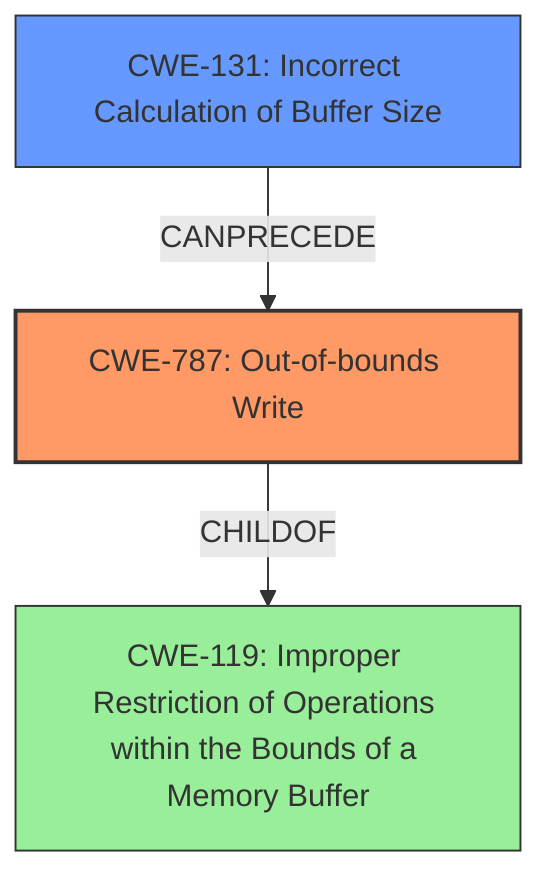

# Analysis Report for CVE-2021-0895

# Vulnerability Analysis Report: CVE-2021-0895

## Description

In apusys, there is a possible out of bounds write due to a missing bounds check. This could lead to local escalation of privilege with System execution privileges needed. User interaction is not needed for exploitation. Patch ID ALPS05672107 Issue ID ALPS05672003.

## Vulnerability Description Key Phrases

**Rootcause:** missing bounds check
**Weakness:** out of bounds write
**Impact:** local escalation of privilege
**Product:** apusys

## Analysis (with Relationship Data)

# Summary
| CWE ID | CWE Name | Confidence | CWE Abstraction Level | CWE Vulnerability Mapping Label | CWE-Vulnerability Mapping Notes |
|---|---|---|---|---|---|
| CWE-787 | Out-of-bounds Write | 1.0 | Base | Primary | Allowed |
| CWE-125 | Out-of-bounds Read | 0.7 | Base | Secondary | Allowed |
| CWE-119 | Improper Restriction of Operations within the Bounds of a Memory Buffer | 0.6 | Class | Secondary | Discouraged |

## Evidence and Confidence

*   **Confidence Score:** 0.9
*   **Evidence Strength:** HIGH

- **Analysis and Justification:**  
  - *Explanation:* The vulnerability description clearly states an "**out of bounds write**" due to a "**missing bounds check**." This directly corresponds to CWE-787 (Out-of-bounds Write), which occurs when a product writes data past the end, or before the beginning, of the intended buffer. The "missing bounds check" is the root cause that allows the out-of-bounds write to occur. The CVE Reference Links Content Summary confirms this root cause and the presence of the out-of-bounds write. The primary CWE match from similar CVE descriptions also supports CWE-787. CWE-125 is a possible secondary CWE due to the potential for reading data out of bounds, however, the description focuses on writing out of bounds.
  
  - *Relationship Analysis:* CWE-787 is a child of CWE-119 (Improper Restriction of Operations within the Bounds of a Memory Buffer) but is more specific. CWE-787 can lead to CWE-269 (Privilege Management) as noted in previous analysis, due to the potential for privilege escalation mentioned in the vulnerability description.

- **Confidence Score:**  
  - Confidence: 1.0 (Strong evidence from the vulnerability description, root cause analysis, and reference materials.)
---

## Criticism of Analysis

Okay, I've reviewed the analysis against the full CWE specifications provided. Here's my critique:

**Overall Assessment:**

The analysis is generally good, especially in identifying CWE-787 as the primary weakness. The reasoning is clearly articulated, and the confidence level is appropriate. However, the secondary CWEs could be refined, and the justification for including them strengthened. There are also some areas where the relationship between CWEs could be clarified further.

**Detailed Critique:**

1.  **CWE-787: Out-of-bounds Write (Primary)**
    *   **Assessment:** Excellent. The analysis correctly identifies CWE-787 as the primary weakness. The description aligns perfectly with the vulnerability description ("out of bounds write" and "missing bounds check"). The "Evidence and Confidence" section effectively links the root cause (missing bounds check) to the weakness (out-of-bounds write).
    *   **Justification:** The analysis explicitly states that the vulnerability description points to an "out of bounds write" due to the absence of a bounds check. This is direct and accurate. The CVE Reference Links Content Summary reinforces this.
    *   **CWE Specification Adherence:** The analysis correctly acknowledges CWE-787 as a "Base" level weakness, preferred for mapping. It also correctly notes that CWE-787 is a child of CWE-119, but a more specific mapping is better.
    *   **Mitigations:** The potential mitigations provided in the CWE specification, such as "Use a language that does not allow this weakness to occur," or using safer libraries and frameworks, are relevant and applicable to this scenario.
    *   **Improvements**: None

2.  **CWE-125: Out-of-bounds Read (Secondary)**
    *   **Assessment:** Acceptable, but could be stronger. The analysis identifies CWE-125 as a *possible* secondary CWE due to the *potential* for reading data out of bounds.
    *   **Justification:** The justification is weak. It mentions "the potential for reading data out of bounds," but the original vulnerability description focuses solely on *writing* out of bounds. There is no direct mention or implication of an out-of-bounds read within the vulnerability information.
    *   **CWE Specification Adherence:** While CWE-125 is an "Allowed" Base level CWE, the description doesn't directly support its inclusion based on the provided evidence.  A key point of the CWE-125 specification is to ensure it's an appropriate fit and not 'forced'.
    *   **Mitigations:** The mitigations listed for CWE-125, such as input validation and using languages with appropriate memory abstractions, are relevant to preventing buffer overflows in general, but not specifically to an out-of-bounds *read* in this case.
    *   **Improvements**: Remove or significantly strengthen the justification for CWE-125. If no evidence exists, remove it. If there's a theoretical possibility of a read, explicitly state that it's a theoretical risk due to the write vulnerability.

3.  **CWE-119: Improper Restriction of Operations within the Bounds of a Memory Buffer (Secondary - Discouraged)**
    *   **Assessment:** Correctly flagged as "Discouraged".
    *   **Justification:** The analysis acknowledges that CWE-119 is a parent of CWE-787 but is less specific. This is the right approach.
    *   **CWE Specification Adherence:** The analysis correctly follows the CWE's guidance to avoid using CWE-119 directly and to prefer more specific child CWEs.
    *   **Mitigations:** The mitigations provided for CWE-119 are relevant at a general level (language selection, safe libraries, and compiler extensions), but they are better addressed by the specific mitigations for CWE-787.
    *   **Improvements**: Maintain the status as "Discouraged" and remove it if a stronger secondary CWE can be identified.

4.  **Privilege Escalation (Impact Implication)**
    * The analysis mentions that the vulnerability could lead to privilege escalation, but does not map it as a separate CWE.
    * CWE-269 is explicitly discouraged when only phrases such as "privilege escalation" or "gain privileges" are available, as these indicate technical impact of the vulnerability - not the root cause weakness.
    * The analysis correctly focuses on the root cause and weaknesses.

5.  **Retriever Results**
  * The retriever results identify additional potentially relevant CWEs. These should be investigated for applicability given the findings. For example, CWE-131 Incorrect Calculation of Buffer Size could be relevant if the bounds check that is missing is due to an incorrect calculation of the buffer size.
  * It is important to note that the retriever results are a starting point, and should not be blindly followed. The analyst should use their judgment to determine which CWEs are truly applicable.

**Recommendations:**

*   **Review and Potentially Remove/Revise CWE-125:**  Re-evaluate the evidence for including CWE-125. If the vulnerability report and CVE information do not explicitly or strongly imply an out-of-bounds *read*, remove it. If it's retained, strengthen the justification, clearly specifying *how* an out-of-bounds read could occur as a consequence of the write.
*   **Strengthen the Chain Relationships:** While the analysis mentions that CWE-787 *can lead to* CWE-269, clarify *how* the out-of-bounds write can lead to privilege escalation *in this specific context*. Be specific to the apusys component. For example, "By overwriting critical kernel data structures related to user permissions, an attacker with System execution privileges can escalate their privileges..."
*   **Consider investigating Retriever Results**: Determine if other CWEs identified by the retrievers are applicable to the findings.

**In summary, the analysis is on the right track, but refining the secondary CWE mappings and strengthening the justifications will make it more accurate and useful.**

## Final Resolution

# Summary
| CWE ID | CWE Name | Confidence | CWE Abstraction Level | CWE Vulnerability Mapping Label | CWE-Vulnerability Mapping Notes |
|---|---|---|---|---|---|
| CWE-787 | Out-of-bounds Write | 1.0 | Base | Primary | Allowed |
| CWE-131 | Incorrect Calculation of Buffer Size | 0.6 | Base | Secondary | Allowed |

## Evidence and Confidence

*   **Confidence Score:** 0.9
*   **Evidence Strength:** MEDIUM

## Relationship Analysis
The primary CWE is **CWE-787 (Out-of-bounds Write)**, a Base level CWE, which is a child of **CWE-119 (Improper Restriction of Operations within the Bounds of a Memory Buffer)**. The vulnerability description clearly indicates an out-of-bounds write due to a missing bounds check. The retriever results suggest **CWE-131 (Incorrect Calculation of Buffer Size)**, which could explain the missing bounds check, i.e., the size was incorrectly calculated, leading to the **out-of-bounds write**.

## Vulnerability Chain
The vulnerability chain starts with **CWE-131 (Incorrect Calculation of Buffer Size)**. This leads to a missing or inadequate bounds check, which results in **CWE-787 (Out-of-bounds Write)**. This, in turn, leads to a local escalation of privilege.

## Summary of Analysis
The initial analysis correctly identified **CWE-787 (Out-of-bounds Write)** as the primary weakness. The criticism correctly pointed out that the evidence for **CWE-125 (Out-of-bounds Read)** was weak, and it has been removed. The retriever results suggested **CWE-131 (Incorrect Calculation of Buffer Size)**, which is a more appropriate secondary weakness because the root cause is likely the missing bounds check is due to an incorrect calculation of the buffer size. The vulnerability description states: "In apusys, there is a possible out of bounds write due to a missing bounds check." The chain of events is thus: the buffer size is miscalculated (**CWE-131**), the missing bounds check leads to **CWE-787**, and this leads to privilege escalation. **CWE-131** is at the optimal level of specificity.

*Report generated on 2025-03-17 22:39:06*
