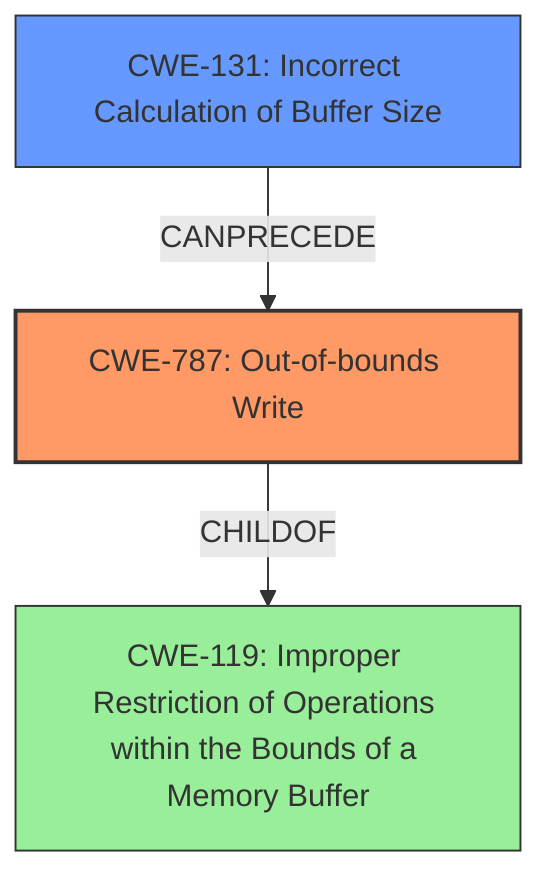

# Final Resolution for CVE-2021-0895

# Summary
| CWE ID | CWE Name | Confidence | CWE Abstraction Level | CWE Vulnerability Mapping Label | CWE-Vulnerability Mapping Notes |
|---|---|---|---|---|---|
| CWE-787 | Out-of-bounds Write | 1.0 | Base | Primary | Allowed |
| CWE-131 | Incorrect Calculation of Buffer Size | 0.6 | Base | Secondary | Allowed |

## Evidence and Confidence

*   **Confidence Score:** 0.9
*   **Evidence Strength:** MEDIUM

## Relationship Analysis
The primary CWE is **CWE-787 (Out-of-bounds Write)**, a Base level CWE, which is a child of **CWE-119 (Improper Restriction of Operations within the Bounds of a Memory Buffer)**. The vulnerability description clearly indicates an out-of-bounds write due to a missing bounds check. The retriever results suggest **CWE-131 (Incorrect Calculation of Buffer Size)**, which could explain the missing bounds check, i.e., the size was incorrectly calculated, leading to the **out-of-bounds write**.

## Vulnerability Chain
The vulnerability chain starts with **CWE-131 (Incorrect Calculation of Buffer Size)**. This leads to a missing or inadequate bounds check, which results in **CWE-787 (Out-of-bounds Write)**. This, in turn, leads to a local escalation of privilege.

## Summary of Analysis
The initial analysis correctly identified **CWE-787 (Out-of-bounds Write)** as the primary weakness. The criticism correctly pointed out that the evidence for **CWE-125 (Out-of-bounds Read)** was weak, and it has been removed. The retriever results suggested **CWE-131 (Incorrect Calculation of Buffer Size)**, which is a more appropriate secondary weakness because the root cause is likely the missing bounds check is due to an incorrect calculation of the buffer size. The vulnerability description states: "In apusys, there is a possible out of bounds write due to a missing bounds check." The chain of events is thus: the buffer size is miscalculated (**CWE-131**), the missing bounds check leads to **CWE-787**, and this leads to privilege escalation. **CWE-131** is at the optimal level of specificity.