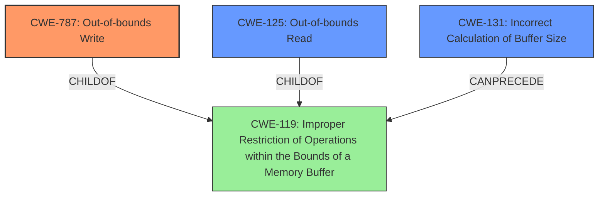

# Final Resolution for CVE-2021-0896

# Summary
| CWE ID | CWE Name | Confidence | CWE Abstraction Level | CWE Vulnerability Mapping Label | CWE-Vulnerability Mapping Notes |
|---|---|---|---|---|---|
| **CWE-787** | **Out-of-bounds Write** | 1.0 | Base | Allowed | Primary **CWE** |
| **CWE-131** | **Incorrect Calculation of Buffer Size** | 0.6 | Base | Allowed | Secondary Candidate |
| **CWE-125** | **Out-of-bounds Read** | 0.5 | Base | Allowed | Secondary Candidate |

## Evidence and Confidence

*   **Confidence Score:** 0.9
*   **Evidence Strength:** HIGH

## Relationship Analysis
The primary relationship influencing the decision is the parent-child relationship between **CWE-787 (Out-of-bounds Write)** and **CWE-119 (Improper Restriction of Operations within the Bounds of a Memory Buffer)**. **CWE-787** is more specific and accurately reflects the vulnerability description's explicit mention of an out-of-bounds write. **CWE-131** can precede **CWE-119**, indicating a potential cause for the buffer issue. **CWE-125** is a peer of **CWE-787** and both are children of **CWE-119**.

## Vulnerability Chain
The vulnerability chain starts with a **missing bounds check**, potentially stemming from an **incorrect calculation of buffer size (CWE-131)**. This leads to an **out-of-bounds write (CWE-787)**, which could potentially be followed by an **out-of-bounds read (CWE-125)** if the written data is later accessed. The final impact is a local escalation of privilege.

## Summary of Analysis
The initial analysis and criticism are well-reasoned and provide a strong foundation for the **CWE** classification. The final determination is primarily based on the explicit statement of "out of bounds write" in the vulnerability description, which directly maps to **CWE-787**.

Evidence: "In apusys, there is a possible **out of bounds write** due to a **missing bounds check**."

The graph relationships confirm that **CWE-787** is the most specific and appropriate choice, as it is a child of the more general **CWE-119**. The inclusion of **CWE-131** as a secondary candidate is justified by the possibility that the missing bounds check is a consequence of an incorrect buffer size calculation. The inclusion of **CWE-125** is justified by the possibility that a read can happen after a write, though it is less likely based on the information available.

The selected **CWEs** are at the optimal level of specificity because they accurately reflect the root cause and potential consequences of the vulnerability. **CWE-787** is a Base level **CWE**, which is preferred for root cause mapping, and it directly addresses the described issue. **CWE-131** is also a Base level **CWE** and represents a plausible underlying cause. **CWE-125** is a Base level **CWE** that could result from the initial **out-of-bounds write**.