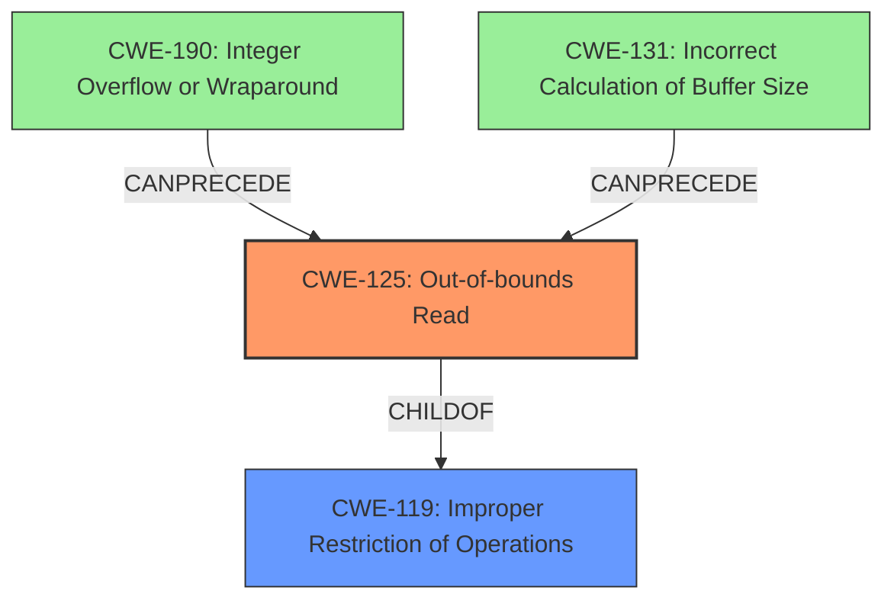

# Analysis Report for CVE-2021-0900

# Vulnerability Analysis Report: CVE-2021-0900

## Description

In apusys, there is a possible out of bounds read due to an incorrect bounds check. This could lead to local information disclosure with System execution privileges needed. User interaction is not needed for exploitation. Patch ID ALPS05672107 Issue ID ALPS05672055.

## Vulnerability Description Key Phrases

**Rootcause:** an incorrect bounds check
**Weakness:** out of bounds read
**Impact:** local information disclosure
**Product:** apusys

## Analysis (with Relationship Data)

# Summary
| CWE ID | CWE Name | Confidence | CWE Abstraction Level | CWE Vulnerability Mapping Label | CWE-Vulnerability Mapping Notes |
|---|---|---|---|---|---|
| CWE-125 | Out-of-bounds Read | 1.0 | Base | Primary | Allowed |

## Evidence and Confidence

*   **Confidence Score:** 1.0
*   **Evidence Strength:** HIGH

- **Analysis and Justification:**  
  - *Explanation:* The vulnerability description clearly states an "**out of bounds read** due to **an incorrect bounds check**." The "CVE Reference Links Content Summary" further confirms this by highlighting the "incorrect bounds check leading to a potential out-of-bounds read." This aligns directly with CWE-125 (Out-of-bounds Read), which describes a scenario where the product reads data past the end or before the beginning of the intended buffer. The impact, local information disclosure, is also consistent with this type of vulnerability. The retriever results also lists CWE-125. The Primary CWE Match based on similar CVE Descriptions is CWE-125. The usage is "Allowed" for CWE-125.
  
  - *Relationship Analysis:* CWE-125 is a child of CWE-119 (Improper Restriction of Operations within the Bounds of a Memory Buffer). While CWE-119 is a broader category, the specific description of an out-of-bounds *read* makes CWE-125 the more appropriate and specific choice. CWE-125 can be triggered by issues such as CWE-190 (Integer Overflow or Wraparound) or CWE-131 (Incorrect Calculation of Buffer Size), but those are not explicitly mentioned in the vulnerability description, so they are not mapped.

- **Confidence Score:**  
  - Confidence: 1.0 (High confidence due to direct evidence from the vulnerability description and supporting information)

## Criticism of Analysis

Okay, I've reviewed the provided analysis, focusing on the CWE specifications and considering the mapping guidance and potential mitigations.

**Overall Assessment:**

The analysis is very good, and the primary CWE mapping to CWE-125 (Out-of-bounds Read) is correct and well-justified. The confidence level of 1.0 is appropriate. The explanation of the evidence strength is thorough.

**Detailed Review:**

*   **CWE-125 Mapping:** The core of the analysis is accurate. The description of the vulnerability - "out of bounds read due to an incorrect bounds check" - aligns perfectly with CWE-125. The impact (local information disclosure) is also a common consequence of out-of-bounds reads. The inclusion of the CVE Reference Links Content Summary further strengthens this mapping, particularly the explicit mention of "incorrect bounds check leading to a potential out-of-bounds read."
    *   The usage of CWE-125 is "Allowed" and appropriate given the specific description.
    *   The analysis correctly notes that CWE-125 is a child of the broader CWE-119, but is the more specific and accurate choice here.

*   **Justification and Relationship Analysis:** The justification provided is clear, concise, and effectively relates the vulnerability details to the CWE-125 definition. It clearly states the weakness and the root cause. The analysis of the relationship between CWE-125 and CWE-119 is also good. The mentions about not mapping CWE-190 and CWE-131 are also correct, as these are potential causes *if* they were present, but the descriptions given for this vulnerability do not mention these issues.

*   **Retriever Results:** The retriever results are included for additional information. The fact that retrievers picked CWE-125 as a top result further validates the analysis.

*   **CWE Examples:** The provided CWE examples for CWE-119, CWE-131, CWE-190, and CWE-125 further help to put the analysis in context.

*   **CWE Mitigations:** The analysis implicitly aligns with potential mitigations suggested for CWE-125, such as input validation and using languages with memory safety features. The note in the analysis about "incorrect bounds check" already implies an absence of input validation, therefore pointing to why the out-of-bounds read happens.

*   **Alternative CWEs Considered (and correctly rejected):**

    *   **CWE-131 (Incorrect Calculation of Buffer Size):** While a faulty buffer size calculation *could* lead to an out-of-bounds read, the primary description states an "incorrect bounds *check*." This suggests the calculation *might* be correct but the bounds are not being validated properly, rather than a faulty initial calculation. If the root cause was a faulty size *calculation*, CWE-131 would be more appropriate.
    *   **CWE-190 (Integer Overflow or Wraparound):** Similar to CWE-131, an integer overflow *could* be a contributing factor to an incorrect bounds check if an index or offset calculation overflows, but the provided description does not explicitly state this.
    *  **CWE-787 (Out-of-bounds Write):** The analysis correctly identifies that the weakness is an *out-of-bounds read*, not a write, making CWE-787 incorrect.

*   **Use of CWE-119:** The analysis explicitly addresses why CWE-119 is not used, which is important because CWE-119 is often misused.

**Suggestions for Improvement (Minor):**

*   While the explanation is excellent, adding a brief mention of *how* the incorrect bounds check leads to information disclosure could further enhance the explanation.  For example, "An incorrect bounds check allows the program to read memory outside the intended buffer, potentially revealing sensitive data from other processes or kernel memory."
*   Even though the analysis correctly rejects several other CWEs, it might be helpful to explicitly mention CWE-20 (Improper Input Validation).  While the description points to an "incorrect bounds check" (implying a coding error within the bounds check), the lack of a *sufficient* bounds check could also be framed as inadequate input validation.  However, since the vulnerability specifically highlights the incorrect *check* and not the absence of a *check*, leaving it mapped to CWE-125 is appropriate.

**Conclusion:**

This is a high-quality analysis with a correct CWE mapping. The justification is strong, and the inclusion of supporting information from the CVE reference and retriever results adds to its credibility. The analysis also demonstrates a good understanding of the relationships between different CWEs and the nuances of choosing the most appropriate mapping. The suggestions for improvement are minor and would primarily serve to further enhance an already well-written analysis.

## Final Resolution

# Summary
| CWE ID | CWE Name | Confidence | CWE Abstraction Level | CWE Vulnerability Mapping Label | CWE-Vulnerability Mapping Notes |
|---|---|---|---|---|---|
| CWE-125 | Out-of-bounds Read | 1.0 | Base | Primary CWE | Allowed |

## Evidence and Confidence

*   **Confidence Score:** 1.0
*   **Evidence Strength:** HIGH

## Relationship Analysis
The primary relationship considered was the parent-child relationship between CWE-125 (**Out-of-bounds Read**) and CWE-119 (**Improper Restriction of Operations within the Bounds of a Memory Buffer**). While CWE-119 is a parent, CWE-125 is more specific and accurately describes the vulnerability. There are potential chain relationships where issues like integer overflows (CWE-190) or incorrect buffer size calculations (CWE-131) could precede an out-of-bounds read (CWE-125), but these are not explicitly mentioned in the description. The abstraction level of CWE-125 as a Base weakness makes it ideal for direct mapping.

## Vulnerability Chain
The vulnerability chain starts with an **incorrect bounds check**, which is the **ROOTCAUSE**. This leads directly to an **out-of-bounds read** (CWE-125). The consequence of this **WEAKNESS** is local information disclosure. The description does not provide enough information to determine if integer overflows or incorrect buffer size calculations are contributing factors, thus those possible links are missing from the chain.

## Summary of Analysis
The initial analysis and criticism both correctly identify CWE-125 (**Out-of-bounds Read**) as the primary **WEAKNESS**. This assessment is based on the explicit statement in the vulnerability description: "In apusys, there is a possible **out of bounds read** due to an **incorrect bounds check**." The graph relationships confirm that CWE-125 is a specific type of buffer access issue (child of CWE-119), making it the most appropriate choice. The retriever results and the "Allowed" mapping guidance for CWE-125 further support this decision. While other CWEs like CWE-190 and CWE-131 could potentially contribute, the provided evidence does not support including them in the classification. Therefore, selecting CWE-125 is at the optimal level of specificity.

*Report generated on 2025-03-17 22:40:55*
