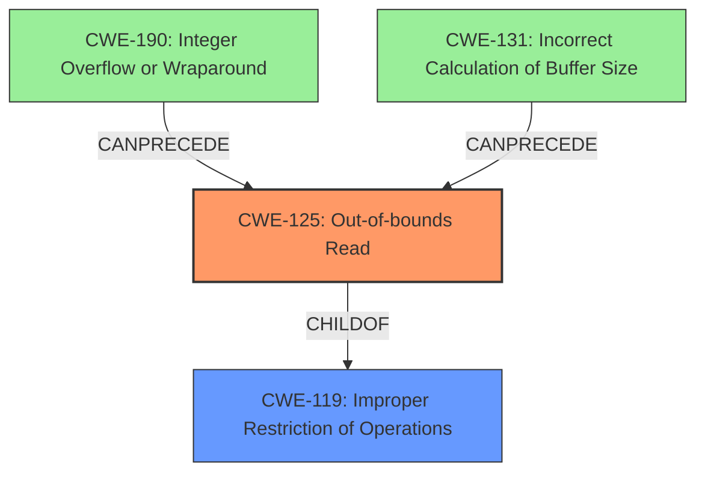

# Final Resolution for CVE-2021-0900

# Summary
| CWE ID | CWE Name | Confidence | CWE Abstraction Level | CWE Vulnerability Mapping Label | CWE-Vulnerability Mapping Notes |
|---|---|---|---|---|---|
| CWE-125 | Out-of-bounds Read | 1.0 | Base | Primary CWE | Allowed |

## Evidence and Confidence

*   **Confidence Score:** 1.0
*   **Evidence Strength:** HIGH

## Relationship Analysis
The primary relationship considered was the parent-child relationship between CWE-125 (**Out-of-bounds Read**) and CWE-119 (**Improper Restriction of Operations within the Bounds of a Memory Buffer**). While CWE-119 is a parent, CWE-125 is more specific and accurately describes the vulnerability. There are potential chain relationships where issues like integer overflows (CWE-190) or incorrect buffer size calculations (CWE-131) could precede an out-of-bounds read (CWE-125), but these are not explicitly mentioned in the description. The abstraction level of CWE-125 as a Base weakness makes it ideal for direct mapping.

## Vulnerability Chain
The vulnerability chain starts with an **incorrect bounds check**, which is the **ROOTCAUSE**. This leads directly to an **out-of-bounds read** (CWE-125). The consequence of this **WEAKNESS** is local information disclosure. The description does not provide enough information to determine if integer overflows or incorrect buffer size calculations are contributing factors, thus those possible links are missing from the chain.

## Summary of Analysis
The initial analysis and criticism both correctly identify CWE-125 (**Out-of-bounds Read**) as the primary **WEAKNESS**. This assessment is based on the explicit statement in the vulnerability description: "In apusys, there is a possible **out of bounds read** due to an **incorrect bounds check**." The graph relationships confirm that CWE-125 is a specific type of buffer access issue (child of CWE-119), making it the most appropriate choice. The retriever results and the "Allowed" mapping guidance for CWE-125 further support this decision. While other CWEs like CWE-190 and CWE-131 could potentially contribute, the provided evidence does not support including them in the classification. Therefore, selecting CWE-125 is at the optimal level of specificity.