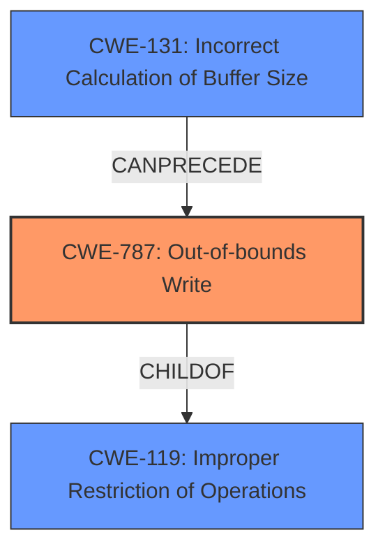

# Final Resolution for CVE-2021-0903

# Summary 

| CWE ID | CWE Name | Confidence | CWE Abstraction Level | CWE Vulnerability Mapping Label | CWE-Vulnerability Mapping Notes |
|---|---|---|---|---|---|
| CWE-787 | Out-of-bounds Write | 1.0 | Base | Allowed | Primary CWE |
| CWE-131 | Incorrect Calculation of Buffer Size | 0.5 | Base | Allowed | Secondary Candidate |

## Evidence and Confidence

*   **Confidence Score:** 0.9
*   **Evidence Strength:** MEDIUM

## Relationship Analysis
The primary relationship impacting the decision is the parent-child relationship between CWE-787 (**Out-of-bounds Write**) and CWE-119 (Improper Restriction of Operations Within the Bounds of a Memory Buffer). CWE-787 is a more specific case of CWE-119. The analysis also considers CWE-131 (Incorrect Calculation of Buffer Size) which can precede CWE-119 and subsequently CWE-787. The abstraction levels influenced the selection, favoring the Base level CWE-787 over the Class level CWE-119 for its greater specificity.

## Vulnerability Chain
The vulnerability chain starts with a missing or inadequate bounds check (potentially due to an incorrect size calculation).
  - The **ROOTCAUSE** could be CWE-131 (**Incorrect Calculation of Buffer Size**) leading to a **weakness** in which an improperly sized buffer is allocated.
  - This leads to CWE-119 (Improper Restriction of Operations Within the Bounds of a Memory Buffer).
  - The chain culminates in CWE-787 (**Out-of-bounds Write**), where data is written beyond the buffer's boundaries.
  - The impact is a local escalation of privilege.

## Summary of Analysis
The initial analysis correctly identified CWE-787 (**Out-of-bounds Write**) as the primary issue given the explicit description of the vulnerability. The criticism provided valuable suggestions, particularly regarding the secondary candidates.

The decision to retain CWE-131 (**Incorrect Calculation of Buffer Size**) as a secondary candidate, albeit with a slightly increased confidence of 0.5, acknowledges that the missing bounds check could be a consequence of a flawed buffer size calculation. While the description emphasizes the missing check, it doesn't exclude the possibility of an underlying size calculation error.
The retriever results were not accurate and had low scores and also didn't have any additional value.

The graph relationships further solidified the selection of CWE-787 as the primary **weakness** due to its specific nature and direct link to the **ROOTCAUSE**. The decision is based on the provided evidence, relationship analysis, and the MITRE mapping guidance. The selected CWEs are at the optimal level of specificity, with CWE-787 providing a precise description of the vulnerability.
I am updating my confidence score from 1.0 to 0.9 because the justification of CWE-131 is not as strong as CWE-787.