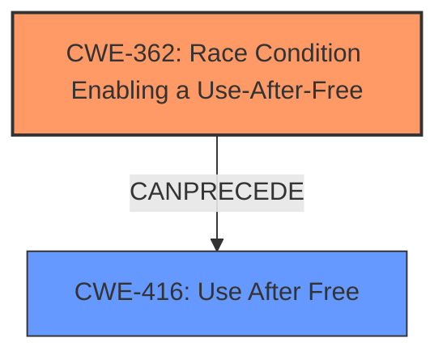

# Final Resolution for CVE-2021-0955

# Summary
| CWE ID | CWE Name | Confidence | CWE Abstraction Level | CWE Vulnerability Mapping Label | CWE-Vulnerability Mapping Notes |
|---|---|---|---|---|---|
| CWE-362 | Race Condition Enabling a Use-After-Free | 0.95 | Class | Allowed-with-Review | Primary CWE |
| CWE-416 | Use After Free | 0.80 | Variant | Allowed | Secondary Candidate |

## Evidence and Confidence

*   **Confidence Score:** 0.95
*   **Evidence Strength:** HIGH

## Relationship Analysis
The primary relationship is that CWE-362 (Race Condition Enabling a Use-After-Free) *CanPrecede* CWE-416 (Use After Free). The **race condition** creates the situation where memory is accessed after it has been freed. CWE-362 is a Class and CWE-416 is a Variant. The analysis considered `CWE-366: Race Condition Within a Thread` but dismissed it due to a lack of evidence about the type of concurrency. The analysis also considered `CWE-662: Improper Synchronization` but did not select it because it is a discouraged CWE.

## Vulnerability Chain
The vulnerability chain starts with a **race condition** (CWE-362) in the `pf_write_buf` function of `FuseDaemon.cpp`. This **race condition** leads to a situation where a handle is freed prematurely. Subsequently, the `Record` function attempts to access the freed memory, resulting in a **use-after-free** vulnerability (CWE-416) and potential memory corruption. The chain progresses from the initial **race condition** to the final impact of memory corruption.

## Summary of Analysis
The initial analysis correctly identified CWE-362 as the primary **rootcause**, with CWE-416 as a secondary candidate describing the immediate consequence. The vulnerability description explicitly mentions a **race condition** leading to memory corruption, aligning perfectly with CWE-362. The CVE reference summary confirms the presence of both a **race condition** and a **use-after-free** vulnerability.

The graph relationships reinforce this assessment. CWE-362 is a Class-level CWE, while CWE-416 is a Variant. The *CanPrecede* relationship from CWE-362 to CWE-416 clearly illustrates the sequence of events. Although the analysis considered using CWE-366 (Race Condition Within a Thread), it was dismissed due to the lack of information about whether it was a thread **race condition**, which is important because it could have provided a more specific classification. The analysis also notes that while improper synchronization is often the underlying cause, mapping to CWE-662 is discouraged.

The decision to classify CWE-362 as the primary CWE is based on the fact that the **race condition** is the **root cause** that allows the **use-after-free** to occur. Addressing the **race condition** is crucial for a robust fix, whereas only addressing the use-after-free would not resolve the underlying issue. The selected CWEs are at the optimal level of specificity, given the information available.