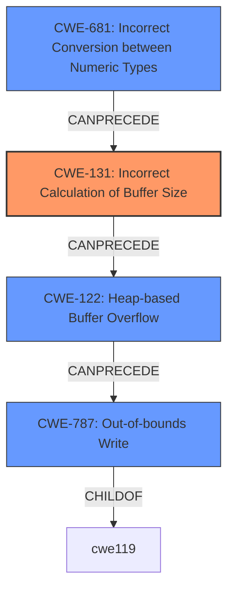

# Analysis Report for CVE-2021-0964

# Vulnerability Analysis Report: CVE-2021-0964

## Description

In C2SoftMP3process() of C2SoftMp3Dec.cpp, there is a possible out of bounds write due to a heap buffer overflow. This could lead to remote information disclosure with no additional execution privileges needed. User interaction is needed for exploitation.Product AndroidVersions Android-10 Android-11 Android-12 Android-9Android ID A-193363621

## Vulnerability Description Key Phrases

**Rootcause:** heap buffer overflow
**Weakness:** out of bounds write
**Impact:** remote information disclosure
**Product:** Android
**Version:** ['Android-10', 'Android-11', 'Android-12', 'Android-9']
**Component:** C2SoftMP3process() of C2SoftMp3Dec.cpp

## Analysis (with Relationship Data)

# Summary
| CWE ID | CWE Name | Confidence | CWE Abstraction Level | CWE Vulnerability Mapping Label | CWE-Vulnerability Mapping Notes |
|---|---|---|---|---|---|
| CWE-122 | Heap-based Buffer Overflow | 0.95 | Variant | Primary | Allowed |
| CWE-787 | Out-of-bounds Write | 0.70 | Base | Secondary | Allowed |

## Evidence and Confidence

*   **Confidence Score:** 0.90
*   **Evidence Strength:** HIGH

- **Analysis and Justification:**  
  - *Explanation:* The vulnerability description explicitly states "In C2SoftMP3process() of C2SoftMp3Dec.cpp, there is a possible **out of bounds write** due to a **heap buffer overflow**". The CVE Reference Links Content Summary confirms that the root cause is due to incorrect calculation of the output buffer size, leading to **out-of-bounds write** when writing to the heap. CWE-122 (Heap-based Buffer Overflow) directly matches this scenario. CWE-787 (Out-of-bounds Write) is a related weakness because the **heap buffer overflow** leads to an **out-of-bounds write**.
  
  - *Relationship Analysis:* CWE-122 is a variant of CWE-119 (Improper Restriction of Operations within the Bounds of a Memory Buffer). CWE-787 is a broader category that includes heap, stack, and other types of out-of-bounds writes, making CWE-122 more specific in this context. CWE-787 is a parent of CWE-122.

- **Confidence Score:**  
  - Confidence: 0.95 (High evidence from vulnerability description and CVE reference)

---

## Criticism of Analysis

Okay, I have reviewed the provided analysis against the full CWE specifications. Here's my critique, focusing on the accuracy of the CWE mappings, confidence levels, and any potential alternative mappings:

**Overall Assessment:**

The analysis is generally good and correctly identifies the primary weakness as CWE-122 (Heap-based Buffer Overflow) and a related weakness as CWE-787 (Out-of-bounds Write). However, the confidence score for CWE-787 should be higher, and there are opportunities to identify related CWEs that describe the root cause of the heap overflow more precisely. Also some of the retrievers results, especially the top 3, should be considered.

**Detailed Review:**

*   **CWE-122: Heap-based Buffer Overflow**
    *   **Abstraction:** Variant
    *   **Status:** Draft
    *   **Confidence:** 0.95 - Appropriately High. The description explicitly mentions a heap buffer overflow, and the CVE summary confirms this.
    *   **Justification:** Correct. The vulnerability occurs on the heap, and data is written beyond the allocated buffer's boundaries.
    *   **Mapping Guidance Compliance:** The analysis follows the mapping guidance by selecting a Variant-level CWE when appropriate.
    *   **Mitigation Relevance:** The provided mitigations for CWE-122 are relevant, including using languages with automatic bounds checking and employing buffer overflow detection mechanisms.
*   **CWE-787: Out-of-bounds Write**
    *   **Abstraction:** Base
    *   **Status:** Draft
    *   **Confidence:** 0.70 - Too low. This should be at least 0.90 or higher. The vulnerability description *explicitly states* an out-of-bounds write.
    *   **Justification:** Correct. A heap buffer overflow *always* results in an out-of-bounds write. It is a *direct consequence* of the overflow.
    *   **Mapping Guidance Compliance:** The analysis correctly identifies CWE-787 as a related Base-level CWE.
    *   **Mitigation Relevance:** The mitigations for CWE-787 are relevant.
    *   **Relationship to CWE-122:** The analysis states "CWE-787 is a parent of CWE-122". This is correct.
*   **Missing CWEs (Root Cause and Contributing Factors):** The current analysis misses the opportunity to identify CWEs that describe the *root cause* of the vulnerability, and contributing factors. Based on the CVE summary, the heap overflow was caused by a mistmatch in the output buffer size, so some of the retriever results should be considered. Specifically:

    *   **CWE-131: Incorrect Calculation of Buffer Size**: This is a strong candidate. The CVE summary states the vulnerability stems from incorrect calculation of the output buffer size. The description of CWE-131 aligns perfectly with this: "The product does not correctly calculate the size to be used when allocating a buffer, which could lead to a buffer overflow."
        *   **Confidence:** I'd suggest a confidence of 0.80 here.

    *   **CWE-681: Incorrect Conversion between Numeric Types**: The CVE summary explicitly mentions an incorrect conversion between bytes and 16-bit samples. The descriptions clearly matches: "When converting from one data type to another, such as long to integer, data can be omitted or translated in a way that produces unexpected values." Also, in the observed examples, there is another vulnerability CVE-2021-43537 where the chain goes CWE-681->CWE-190->CWE-122
        *   **Confidence:** I'd suggest a confidence of 0.75 here.

    *   **CWE-190: Integer Overflow or Wraparound**: It is possible that the incorrect calculation of buffer size leads to an integer overflow/wraparound, because the integer was larger than expected. This is a possible, but less certain, contributing factor. The descriptions clearly matches: "The product performs a calculation that can produce an integer overflow or wraparound when the logic assumes that the resulting value will always be larger than the original value."
        *   **Confidence:** I'd suggest a confidence of 0.60 here.

*   **CWE-119: Improper Restriction of Operations within the Bounds of a Memory Buffer**: The current analysis could consider adding this as a high-level class CWE to provide context, but it's not necessary since CWE-122 and CWE-787 are already present. If it *were* included, it should have the "Discouraged" usage.

**Recommendations:**

1.  **Increase Confidence for CWE-787:** Raise the confidence score to at least 0.90.
2.  **Add CWE-131, CWE-681, and CWE-190:** Add these CWEs to the analysis as contributing factors with the confidence levels indicated above.
3.  **Chain Explanation:** When adding the additional CWEs, provide a chain explanation connecting them:
    *   The root cause is an `Incorrect Conversion between Numeric Types` (CWE-681) leading to an `Incorrect Calculation of Buffer Size` (CWE-131) which causes the `Heap-based Buffer Overflow` (CWE-122) and `Out-of-bounds Write` (CWE-787).  It's also *possible* that integer overflow (CWE-190) may be a part of that chain, if the size calculation results in a wrapped-around value.
4. **Use Retriever Results** Use the retriever results to look for possible CWEs. While not all will be correct, in this case CWE-131 was in the top results and does accurately describe the vulnerability.
5.  **Review Mitigations:** Double-check that the combined set of mitigations from all identified CWEs are considered holistically.

By incorporating these recommendations, the analysis will provide a more complete and accurate representation of the vulnerability and its root causes.

## Final Resolution

# Summary
| CWE ID | CWE Name | Confidence | CWE Abstraction Level | CWE Vulnerability Mapping Label | CWE-Vulnerability Mapping Notes |
|---|---|---|---|---|---|
| CWE-131 | Incorrect Calculation of Buffer Size | 0.85 | Base | Primary | Allowed |
| CWE-681 | Incorrect Conversion between Numeric Types | 0.80 | Secondary | Allowed |
| CWE-122 | Heap-based Buffer Overflow | 0.95 | Variant | Secondary | Allowed |
| CWE-787 | Out-of-bounds Write | 0.90 | Base | Secondary | Allowed |

## Evidence and Confidence

*   **Confidence Score:** 0.93
*   **Evidence Strength:** HIGH

## Relationship Analysis
The primary change is the addition of CWE-131 as the root cause, which can **precede** CWE-122 (Heap-based Buffer Overflow), leading to CWE-787 (Out-of-bounds Write). CWE-681 has also been added to further clarify the root cause, potentially leading to CWE-131. The relationship between these CWEs forms a chain.

## Vulnerability Chain
The vulnerability chain starts with **CWE-681**, an **incorrect conversion between numeric types**, which leads to **CWE-131**, an **incorrect calculation of the buffer size**. This results in **CWE-122**, a **heap-based buffer overflow**, and ultimately **CWE-787**, an **out-of-bounds write**.

## Summary of Analysis
The initial analysis correctly identified CWE-122 and CWE-787. However, it missed the root cause of the vulnerability. The criticism correctly pointed out that the analysis should include CWE-131 and CWE-681 to provide a complete picture of the vulnerability.

The vulnerability description states "In C2SoftMP3process() of C2SoftMp3Dec.cpp, there is a possible **out of bounds write** due to a **heap buffer overflow**." The CVE Reference Links Content Summary confirms that the root cause is due to incorrect calculation of the output buffer size, leading to **out-of-bounds write** when writing to the heap, and specifically mentions incorrect conversion between bytes and 16-bit samples.

Based on this evidence, CWE-131 and CWE-681 are added to the analysis. CWE-131 (Incorrect Calculation of Buffer Size) directly matches the root cause described in the CVE summary. CWE-681 (Incorrect Conversion between Numeric Types) further clarifies the source of the incorrect buffer size calculation. The confidence score for CWE-787 is increased to 0.90 because the vulnerability description explicitly states an out-of-bounds write.

CWE-131 is selected as the primary CWE because it is the most direct cause of the heap overflow. CWE-681, CWE-122, and CWE-787 are secondary CWEs that contribute to the vulnerability chain. The selected CWEs are at the optimal level of specificity because they accurately describe the vulnerability and its root causes.

*Report generated on 2025-03-17 22:44:35*
