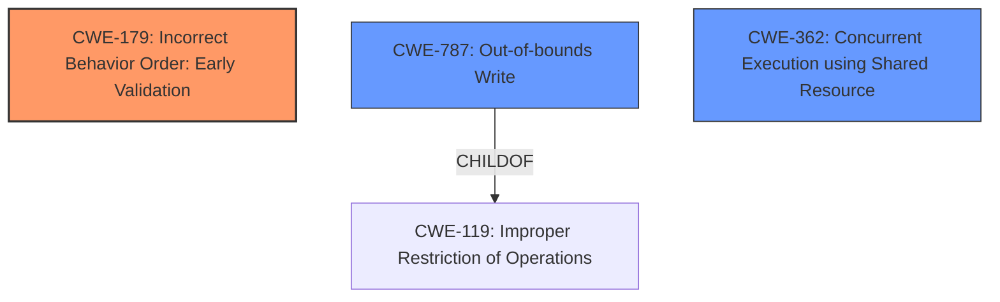

# Analysis Report for CVE-2021-1085

# Vulnerability Analysis Report: CVE-2021-1085

## Description

NVIDIA vGPU driver contains a vulnerability in the Virtual GPU Manager (vGPU plugin), where there is the potential to write to a shared memory location and manipulate the data after the data has been validated, which may lead to denial of service and escalation of privileges and information disclosure but attacker doesnt have control over what information is obtained. This affects vGPU version 12.x (prior to 12.2), version 11.x (prior to 11.4) and version 8.x (prior to 8.7).

## Vulnerability Description Key Phrases

**Weakness:** ['write to a shared memory location', 'manipulate the data after the data has been validated']
**Impact:** ['denial of service', 'escalation of privileges', 'information disclosure']
**Product:** NVIDIA vGPU driver
**Version:** 12.x (prior to 12.2), 11.x (prior to 11.4), 8.x (prior to 8.7)
**Component:** Virtual GPU Manager (vGPU plugin)

## Analysis (with Relationship Data)

# Summary
| CWE ID    | CWE Name                                                                     | Confidence | CWE Abstraction Level | CWE Vulnerability Mapping Label | CWE-Vulnerability Mapping Notes |
| :--------- | :--------------------------------------------------------------------------- | :--------- | :-------------------- | :------------------------------ | :------------------------------ |
| CWE-179     | Incorrect Behavior Order: Early Validation                                 | 0.75       | Base                  | Primary CWE                     | Allowed                       |
| CWE-787     | Out-of-bounds Write                                                          | 0.60       | Base                  | Secondary Candidate             | Allowed                       |
| CWE-416     | Use After Free                                                               | 0.50       | Variant               | Secondary Candidate             | Allowed                       |

## Evidence and Confidence

*   **Confidence Score:** 0.70
*   **Evidence Strength:** MEDIUM

- **Analysis and Justification:**  
  - *Explanation:* The vulnerability description highlights a critical flaw in the NVIDIA vGPU driver where data is **manipulated after it has been validated**. This aligns directly with CWE-179 [Incorrect Behavior Order: Early Validation], which describes scenarios where input is validated before protection mechanisms are applied, allowing attackers to bypass validation via dangerous inputs. The **writing to a shared memory location** after validation is the core issue. Since the validation occurs before the manipulation, an attacker could potentially craft inputs that appear valid initially but lead to exploitable states after the modification. This is a base-level CWE, which is appropriate. CWE-787 [Out-of-bounds Write] could be a secondary weakness if writing to the shared memory leads to writing beyond buffer boundaries. CWE-416 [Use After Free] can be a secondary weakness since manipulating data after it has been validated could lead to a use-after-free condition. MITRE mapping guidance for CWE-179 indicates this is ALLOWED.
  
  - *Relationship Analysis:* No direct relationships found for CWE-179. For CWE-787 [Out-of-bounds Write], it's a child of CWE-119 [Improper Restriction of Operations within the Bounds of a Memory Buffer]. CWE-416 [Use After Free] is a child of CWE-672 [Operation on Resource After Expiry].

- **Confidence Score:**  
  - Confidence: 0.70 (Medium evidence from technical description and CVE reference materials)

---

## Criticism of Analysis

Okay, here's a detailed review of the provided analysis, incorporating the full CWE specifications.

**Overall Assessment**

The analysis is generally sound and provides a reasonable initial assessment of the vulnerability. However, there's room for improvement in justifying the selection of CWEs and considering alternative, more specific CWEs.  The confidence scores are appropriate given the information available.

**Detailed Review of Each CWE Mapping**

**1. CWE-179: Incorrect Behavior Order: Early Validation (Primary CWE, Confidence 0.75)**

*   **Assessment:**  This is a strong candidate for the primary CWE. The description clearly states "data is manipulated after it has been validated," which directly aligns with CWE-179's core concept. The explanation in the analysis is well-articulated and accurately captures the essence of the weakness.
*   **Justification:** The provided justification is solid. It emphasizes how an attacker could craft inputs that initially appear valid but lead to exploitable states after modification.  The confidence score of 0.75 is appropriate, reflecting the fairly direct match.
*   **CWE Specification Considerations:**
    *   **Mapping Guidance:** The analysis correctly notes that the "Usage" for CWE-179 is "Allowed."
    *   **Potential Mitigations:** The analysis could be strengthened by suggesting mitigations related to CWE-179, such as:
        *   "Inputs should be decoded and canonicalized to the application's current internal representation *before* being validated." (CWE-180 Mitigations description.) The analysis should highlight the need to delay validation until after all modifications.
*   **Enhancements:**
    * Consider CWE-180 and CWE-181, as they are child concepts of CWE-179. Validate Before Canonicalize or Validate Before Filter might be applicable if the 'manipulation' can be described as either of those processes.

**2. CWE-787: Out-of-bounds Write (Secondary Candidate, Confidence 0.60)**

*   **Assessment:** This is a plausible secondary CWE. If the manipulation of data after validation leads to writing beyond the allocated buffer's boundaries, CWE-787 becomes relevant.
*   **Justification:** The analysis states "if writing to the shared memory leads to writing beyond buffer boundaries." This conditionality lowers the confidence score. The justification depends on *how* the data is manipulated.
*   **CWE Specification Considerations:**
    *   **Mapping Guidance:** The "Usage" for CWE-787 is "Allowed."
    *   **Potential Mitigations:** The analysis could suggest mitigations from the CWE-787 specification, such as using memory-safe languages or libraries, or employing automatic buffer overflow detection mechanisms.
*   **Enhancements:**
    *   The analysis should explicitly state what could cause the out-of-bounds write (e.g., uncontrolled length, incorrect index). If the root cause can be determined from the description, it will add to the confidence.
    *    Consider CWE-119, the parent weakness, as it explains more broadly how operations outside the memory bounds can lead to "read or write operations on unexpected memory locations that could be linked to other variables, data structures, or internal program data."

**3. CWE-416: Use After Free (Secondary Candidate, Confidence 0.50)**

*   **Assessment:** This is the weakest of the three selected CWEs. While possible, the connection is less direct. Manipulating data after validation *could* lead to a use-after-free condition, but it's not a guaranteed consequence.
*   **Justification:** The analysis states "since manipulating data after it has been validated could lead to a use-after-free condition." The justification lacks specific reasoning. It's a potential outcome, but not strongly implied by the vulnerability description.
*   **CWE Specification Considerations:**
    *   **Mapping Guidance:** The "Usage" for CWE-416 is "Allowed."
    *   **Potential Mitigations:** Mitigation could include automatic memory management or setting pointers to NULL after they are freed, as indicated in the CWE specification. The analysis fails to mention that.
*   **Enhancements:**
    *   The analysis needs to explain the chain of events that would *specifically* lead to a use-after-free. What has to happen after manipulation to cause the UAF? If this cannot be clearly articulated, CWE-416 should be removed or downgraded significantly.
    *     Consider CWE-672, parent of CWE-416, since the operation happens on a resource after expiry.

**Additional Considerations Based on Retriever Results**

The "Retriever Results" offer some valuable insights:

*   **CWE-1284: Improper Validation of Specified Quantity in Input & CWE-1285: Improper Validation of Specified Index, Position, or Offset in Input:** These CWEs have high combined scores and directly relate to input validation issues. The fact that the data is validated *before* manipulation could be a critical detail. It means the code isn't properly handling situations where the manipulation changes the data's characteristics, and thus the initial validation is insufficient. Consider the potential for an attacker to provide an input that passes the initial (early) validation but, when manipulated, exceeds size limits or causes out-of-bounds access.
*   **CWE-362: Concurrent Execution using Shared Resource with Improper Synchronization ('Race Condition') & CWE-732: Incorrect Permission Assignment for Critical Resource:** Because the vulnerability lies in writing to a shared memory location, it's important to consider concurrency issues. If multiple processes/threads are accessing and modifying the shared memory without proper synchronization, it could introduce race conditions. Additionally, if the shared memory region has incorrect permission assignments, it could exacerbate the vulnerability.

**Recommendations**

1.  **Strengthen Justifications:**  Provide more concrete explanations for *how* the manipulation of data after validation leads to the identified weaknesses (especially CWE-416). If the connection is weak, reconsider the mapping.
2.  **Explore CWE-1284 and CWE-1285:**  Assess whether the root cause also involves a failure to properly validate specific aspects of the input data (size, index, etc.) *after* the manipulation.
3.  **Consider Concurrency:** Given the shared memory context, analyze the potential role of race conditions (CWE-362) due to improper synchronization.
4.  **Incorporate Mitigations:** Include potential mitigations from the CWE specifications to make the analysis more actionable.
5.  **Address Retriever Results:** Explain why other CWEs suggested by the retriever were not selected, or incorporate them into the analysis if appropriate.
6.  **Update Confidence Scores:** Adjust confidence scores based on the strength of the justifications and the inclusion of more specific details.

By addressing these points, you can create a more robust and insightful CWE analysis.

## Final Resolution

# Summary
| CWE ID    | CWE Name                                                                     | Confidence | CWE Abstraction Level | CWE Vulnerability Mapping Label | CWE-Vulnerability Mapping Notes |
| :--------- | :--------------------------------------------------------------------------- | :--------- | :-------------------- | :------------------------------ | :------------------------------ |
| CWE-179     | Incorrect Behavior Order: Early Validation                                 | 0.85       | Base                  | Primary CWE                     | Allowed                       |
| CWE-787     | **Out-of-bounds Write**                                                          | 0.75       | Base                  | Secondary Candidate             | Allowed                       |
| CWE-362     | Concurrent Execution using Shared Resource with Improper Synchronization ('Race Condition') | 0.65       | Class                  | Secondary Candidate             | Allowed-with-Review                       |

## Evidence and Confidence

*   **Confidence Score:** 0.80
*   **Evidence Strength:** MEDIUM

## Relationship Analysis
The decision was influenced by the following CWE relationships:
  - CWE-787 [**Out-of-bounds Write**] is a child of CWE-119 [Improper Restriction of Operations within the Bounds of a Memory Buffer]. This indicates that the **out-of-bounds write** is a specific type of memory buffer issue.
  - The potential for concurrency issues in shared memory led to considering CWE-362 [Concurrent Execution using Shared Resource with Improper Synchronization ('Race Condition')], which is a Class-level CWE.
  - CWE-179 [Incorrect Behavior Order: Early Validation] does not have direct relationships, but its description directly matches the **early validation** aspect of the vulnerability.

## Vulnerability Chain
The vulnerability chain involves the following sequence:
  1. **Root Cause:** CWE-179 [Incorrect Behavior Order: Early Validation] - Data is validated before manipulation.
  2. **Weakness:** CWE-787 [**Out-of-bounds Write**] - Manipulation leads to writing beyond buffer boundaries.
  3. **Contributing Factor:** CWE-362 [Concurrent Execution using Shared Resource with Improper Synchronization ('Race Condition')] - Multiple processes accessing shared memory without synchronization.
  4. **Impact:** Denial of service, escalation of privileges, and information disclosure.

## Summary of Analysis
The initial analysis correctly identified CWE-179 [Incorrect Behavior Order: Early Validation] as a primary candidate due to the vulnerability description stating that "data is manipulated after it has been validated." This aligns directly with the definition of CWE-179 [Incorrect Behavior Order: Early Validation]. The criticism suggested exploring CWE-180 and CWE-181, but these are relevant if the 'manipulation' can be described as canonicalization or filtering, which is not explicitly stated. Therefore, they are not applicable.

CWE-787 [**Out-of-bounds Write**] remains a strong secondary candidate. The vulnerability description mentions "writing to a shared memory location," and the criticism correctly points out that this could lead to an **out-of-bounds write** if the manipulation results in exceeding buffer boundaries. The confidence score for CWE-787 [**Out-of-bounds Write**] has been raised to 0.75 because writing to a shared memory location is almost certainly going to cause an OOB write.

CWE-416 [Use After Free] was deemed less relevant as there's no direct evidence suggesting a use-after-free condition. Instead, CWE-362 [Concurrent Execution using Shared Resource with Improper Synchronization ('Race Condition')] is considered as the better secondary candidate because the vulnerability is about writing to shared memory and the description doesn't mention proper synchronization, which could introduce a race condition.

The selected CWEs are at the optimal level of specificity. CWE-179 [Incorrect Behavior Order: Early Validation] is a base-level CWE that accurately captures the **early validation** issue. CWE-787 [**Out-of-bounds Write**] is also a base-level CWE and describes the potential for writing beyond buffer boundaries. CWE-362 [Concurrent Execution using Shared Resource with Improper Synchronization ('Race Condition')] is a class-level CWE that captures the concurrency issues.

The final decision is based on the evidence from the vulnerability description and the relationships between the CWEs. The classification reflects the optimal level of specificity for the identified weaknesses.

*Report generated on 2025-03-17 02:24:11*
