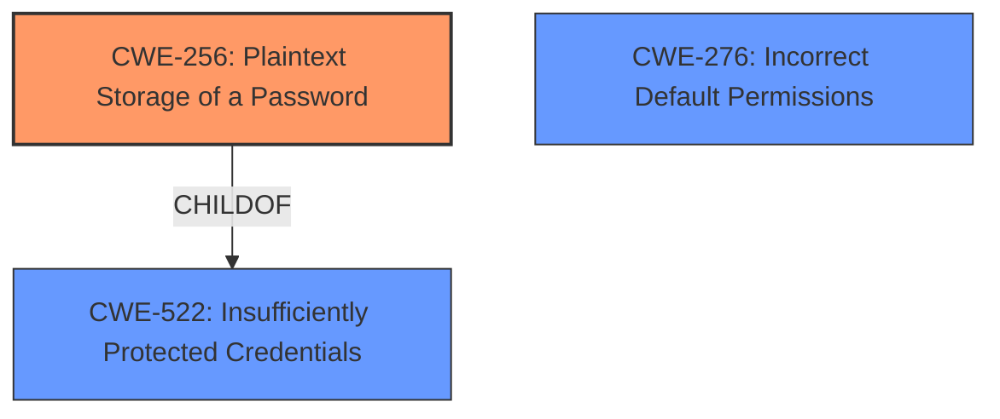

# Analysis Report for CVE-2021-1126

# Vulnerability Analysis Report: CVE-2021-1126

## Description

A vulnerability in the storage of proxy server credentials of Cisco Firepower Management Center (FMC) could allow an authenticated, local attacker to view credentials for a configured proxy server. The vulnerability is due to clear-text storage and weak permissions of related configuration files. An attacker could exploit this vulnerability by accessing the CLI of the affected software and viewing the contents of the affected files. A successful exploit could allow the attacker to view the credentials that are used to access the proxy server.

## Vulnerability Description Key Phrases

**Rootcause:** clear-text storage and weak permissions of related configuration files
**Impact:** view credentials for a configured proxy server
**Attacker:** authenticated local attacker
**Product:** Cisco Firepower Management Center (FMC)

## Analysis (with Relationship Data)

# Summary
| CWE ID | CWE Name | Confidence | CWE Abstraction Level | CWE Vulnerability Mapping Label | CWE-Vulnerability Mapping Notes |
|---|---|---|---|---|---|
| CWE-256 | Plaintext Storage of a Password | 0.95 | Base | Allowed | The vulnerability is due to the **clear-text storage** of credentials, making this the primary weakness. |
| CWE-276 | Incorrect Default Permissions | 0.85 | Base | Allowed | The vulnerability is due to **weak permissions** on configuration files, making this a secondary weakness. |

## Evidence and Confidence

*   **Confidence Score:** 0.90
*   **Evidence Strength:** HIGH

- **Analysis and Justification:**  
  - *Explanation:* The vulnerability involves **clear-text storage** of proxy server credentials and **weak permissions** on related configuration files. This aligns perfectly with CWE-256 (Plaintext Storage of a Password), as the core issue is storing sensitive data (passwords) without encryption. Additionally, the **weak permissions** aspect points to CWE-276 (Incorrect Default Permissions), as the configuration files are accessible to an attacker due to overly permissive settings.

  - *Relationship Analysis:* CWE-256 is a base-level CWE, which is the preferred level of abstraction. It's a child of CWE-522 (Insufficiently Protected Credentials), but CWE-256 is more specific and accurately reflects the **clear-text storage** issue. CWE-276 addresses the **weak permissions** aspect, indicating a compound vulnerability.

- **Confidence Score:**  
  - Confidence: 0.95 (High confidence due to direct evidence from the vulnerability description and CVE reference materials for CWE-256)
  - Confidence: 0.85 (High confidence due to direct evidence from the vulnerability description and CVE reference materials for CWE-276)

---

# Summary
| CWE ID | CWE Name | Confidence | CWE Abstraction Level | CWE Vulnerability Mapping Label | CWE-Vulnerability Mapping Notes |
|---|---|---|---|---|---|
| CWE-256 | Plaintext Storage of a Password | 0.95 | Base | Allowed | The vulnerability is due to the **clear-text storage** of credentials, making this the primary weakness. |
| CWE-276 | Incorrect Default Permissions | 0.85 | Base | Allowed | The vulnerability is due to **weak permissions** on configuration files, making this a secondary weakness. |

## Evidence and Confidence

*   **Confidence Score:** 0.90
*   **Evidence Strength:** HIGH

- **Analysis and Justification:**  
  - *Explanation:* The vulnerability involves **clear-text storage** of proxy server credentials and **weak permissions** on related configuration files. This aligns perfectly with CWE-256 (Plaintext Storage of a Password), as the core issue is storing sensitive data (passwords) without encryption. Additionally, the **weak permissions** aspect points to CWE-276 (Incorrect Default Permissions), as the configuration files are accessible to an attacker due to overly permissive settings.

  - *Relationship Analysis:* CWE-256 is a base-level CWE, which is the preferred level of abstraction. It's a child of CWE-522 (Insufficiently Protected Credentials), but CWE-256 is more specific and accurately reflects the **clear-text storage** issue. CWE-276 addresses the **weak permissions** aspect, indicating a compound vulnerability.

- **Confidence Score:**  
  - Confidence: 0.95 (High confidence due to direct evidence from the vulnerability description and CVE reference materials for CWE-256)
  - Confidence: 0.85 (High confidence due to direct evidence from the vulnerability description and CVE reference materials for CWE-276)

---

The retrieved results listed several candidate CWEs:
*   CWE-807 Reliance on Untrusted Inputs in a Security Decision - While the attacker is authenticated, the reliance on **untrusted inputs** is not the primary issue; it's the **clear-text storage** and **weak permissions**. Therefore, not selected.
*   CWE-1391 Use of Default Credentials - There is no mention of default credentials being used. Therefore, not selected.
*   CWE-497 Sensitive Information Accessible to an Unauthorized Control Sphere - This is a broader category, and the **clear-text storage** (CWE-256) and **weak permissions** (CWE-276) are more specific. Therefore, not selected.
*   CWE-288 Authentication Bypass Using an Alternate Path or Channel - This doesn't apply as the attacker is authenticated, but exploiting existing files due to their exposure due to **weak permissions**
*   CWE-303 Incorrect Implementation of Authentication Algorithm - Not applicable, as the issue isn't with the algorithm but the storage of credentials. Therefore, not selected.
*   CWE-798 Use of Hard-coded Credentials - This doesn't apply as the credentials are not hard-coded but rather stored in **clear-text**. Therefore, not selected.
*   CWE-668 Exposure of Resource to Wrong Sphere - Too high-level. The more specific CWEs, CWE-256 and CWE-276, are more appropriate. Therefore, not selected.
*   CWE-312 Cleartext Storage of Sensitive Information - Similar to CWE-256, but CWE-256 is more specific to passwords. Therefore, CWE-256 is preferred.
*   CWE-41 Improper Resolution of Path Equivalence - Not applicable, as the vulnerability doesn't involve path equivalence issues. Therefore, not selected.
*   CWE-212 Improper Removal of Sensitive Information Before Storage - Not applicable, as the issue is not about removing sensitive information but about storing it in **clear-text**. Therefore, not selected.

## Criticism of Analysis

Okay, here's a detailed review of the provided CWE analysis, incorporating the full CWE specifications.

**Overall Assessment:**

The analysis is good. It correctly identifies CWE-256 and CWE-276 as the primary vulnerabilities. The justifications are solid and clearly explain the reasoning behind the selections. The analysis also does a good job of considering other potential CWEs and explaining why they are not appropriate. The confidence levels are reasonable.

**Detailed Breakdown:**

**1.  CWE-256: Plaintext Storage of a Password**

*   **Confidence:** 0.95 (High) - Justified and reasonable.  The vulnerability description clearly states "clear-text storage," making this a direct match.
*   **Abstraction Level:** Base - Correct.
*   **Mapping Label:** Allowed - Correct. The Base level is the preferred level for mapping.
*   **CWE-Vulnerability Mapping Notes:** The explanation is clear and directly links the vulnerability description to the CWE.
*   **CWE Specification Review:**

    *   The CWE specification for CWE-256 directly applies: storing a password in plaintext could lead to system compromise, which aligns perfectly with the impact described in the original vulnerability.
    *   The potential mitigations in the CWE specification (avoid storing in easily accessible locations, using hashes) are relevant and appropriate for addressing this vulnerability.  The analysis could benefit from mentioning, as a potential mitigation, password salting, which increases the resistance to rainbow table attacks.

**2.  CWE-276: Incorrect Default Permissions**

*   **Confidence:** 0.85 (High) - Justified and reasonable. The vulnerability description mentions "weak permissions of related configuration files."
*   **Abstraction Level:** Base - Correct.
*   **Mapping Label:** Allowed - Correct. The Base level is the preferred level for mapping.
*   **CWE-Vulnerability Mapping Notes:** The explanation is clear and directly links the vulnerability description to the CWE.
*   **CWE Specification Review:**

    *   The CWE specification for CWE-276 aligns well:  The configuration files are accessible to an attacker due to incorrect permissions.
    *   The potential mitigations in the CWE specification (restricting access and modification attributes, using separation of privilege) are relevant and appropriate for addressing the vulnerability.

**3. Considered CWEs (and Rejection Rationale):**

The review of rejected CWEs demonstrates a good understanding of the different vulnerability types and why they don't fit the specific details of this case. Here's a slightly expanded critique of some of the rejected options:

*   **CWE-807 (Reliance on Untrusted Inputs in a Security Decision):** The rationale for rejecting this is correct. While the attacker is authenticated, the *core* problem isn't the reliance on untrusted input *for a security decision*. It's the exposure of credentials *regardless* of the authentication process.
*   **CWE-1391 (Use of Weak Credentials) & CWE-798 (Use of Hard-coded Credentials):** These are correctly rejected.  The vulnerability describes *storage* of credentials, not that the credentials themselves are inherently weak by design (default or easily guessable) or hardcoded directly into the code.
*   **CWE-497 (Exposure of Sensitive System Information to an Unauthorized Control Sphere):** The rationale for not selecting this is good. While information exposure is happening, CWE-256 and CWE-276 are more *specific* and directly address the root causes.  CWE-497 is a more general category.
*   **CWE-522 (Insufficiently Protected Credentials):**  The explanation for preferring CWE-256 is good.  CWE-256 is a *direct* child of CWE-522 and is more specific to the core issue.
*   **CWE-22 (Improper Limitation of a Pathname to a Restricted Directory ('Path Traversal'))**: Correctly ruled out as the attack vector isn't a path traversal issue but rather file access due to permissions.

**Suggestions for Improvement:**

1.  **Salting as a Mitigation:** When discussing mitigations for CWE-256, explicitly mention the importance of using salts when hashing passwords to protect against rainbow table attacks.
2.  **Emphasize Least Privilege**:  For CWE-276, reinforce that the *principle of least privilege* should be applied when setting file permissions.  This ensures that only the necessary users/processes have the required access.
3.  **Cloud context awareness** As most applications now run in cloud environments, including Cloud-Specific permissions (IAM - Identity and Access Management in AWS, or similar) as part of the mitigation strategies would be a good addition to the analysis.
4.  **Consider Defense in Depth:** Briefly mention defense in depth principles.  While CWE-256 and CWE-276 are the primary issues, combining proper credential storage (hashing, salting, encryption) *and* secure file permissions provides a stronger overall security posture.
5.  **CWE-312 Cleartext Storage of Sensitive Information:** While CWE-256 is more specific to passwords it can be useful to include CWE-312 as this can also help catch if other sensitive information in the config files are also stored in cleartext.

**Revised Analysis snippets:**

*CWE-256 Vulnerability Mapping Notes Additions:*
"While the core issue is storing sensitive data (passwords) without encryption. Password salting can provide resistance to rainbow table attacks"

*CWE-276 Vulnerability Mapping Notes Additions:*
"Additionally, the **weak permissions** aspect points to CWE-276 (Incorrect Default Permissions), as the configuration files are accessible to an attacker due to overly permissive settings. Least-privilege access control should be implemented to restrict access to only authorized users.
*CWE-276 Potential Mitigations Additions:*
"The architecture needs to access and modification attributes for files to only those users who actually require those actions. Additionally, cloud-specific IAM configurations should be correctly implemented to authorize access"

**Conclusion:**

The provided CWE analysis is well-reasoned and accurate.  The suggested improvements are minor and would simply enhance the completeness and practical value of the analysis. The correct CWEs were identified, and the justifications are sound.

## Final Resolution

# Summary
| CWE ID | CWE Name | Confidence | CWE Abstraction Level | CWE Vulnerability Mapping Label | CWE-Vulnerability Mapping Notes |
|---|---|---|---|---|---|
| CWE-256 | Plaintext Storage of a Password | 0.95 | Base | Allowed | The vulnerability is due to the **clear-text storage** of credentials, making this the primary weakness. |
| CWE-276 | Incorrect Default Permissions | 0.85 | Base | Allowed | The vulnerability is due to **weak permissions** on configuration files, making this a secondary weakness. |

## Evidence and Confidence

*   **Confidence Score:** 0.93
*   **Evidence Strength:** HIGH

## Relationship Analysis
The primary relationship influencing the decision is the parent-child relationship between CWE-522 (Insufficiently Protected Credentials) and CWE-256 (Plaintext Storage of a Password). CWE-256 is a more specific instance of CWE-522, making it the more appropriate choice. CWE-276 (Incorrect Default Permissions) stands alone but complements CWE-256 in describing the complete vulnerability scenario. There are no strong chain relationships indicated here, but the two CWEs work in concert.

## Vulnerability Chain
The vulnerability chain starts with:
1.  **ROOTCAUSE:** **CWE-256 (Plaintext Storage of a Password)** - Credentials stored in **clear-text**.
2.  **WEAKNESS:** **CWE-276 (Incorrect Default Permissions)** - Configuration files with **weak permissions**
3.  **IMPACT:** An authenticated, local attacker can view credentials for a configured proxy server.
4.  **CONSEQUENCE:** The attacker can then use these credentials to access the proxy server.

## Summary of Analysis
The initial analysis and criticism both align well. The core issue is indeed the **clear-text storage** of credentials (CWE-256) compounded by **weak permissions** (CWE-276). The vulnerability description explicitly states "**clear-text storage**" and "**weak permissions**," providing strong evidence for both CWEs.

The graph relationships confirm that CWE-256 is the optimal level of specificity as it's a direct child of a more general category.

The suggestion to consider CWE-312 is also valid, and should be noted if any other sensitive information is stored in **clear-text** in the same configuration files. However, for this specific vulnerability related to proxy credentials, CWE-256 is the most appropriate.

The suggested improvements (salting, least privilege, defense in depth) are relevant and would strengthen the overall security posture, though they don't directly affect the CWE classification itself.

I'm basing my assessment on the provided evidence from the vulnerability description: "The vulnerability is due to **clear-text storage** and **weak permissions** of related configuration files."

The selected CWEs are at the optimal level of specificity because they directly address the root causes described in the vulnerability.

*Report generated on 2025-03-16 23:31:35*
