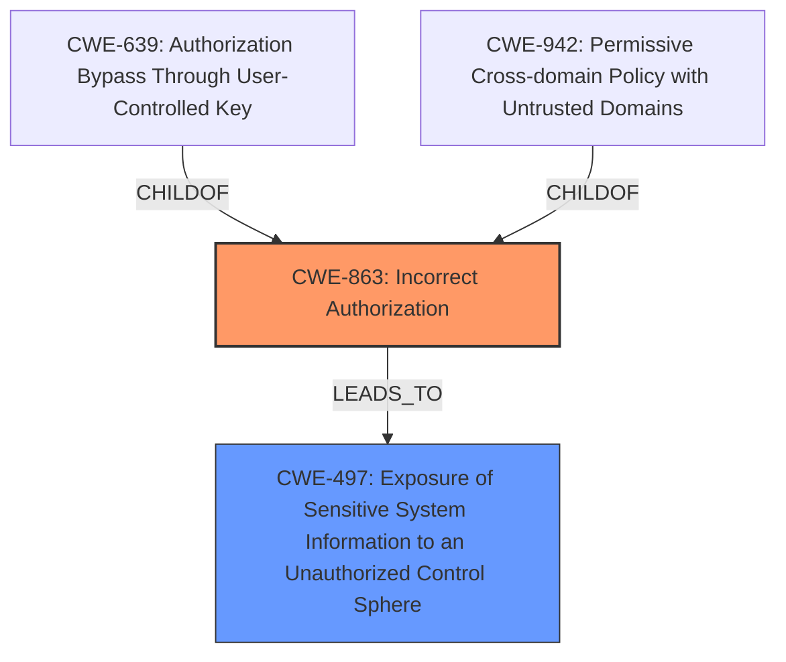

# Analysis Report for CVE-2021-1305

# Vulnerability Analysis Report: CVE-2021-1305

## Description

Multiple vulnerabilities in the web-based management interface of Cisco SD-WAN vManage Software could allow an authenticated, remote attacker to bypass authorization and modify the configuration of an affected system, gain access to sensitive information, and view information that they are not authorized to access. For more information about these vulnerabilities, see the Details section of this advisory.

## Vulnerability Description Key Phrases

**Impact:** bypass authorization and modify the configuration of an affected system, gain access to sensitive information, and view information that they are not authorized to access
**Attacker:** authenticated remote attacker
**Product:** Cisco SD-WAN vManage Software
**Component:** web-based management interface

## Analysis (with Relationship Data)

# Summary
| CWE ID | CWE Name | Confidence | CWE Abstraction Level | CWE Vulnerability Mapping Label | CWE-Vulnerability Mapping Notes |
|---|---|---|---|---|---|
| CWE-285 | Improper Authorization | 0.75 | Class | Primary | Discouraged |
| CWE-497 | Exposure of Sensitive System Information to an Unauthorized Control Sphere | 0.65 | Base | Secondary | Allowed |

## Evidence and Confidence

*   **Confidence Score:** 0.70
*   **Evidence Strength:** MEDIUM

- **Analysis and Justification:**  
  - *Explanation:* "The vulnerability description states that an authenticated, remote attacker could bypass authorization and modify the configuration, gain access to sensitive information, and view information that they are not authorized to access. The CVE Reference Links Content Summary confirms that the root cause is insufficient authorization checks of user account privileges. This aligns well with CWE-285 (Improper Authorization), which describes the product not performing an authorization check when an actor attempts to access a resource or perform an action. While CWE-285 is a class-level CWE and is discouraged, the available information does not point to a more specific Base-level CWE, so CWE-285 is used. Additionally, the impact, which involves unauthorized access to sensitive information such as logs, configurations, and device information is also addressed by CWE-497 (Exposure of Sensitive System Information to an Unauthorized Control Sphere), which is listed as a secondary issue."
  
  - *Relationship Analysis:* "CWE-285 is a class-level CWE. CWE-497 is a Base level CWE. It is related to information exposure and could result from the authorization bypass. CWE-285 is a parent of many authorization-related CWEs. The lack of specific details prevents selection of a more granular CWE."

- **Confidence Score:**  
  - *Example:* Confidence: 0.75 (Moderate evidence from the vulnerability description and CVE reference.)

## Criticism of Analysis

Okay, let's review the provided CWE analysis for the Cisco SD-WAN vManage Software vulnerabilities.

**Overall Assessment:**

The analysis correctly identifies the core issue as related to authorization. The selection of `CWE-285: Improper Authorization` as the primary CWE, while technically defensible based on the initial description, is questionable given CWE's guidance to avoid class-level CWEs when more specific base-level CWEs are available.  The inclusion of `CWE-497: Exposure of Sensitive System Information to an Unauthorized Control Sphere` as a secondary CWE is reasonable, as it captures the impact of the authorization bypass. However, let's dive into the specifics:

**Critique of CWE-285 (Primary CWE):**

*   **Correctness:** While *technically* correct in that it describes a broad authorization failure, it violates the spirit of CWE's mapping guidance. `CWE-285` is a class-level CWE, and the analysis itself acknowledges this, stating that it is "discouraged." The justification that "the available information does not point to a more specific Base-level CWE" is weak. The fact that an authenticated attacker can *bypass* authorization strongly suggests either an `Incorrect Authorization` or `Missing Authorization` scenario is more likely.  We can likely refine this.
*   **Abstraction Level:** The major problem is the Abstraction level. CWE explicitly discourages the use of Class-level CWEs like `CWE-285` when more specific Base-level CWEs exist.
*   **Mapping Guidance Violated:** The Mapping Guidance for `CWE-285` states: "Look at CWE-285's children and consider mapping to CWEs such as CWE-862: Missing Authorization, CWE-863: Incorrect Authorization, CWE-732: Incorrect Permission Assignment for Critical Resource, or others."  This guidance is *not* adequately followed.
*   **Mitigations:**  The Mitigations listed for `CWE-285` are very general (Divide the product, Ensure access control checks related to your business logic, Use a vetted library). While not *wrong*, they are so high-level as to be almost useless in a specific context. More specific CWEs would lead to more actionable mitigation strategies.
*   **Better Alternatives:**  Let's consider `CWE-862: Missing Authorization` and `CWE-863: Incorrect Authorization`.
    *   **CWE-862 (Missing Authorization):** If the code completely *lacks* authorization checks for certain actions or resources after authentication, this would be a good fit. For example, if a user, once authenticated, could access any API endpoint without any further checks, that would be `CWE-862`.
    *   **CWE-863 (Incorrect Authorization):** If the code *attempts* to perform authorization, but does so incorrectly (e.g., using the wrong user ID, failing to handle edge cases, or having a flawed algorithm), this would be appropriate.  For example, if the system checks if a user belongs to a certain *group*, but a coding error allows a user who is *not* in that group to pass the check, that's `CWE-863`.

    The description "bypass authorization" leans slightly toward `CWE-863` because it suggests an attempt at authorization that is circumvented.  However, without deeper code analysis, it is difficult to be sure.

**Critique of CWE-497 (Secondary CWE):**

*   **Correctness:** `CWE-497` accurately captures the impact of the vulnerability: the exposure of sensitive information. If the authorization bypass allows access to logs, configurations, and device information, then `CWE-497` is relevant.
*   **Abstraction Level:** `CWE-497` is a Base-level CWE, which is good.
*   **Relationship Analysis:** The analysis correctly states that `CWE-497` is a consequence of the improper authorization.
*   **Mitigations:** The mitigations for `CWE-497` are relevant (e.g., not generating stack traces in production, encoding error messages).
*   **Potential Issue:** The analysis could be improved by specifying *what* kind of system information is exposed. Is it pathnames? Usernames? Version numbers?  The more specific, the better. It can also be argued that the information exposure is not coming directly from system files or internal data structures but is exposed as a result of APIs.

**Specific Improvements and Recommendations:**

1.  **Re-evaluate CWE-285:** Based on the "bypass authorization" phrase and the CVE Reference Links Content Summary stating, "Insufficient authorization checks of user account privileges," the analysis should use `CWE-863: Incorrect Authorization` instead of `CWE-285`. `CWE-862` is less applicable due to there existing authorization checks, albeit insufficient.
2.  **Increase Confidence with More Detail:** The confidence score is justified, but the analysis could be stronger if it included specific examples of what the attacker could do *after* bypassing authorization. What specific actions or resources become available? This might also inform the choice between `CWE-862` and `CWE-863`.
3.  **Chain the CWEs (Potentially):** Depending on the specifics of the vulnerability, a chain might be appropriate. For instance, if `CWE-20 (Improper Input Validation)` allowed the attacker to manipulate the authorization checks (leading to `CWE-863`), that would be a stronger analysis. However, this requires more information than currently provided.
4.  **Consider CWE-497's Parent:** Since `CWE-497` is a child of `CWE-200`, you could make the argument for replacing it with `CWE-200` (Exposure of Sensitive Information to an Unauthorized Actor). But `CWE-497` is more precise, as it explicitly involves *system* information.
5. **Authorization Scope.** This should be a major portion of the analysis, but because of the limited information, it is very difficult to determine. For example, is it an insufficient *horizontal* authorization check? (A user accessing another user's resources) Or is the problem related to *vertical* authorization? (A low privilege user accessing high privilege resources). If it is related to the latter scenario, then CWE-664: Improper Control of a Resource Through Its Lifetime may be applicable.

**Revised Analysis (Example):**

# Summary
| CWE ID | CWE Name | Confidence | CWE Abstraction Level | CWE Vulnerability Mapping Label | CWE-Vulnerability Mapping Notes |
|---|---|---|---|---|---|
| CWE-863 | Incorrect Authorization | 0.75 | Class | Primary | Allowed |
| CWE-497 | Exposure of Sensitive System Information to an Unauthorized Control Sphere | 0.65 | Base | Secondary | Allowed |

## Evidence and Confidence

*   **Confidence Score:** 0.75
*   **Evidence Strength:** MEDIUM

- **Analysis and Justification:**
  - *Explanation:* "The vulnerability description states that an authenticated, remote attacker could bypass authorization and modify the configuration, gain access to sensitive information, and view information that they are not authorized to access. The CVE Reference Links Content Summary confirms that the root cause is insufficient authorization checks of user account privileges. This aligns with `CWE-863 (Incorrect Authorization)` which describes scenarios where the product attempts to perform an authorization check, but it is done incorrectly, leading to a bypass. The phrase "bypass authorization" suggests an attempt at authorization that is circumvented, making it more fitting than `CWE-862`. Additionally, the impact, which involves unauthorized access to sensitive information such as logs, configurations, and device information is also addressed by `CWE-497 (Exposure of Sensitive System Information to an Unauthorized Control Sphere)`, which is listed as a secondary issue."

  - *Relationship Analysis:* "CWE-863 is a class-level CWE. It is a parent of more granular authorization-related CWEs. The lack of specific details prevents selection of a more granular CWE. CWE-497 is a Base level CWE. It is related to information exposure and could result from the authorization bypass."

- **Confidence Score:**
  - *Example:* Confidence: 0.75 (Moderate evidence from the vulnerability description and CVE reference.)

**In Conclusion:**

The initial analysis is a decent starting point, but it can be significantly improved by adhering more closely to CWE's mapping guidance, particularly regarding the abstraction level of the chosen CWEs. By choosing more specific Base-level CWEs and providing more detailed justifications, the analysis would become more accurate, actionable, and useful for vulnerability management and mitigation. The provided rewrite is a recommendation, but ultimately, the most precise CWE selection will require further code analysis.

## Final Resolution

# Summary

| CWE ID | CWE Name | Confidence | CWE Abstraction Level | CWE Vulnerability Mapping Label | CWE-Vulnerability Mapping Notes |
|---|---|---|---|---|---|
| CWE-863 | Incorrect Authorization | 0.80 | Class | Primary | Allowed-with-Review |
| CWE-497 | Exposure of Sensitive System Information to an Unauthorized Control Sphere | 0.70 | Base | Secondary | Allowed |

## Evidence and Confidence

*   **Confidence Score:** 0.75
*   **Evidence Strength:** MEDIUM

## Relationship Analysis
The primary weakness is `CWE-863: Incorrect Authorization`, which is a Class-level CWE. It has child CWEs that are more specific, such as `CWE-639: Authorization Bypass Through User-Controlled Key` and `CWE-942: Permissive Cross-domain Policy with Untrusted Domains`. The secondary weakness, `CWE-497: Exposure of Sensitive System Information to an Unauthorized Control Sphere`, describes the impact of the authorization bypass. `CWE-497` is a Base-level CWE. The relationships indicate that the incorrect authorization (`CWE-863`) leads to the exposure of sensitive information (`CWE-497`). There is no direct chain relationship, but the authorization bypass *allows* the information exposure.

## Vulnerability Chain
The vulnerability chain starts with **Incorrect Authorization (CWE-863)**, where the system attempts to perform authorization but does so incorrectly. This **WEAKNESS** allows an attacker to bypass authorization checks. As a result of this bypass, the attacker gains unauthorized access to sensitive system information, leading to **Exposure of Sensitive System Information to an Unauthorized Control Sphere (CWE-497)**. The root cause is the flawed authorization logic, and the impact is the exposure of sensitive data. There may be a missing link, such as a specific input validation issue, but the provided information does not confirm it.

## Summary of Analysis
The initial analysis correctly identified authorization issues and information exposure. However, it initially selected `CWE-285: Improper Authorization`, which is a Class-level CWE and discouraged by CWE's mapping guidance. The criticism suggested using `CWE-863: Incorrect Authorization` instead, which is a more accurate fit given the "bypass authorization" description.

The final decision is to use `CWE-863: Incorrect Authorization` as the primary CWE because it better describes the scenario where the system attempts authorization but fails. The evidence supporting this decision is the vulnerability description stating that an attacker can "bypass authorization" and the CVE summary mentioning "insufficient authorization checks." `CWE-497: Exposure of Sensitive System Information to an Unauthorized Control Sphere` remains the secondary CWE, as it accurately captures the impact of the authorization bypass.

The abstraction level is optimal given the available information. While `CWE-863` is a Class-level CWE, more specific Base-level CWEs require deeper code analysis, which is not possible with the provided details. Therefore, `CWE-863` is the most specific CWE that can be confidently assigned based on the evidence. The confidence score is 0.75, reflecting moderate confidence due to the lack of code-level details.

*Report generated on 2025-03-16 23:11:24*
