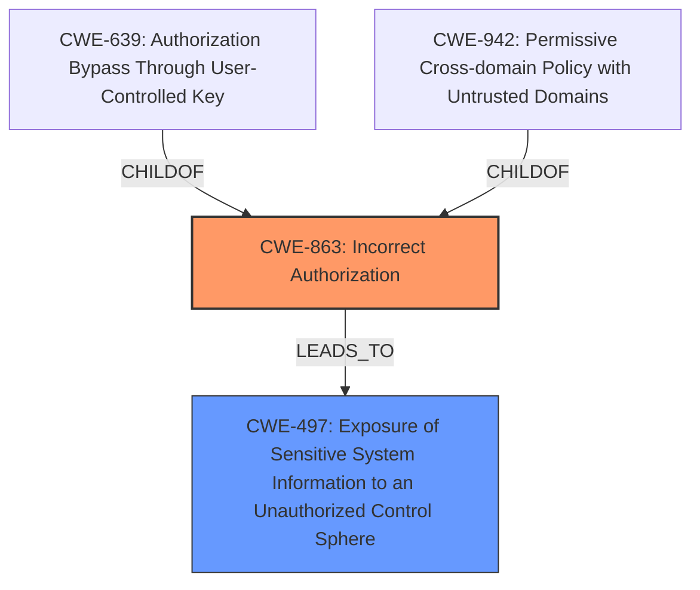

# Final Resolution for CVE-2021-1305

# Summary

| CWE ID | CWE Name | Confidence | CWE Abstraction Level | CWE Vulnerability Mapping Label | CWE-Vulnerability Mapping Notes |
|---|---|---|---|---|---|
| CWE-863 | Incorrect Authorization | 0.80 | Class | Primary | Allowed-with-Review |
| CWE-497 | Exposure of Sensitive System Information to an Unauthorized Control Sphere | 0.70 | Base | Secondary | Allowed |

## Evidence and Confidence

*   **Confidence Score:** 0.75
*   **Evidence Strength:** MEDIUM

## Relationship Analysis
The primary weakness is `CWE-863: Incorrect Authorization`, which is a Class-level CWE. It has child CWEs that are more specific, such as `CWE-639: Authorization Bypass Through User-Controlled Key` and `CWE-942: Permissive Cross-domain Policy with Untrusted Domains`. The secondary weakness, `CWE-497: Exposure of Sensitive System Information to an Unauthorized Control Sphere`, describes the impact of the authorization bypass. `CWE-497` is a Base-level CWE. The relationships indicate that the incorrect authorization (`CWE-863`) leads to the exposure of sensitive information (`CWE-497`). There is no direct chain relationship, but the authorization bypass *allows* the information exposure.

## Vulnerability Chain
The vulnerability chain starts with **Incorrect Authorization (CWE-863)**, where the system attempts to perform authorization but does so incorrectly. This **WEAKNESS** allows an attacker to bypass authorization checks. As a result of this bypass, the attacker gains unauthorized access to sensitive system information, leading to **Exposure of Sensitive System Information to an Unauthorized Control Sphere (CWE-497)**. The root cause is the flawed authorization logic, and the impact is the exposure of sensitive data. There may be a missing link, such as a specific input validation issue, but the provided information does not confirm it.

## Summary of Analysis
The initial analysis correctly identified authorization issues and information exposure. However, it initially selected `CWE-285: Improper Authorization`, which is a Class-level CWE and discouraged by CWE's mapping guidance. The criticism suggested using `CWE-863: Incorrect Authorization` instead, which is a more accurate fit given the "bypass authorization" description.

The final decision is to use `CWE-863: Incorrect Authorization` as the primary CWE because it better describes the scenario where the system attempts authorization but fails. The evidence supporting this decision is the vulnerability description stating that an attacker can "bypass authorization" and the CVE summary mentioning "insufficient authorization checks." `CWE-497: Exposure of Sensitive System Information to an Unauthorized Control Sphere` remains the secondary CWE, as it accurately captures the impact of the authorization bypass.

The abstraction level is optimal given the available information. While `CWE-863` is a Class-level CWE, more specific Base-level CWEs require deeper code analysis, which is not possible with the provided details. Therefore, `CWE-863` is the most specific CWE that can be confidently assigned based on the evidence. The confidence score is 0.75, reflecting moderate confidence due to the lack of code-level details.