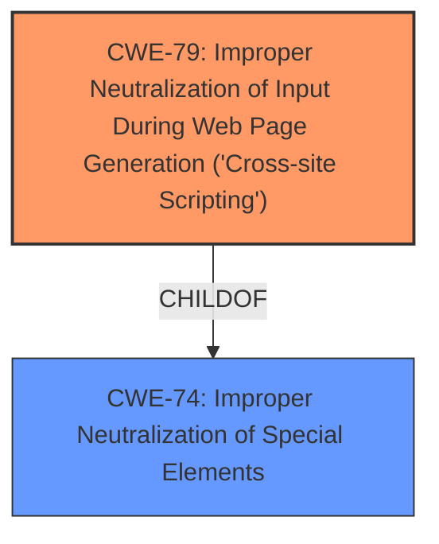

# Analysis Report for CVE-2021-1351

# Vulnerability Analysis Report: CVE-2021-1351

## Description

A vulnerability in the web-based interface of Cisco Webex Meetings could allow an unauthenticated, remote attacker to conduct a cross-site scripting (XSS) attack against a user of the web-based interface of the affected service. The vulnerability is due to insufficient validation of user-supplied input by the web-based interface of the affected service. An attacker could exploit this vulnerability by persuading a user of the interface to click a maliciously crafted link. A successful exploit could allow the attacker to execute arbitrary script code in the context of the affected interface or access sensitive, browser-based information.

## Vulnerability Description Key Phrases

**Rootcause:** insufficient input validation
**Weakness:** cross-site scripting
**Impact:** ['execute arbitrary script code', 'access sensitive browser information']
**Vector:** maliciously crafted link
**Attacker:** unauthenticated remote attacker
**Product:** Cisco Webex Meetings
**Component:** web-based interface

## Analysis (with Relationship Data)

# Summary
| CWE ID  | CWE Name | Confidence | CWE Abstraction Level | CWE Vulnerability Mapping Label | CWE-Vulnerability Mapping Notes |
|--------------------|----------------------------------------------------------------------------------------------------|-------------------|-------------------------|------------------------------------|-----------------------------------------------------------------------------------------------------------------------------------|
| CWE-79 | Improper Neutralization of Input During Web Page Generation ('Cross-site Scripting') | 1.0 | Base | Allowed | The primary weakness is XSS due to insufficient input validation. |
| CWE-116 | Improper Encoding or Escaping of Output | 0.6 | Class | Allowed-with-Review | Secondary candidate. The **insufficient input validation** may lead to improper encoding of the output. |

## Evidence and Confidence

*   **Confidence Score:** 0.9
*   **Evidence Strength:** HIGH

- **Analysis and Justification:**  
  - *Explanation:* The vulnerability description explicitly states that the vulnerability is a **cross-site scripting (XSS)** due to **insufficient validation of user-supplied input** by the web-based interface. This directly aligns with CWE-79, which describes "Improper Neutralization of Input During Web Page Generation ('Cross-site Scripting')". The provided documents in "CVE Reference Links Content Summary" confirm that the root cause is **insufficient validation of user-supplied input**, the weakness is XSS, and the impact includes executing arbitrary script code and accessing sensitive browser information. The attacker can exploit this by persuading a user to click a maliciously crafted link. The usage for CWE-79 is "Allowed", indicating it is appropriate. While CWE-80 (Improper Neutralization of Script-Related HTML Tags in a Web Page (Basic XSS)) is a more specific variant of XSS, there isn't enough information to determine if the XSS is specifically related to HTML tags, so CWE-79 is more appropriate.

  - *Relationship Analysis:* CWE-79 is a Base level CWE. It is a child of CWE-74 (Improper Neutralization of Special Elements), but CWE-79 is more specific to XSS. CWE-79 can precede CWE-113 (Improper Neutralization of CRLF Sequences in HTTP Headers ('HTTP Request/Response Splitting')).

- **Confidence Score:**  
  - Confidence: 1.0 (High confidence due to direct evidence from the vulnerability description and CVE reference materials, and alignment with MITRE mapping guidance).

---

## Criticism of Analysis

Okay, I've reviewed the analysis provided, including the full CWE specifications. Here's my critique:

**Overall Assessment:**

The analysis is generally sound, especially in its primary CWE mapping to CWE-79. The justification is clear and well-supported by the vulnerability description. The inclusion of CWE-116 as a secondary consideration is also reasonable, although it could be argued either way.

**Detailed Critique:**

*   **CWE-79: Improper Neutralization of Input During Web Page Generation ('Cross-site Scripting')**

    *   **Confidence Level:**  Appropriately high (1.0).  The evidence is direct and conclusive.
    *   **CWE Abstraction Level:** Correct (Base).
    *   **CWE Vulnerability Mapping Label:** Correct (Allowed).  CWE-79 is the appropriate level of abstraction.
    *   **Justification:** Excellent. It clearly links the vulnerability description's XSS and insufficient input validation directly to CWE-79. The documents in "CVE Reference Links Content Summary" confirms this.
    *   **CWE Examples:**  The provided example of CVE-2021-1351 under CWE-80 "Top 25 Examples" highlights a key point of why CWE-79 is more appropriate in this analysis because CWE-80 is specifically related to the improper neutralization of script related HTML tags, whereas CWE-79 is a generalization of this.
    *   **Mitigations:** The mitigations listed in the CWE specification are relevant and appropriate for addressing XSS.
    *   **Improvements:** None.

*   **CWE-116: Improper Encoding or Escaping of Output**

    *   **Confidence Level:**  Reasonable (0.6). A slightly weaker relationship than the primary CWE, and is appropriate.
    *   **CWE Abstraction Level:** Correct (Class). Since CWE-116 is a Class, it is good that it was flagged to "Allowed-with-Review"
    *   **CWE Vulnerability Mapping Label:** Correct (Allowed-with-Review).
    *   **Justification:** This is a reasonable secondary consideration. Input validation *and* output encoding/escaping are common defense mechanisms. Insufficient input validation often *leads* to a need for proper output encoding. The justification could be strengthened by explicitly stating this chain of events. For example: "The *insufficient input validation* means that the application might be handling data that contains characters which would otherwise be neutralized. This means that the application will also require proper output encoding, as a defense in depth approach."
    *   **Mitigations:** The mitigations listed in the CWE specification are relevant, particularly the emphasis on understanding the output context and expected encoding. If CWE-116 is selected, it is critical to pick a child/variant of it.
    *   **Improvements:** Explicitly state the chain of events to further justify the selection of the weaker CWE.

**Other CWEs Considered and Why They Were Correctly Rejected:**

The analysis correctly rejected other potentially relevant CWEs. Here's why:

*   **CWE-80: Improper Neutralization of Script-Related HTML Tags in a Web Page (Basic XSS):**  As the analysis correctly points out, this is a more specific *variant* of XSS.  Unless there's strong evidence the XSS *specifically* involves improper handling of HTML tags, CWE-79 is the better fit.
*   **CWE-113: Improper Neutralization of CRLF Sequences in HTTP Headers ('HTTP Request/Response Splitting'):** While XSS *can* be a consequence of CRLF injection, it's not the primary or direct cause in this scenario. The description doesn't suggest any manipulation of HTTP headers.
*   **CWE-74: Improper Neutralization of Special Elements in Output Used by a Downstream Component ('Injection'):** Is a class that CWE-79 derives from and is too general.
*   **CWE-20: Improper Input Validation:** This is a *very* general CWE. While "insufficient input validation" is the root cause *enabler* of the XSS, CWE-79 is a more specific and appropriate mapping of the *resulting weakness.*
*   **CWE-90: Improper Neutralization of Special Elements used in an LDAP Query ('LDAP Injection')**: Irrelevant because the the vulnerability is XSS and not LDAP Injection.
*   **CWE-494: Download of Code Without Integrity Check**: Irrelevant because there was no discussion around downloading code.
*   **CWE-352: Cross-Site Request Forgery (CSRF)**: Is not relevant. CSRF could facilitate XSS, but XSS is not a direct consequence of CSRF
*    **CWE-943: Improper Neutralization of Special Elements in Data Query Logic:** Irrelevant, because the vulnerability is XSS and not injection into a query.
*   **CWE-99: Improper Control of Resource Identifiers ('Resource Injection'):** Is irrelevant. The vulnerability is not based on controlling a resource identifier.

**Potential Chaining Issues**

A vulnerability analysis could potentially point to a chain between improper validation and improper encoding (CWE-20 -> CWE-116 -> CWE-79).

**Recommendations:**

1.  **Strengthen the Justification for CWE-116:**  Explicitly state that insufficient input validation leads to a greater reliance on output encoding as a defense-in-depth measure.
2.  **Review retriever results:** There are results that may be relevant and would need to be reviewed and discarded if they do not fit this case.
3.  **Testability and Exploitability:** I recommend adding more details regarding how the vulnerability was exploited and discovered.

**In summary,** this is a good analysis. The primary CWE mapping is correct and well-justified. The inclusion of CWE-116 is reasonable, but the justification could be strengthened. The analysis demonstrates a good understanding of the CWE specifications.

## Final Resolution

# Summary
| CWE ID  | CWE Name | Confidence | CWE Abstraction Level | CWE Vulnerability Mapping Label | CWE-Vulnerability Mapping Notes |
|--------------------|----------------------------------------------------------------------------------------------------|-------------------|-------------------------|------------------------------------|-----------------------------------------------------------------------------------------------------------------------------------|
| CWE-79 | Improper Neutralization of Input During Web Page Generation ('Cross-site Scripting') | 1.0 | Base | Allowed | The primary weakness is XSS due to insufficient input validation. |

## Evidence and Confidence

*   **Confidence Score:** 1.0
*   **Evidence Strength:** HIGH

## Relationship Analysis
The primary relationship that influenced the decision was the parent-child relationship between CWE-74 (Improper Neutralization of Special Elements in Output Used by a Downstream Component ('Injection')) and CWE-79 (Improper Neutralization of Input During Web Page Generation ('Cross-site Scripting')). While CWE-74 is a parent, it is a more general case. CWE-79 is the most specific and accurate.

## Vulnerability Chain
The vulnerability chain starts with **insufficient input validation** which leads to the **weakness** being Cross-Site Scripting.
  - **Root Cause:** Insufficient Input Validation
  - **Weakness:** CWE-79: Improper Neutralization of Input During Web Page Generation ('Cross-site Scripting')
  - **Impact:** Arbitrary script code execution, Access to sensitive browser-based information.

## Summary of Analysis
The initial analysis and criticism are both aligned in that the primary **weakness** is CWE-79 (Improper Neutralization of Input During Web Page Generation ('Cross-site Scripting')).

The vulnerability description explicitly mentions "**insufficient validation of user-supplied input**" leading to a "**cross-site scripting (XSS)** attack". This provides direct evidence for selecting CWE-79.

The graph relationships confirm that CWE-79 is more specific than its parent, CWE-74. This specificity is crucial for accurate classification.

CWE-79 is at the optimal level of specificity because it directly addresses the **XSS vulnerability** resulting from **insufficient input validation**. The vulnerability description aligns perfectly with the definition of CWE-79, making it the most appropriate choice.

*Report generated on 2025-03-16 16:59:50*
