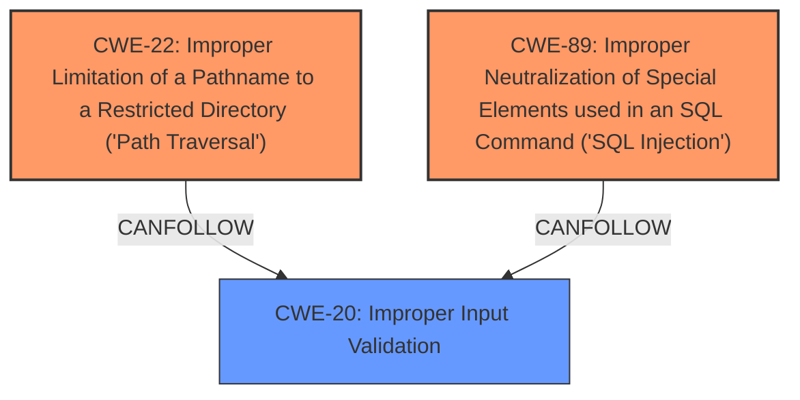

# Final Resolution for CVE-2021-1357

# Summary

| CWE ID | CWE Name | Confidence | CWE Abstraction Level | CWE Vulnerability Mapping Label | CWE-Vulnerability Mapping Notes |
|---|---|---|---|---|---|
| CWE-22 | Improper Limitation of a Pathname to a Restricted Directory ('Path Traversal') | 0.9 | Base | Primary | Allowed |
| CWE-20 | Improper Input Validation | 0.8 | Class | Secondary | CanFollow: **Path traversal vulnerability** is caused by lack of proper input validation. |
| CWE-89 | Improper Neutralization of Special Elements used in an SQL Command ('SQL Injection') | 0.9 | Base | Primary | Allowed |
| CWE-20 | Improper Input Validation | 0.8 | Class | Secondary | CanFollow: **SQL injection vulnerability** is caused by lack of proper input validation. |

## Evidence and Confidence

*   **Confidence Score:** 0.9
*   **Evidence Strength:** HIGH

## Relationship Analysis
The primary relationships that impacted my decision were the `CanFollow` relationship between **CWE-22** (Improper Limitation of a Pathname to a Restricted Directory ('Path Traversal')) and **CWE-20** (Improper Input Validation), as well as the `CanFollow` relationship between **CWE-89** (Improper Neutralization of Special Elements used in an SQL Command ('SQL Injection')) and **CWE-20**. These relationships indicate that the **path traversal** and **SQL injection vulnerabilities** are a consequence of improper input validation. I chose to include **CWE-20** as a secondary CWE to highlight this underlying cause. Although **CWE-20** is a Class level CWE, its inclusion is justified by its direct contribution to the vulnerability chain and the explicit mention of improper validation in the vulnerability description. I chose the base level CWEs for the primary causes since that is the recommended approach.

## Vulnerability Chain
The vulnerability chain starts with **CWE-20** (Improper Input Validation). Due to the lack of proper input validation, an attacker can inject malicious path traversal sequences leading to **CWE-22** (Improper Limitation of a Pathname to a Restricted Directory ('Path Traversal')), allowing the attacker to access unauthorized files. Similarly, due to the lack of proper input validation, an attacker can inject malicious SQL code leading to **CWE-89** (Improper Neutralization of Special Elements used in an SQL Command ('SQL Injection')), allowing the attacker to execute arbitrary SQL commands.
  - The sequence of weaknesses starts with **CWE-20** leading to either **CWE-22** or **CWE-89**
  - **CWE-20** represents the root cause. **CWE-22** and **CWE-89** represent the impacts.
  - No missing links were identified based on the provided relationship data.

## Summary of Analysis
The initial analysis correctly identified **CWE-22** and **CWE-89** as the primary **weaknesses** based on the vulnerability description, which explicitly mentions "**path traversal attacks** and **SQL injection attacks**." The CVE reference summary further confirms the **path traversal vulnerability** due to improper validation of user-supplied input.

The criticism provided valuable insights into strengthening the analysis by explicitly chaining the CWEs and considering more specific CWEs where appropriate. Based on the criticism and relationship analysis, I added **CWE-20** (Improper Input Validation) as a secondary CWE to highlight the underlying cause of both **path traversal** and **SQL injection vulnerabilities**.

The selected CWEs are at the optimal level of specificity. While more specific CWEs could be considered, they might not perfectly fit the general description of the vulnerabilities. **CWE-22** and **CWE-89** accurately represent the nature of the vulnerabilities, and **CWE-20** provides valuable context regarding the root cause.

The decision to include **CWE-20** is also supported by the CVE summary, which notes that the root cause is improper validation of user-supplied input. This explicit mention of improper validation justifies the inclusion of **CWE-20** in the analysis, even though it is a Class level CWE.