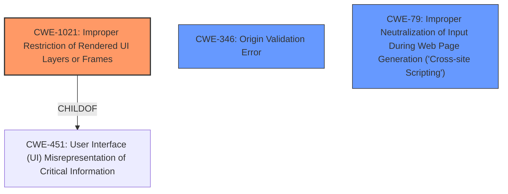

# Analysis Report for CVE-2021-1403

# Vulnerability Analysis Report: CVE-2021-1403

## Description

A vulnerability in the web UI feature of Cisco IOS XE Software could allow an unauthenticated, remote attacker to conduct a cross-site WebSocket hijacking (CSWSH) attack and cause a denial of service (DoS) condition on an affected device. This vulnerability is due to insufficient HTTP protections in the web UI on an affected device. An attacker could exploit this vulnerability by persuading an authenticated user of the web UI to follow a crafted link. A successful exploit could allow the attacker to corrupt memory on the affected device, forcing it to reload and causing a DoS condition.

## Vulnerability Description Key Phrases

**Rootcause:** insufficient HTTP protections
**Impact:** ['cross-site WebSocket hijacking (CSWSH) attack', 'denial of service (DoS) condition']
**Vector:** crafted link
**Attacker:** unauthenticated remote attacker
**Product:** Cisco IOS XE Software
**Component:** web UI feature

## Analysis (with Relationship Data)

# Summary
| CWE ID | CWE Name | Confidence | CWE Abstraction Level | CWE Vulnerability Mapping Label | CWE-Vulnerability Mapping Notes |
|---|---|---|---|---|---|
| CWE-1021 | Improper Restriction of Rendered UI Layers or Frames | 0.75 | Base | Allowed | Primary CWE |
| CWE-346 | Origin Validation Error | 0.60 | Class | Allowed-with-Review | Secondary Candidate |
| CWE-79 | Improper Neutralization of Input During Web Page Generation ('Cross-site Scripting') | 0.50 | Base | Allowed | Secondary Candidate |
| CWE-20 | Improper Input Validation | 0.40 | Class | Discouraged | Secondary Candidate |

## Evidence and Confidence

*   **Confidence Score:** 0.70
*   **Evidence Strength:** MEDIUM

- **Analysis and Justification:**
  - *Explanation:* The vulnerability allows an unauthenticated attacker to perform a cross-site websocket hijacking (CSWSH) attack by persuading an authenticated user to click a crafted link. The **root cause** is attributed to **insufficient HTTP protections** in the web UI. CWE-1021 (Improper Restriction of Rendered UI Layers or Frames) aligns well with this because it involves the lack of proper restrictions on UI layers or frames, potentially leading to user confusion and vulnerabilities like CSWSH. The attack involves tricking an authenticated user, which suggests the rendered UI isn't properly isolated.

  - *Relationship Analysis:* While CWE-1021 doesn't have direct relationships in the provided data, its nature relates to cross-site issues which could involve weaknesses such as CWE-79 (Cross-Site Scripting), but this isn't directly indicated in the description. CWE-346 (Origin Validation Error) could be applicable as the origin isn't properly validated, contributing to the CSWSH.

- **Confidence Score:**
  - *Example:* Confidence: 0.75 (Moderate evidence due to the nature of CSWSH and UI rendering issues)

---
### Additional considerations for secondary candidates:

*   **CWE-346 (Origin Validation Error):** This is considered as a secondary candidate because CSWSH inherently relies on the inability to properly validate the origin of websocket requests. The **insufficient HTTP protections** could imply a failure to validate the origin. Confidence: 0.60

*   **CWE-79 (Improper Neutralization of Input During Web Page Generation ('Cross-site Scripting')):** Although the description doesn't explicitly mention XSS, CSWSH attacks often involve elements of XSS to craft the malicious link and persuade the user. However, without explicit evidence of input being improperly neutralized, this is a lower confidence mapping. Confidence: 0.50

*   **CWE-20 (Improper Input Validation):** This is a general weakness and is discouraged when more specific CWEs are available. While the **insufficient HTTP protections** imply some form of input validation failure, it's too broad to be the primary mapping. Confidence: 0.40

## Criticism of Analysis

Okay, I've reviewed the provided analysis against the full CWE specifications. Here's my critique:

**Overall Assessment:**

The analysis is generally good, but there are areas where the CWE selection could be more precise, and the justifications could be strengthened by directly referencing relevant aspects of the CWE specifications. The confidence scores are appropriate for the level of evidence presented.

**Detailed Review:**

1.  **CWE-1021 (Improper Restriction of Rendered UI Layers or Frames) - Primary CWE:**

    *   **Confidence:** 0.75 - Appropriate confidence.
    *   **Justification:** The justification is reasonable, connecting the lack of UI restrictions to the possibility of CSWSH. The explanation that "the rendered UI isn't properly isolated" is on the right track.
    *   **Critique:** The description directly says "Web application is expected to place restrictions on whether it is allowed to be rendered within frames, iframes, objects, embed or applet elements. Without the restrictions, users can be tricked into interacting with the application when they were not intending to." In our case, the crafted link can make it seem to the user that it's a legitimate part of the web UI, when in reality it redirects the connection.
    *   **Mitigations:** The mitigations suggest implementation controls such as `X-Frame-Options` or Content Security Policy (CSP). This indicates that it will prevent iframing and clickjacking attacks, which are the same family of attacks.
    *   **Improvements:**  Explicitly state that the user is being tricked into interacting with a UI element (the link) that appears to be part of the trusted application but is actually controlled by the attacker, leading to the CSWSH.

2.  **CWE-346 (Origin Validation Error) - Secondary Candidate:**

    *   **Confidence:** 0.60 - Appropriate confidence.
    *   **Justification:**  The explanation that CSWSH relies on the inability to properly validate the origin of WebSocket requests is accurate.
    *   **Critique:** This CWE is a Class, and the mapping guidance recommends examining its children for a better fit. While appropriate at a high level, it lacks the necessary nuance for describing the actual vulnerability.  The "additional details" from the CVE Reference Links Content Summary indicates the HTTP Server feature is enabled, which is controlled by the user.
    *   **Improvements:** While valid as a secondary candidate, it might be better to look for a more specific child of CWE-346.  Consider a potential chain involving improper configuration (user enabling the HTTP server) that leads to a lack of origin validation.

3.  **CWE-79 (Improper Neutralization of Input During Web Page Generation ('Cross-site Scripting')) - Secondary Candidate:**

    *   **Confidence:** 0.50 - Justified confidence, given the limited evidence.
    *   **Justification:** Acknowledges the possibility of XSS being involved in crafting the malicious link.
    *   **Critique:**  The description correctly notes that there's no *explicit* evidence of improper input neutralization. This makes the mapping weak.
    *   **Improvements:** Unless there's further evidence of XSS being directly involved (e.g., the crafted link *injects* script into the web page), this mapping should remain a low-confidence secondary consideration.

4.  **CWE-20 (Improper Input Validation) - Secondary Candidate:**

    *   **Confidence:** 0.40 - Correctly identified as discouraged and too general.
    *   **Justification:** Correctly states that it's a general weakness.
    *   **Critique:** The analysis appropriately recognizes that CWE-20 is discouraged when more specific CWEs exist.
    *   **Improvements:** No changes needed, as the analysis correctly discourages this mapping.

**Additional Considerations:**

*   **Missing CWEs:** Given the information provided, it's difficult to pinpoint additional specific CWEs without more context. However, one area to explore is the configuration of the web UI itself. Is there a default configuration that's insecure? If so, then CWE-272 (Least Privilege Violation) could be considered.
*   **Chains:** More exploration of CWE chains could strengthen the analysis. For example: Improper Configuration -> Lack of Origin Validation -> CSWSH -> DoS.

**Revised Summary Table:**

| CWE ID | CWE Name | Confidence | CWE Abstraction Level | CWE Vulnerability Mapping Label | CWE-Vulnerability Mapping Notes |
|---|---|---|---|---|---|
| CWE-1021 | Improper Restriction of Rendered UI Layers or Frames | 0.75 | Base | Allowed | Primary CWE |
| CWE-346 | Origin Validation Error | 0.60 | Class | Allowed-with-Review | Secondary Candidate |
| CWE-79 | Improper Neutralization of Input During Web Page Generation ('Cross-site Scripting') | 0.50 | Base | Allowed | Secondary Candidate |
| CWE-20 | Improper Input Validation | 0.40 | Class | Discouraged | Secondary Candidate |

**In summary:** The analysis demonstrates a good understanding of the vulnerability and the CWE framework. However, strengthening the justifications by explicitly referencing relevant aspects of the CWE specifications and exploring potential CWE chains would make the analysis even more robust.

## Final Resolution

# Summary
| CWE ID | CWE Name | Confidence | CWE Abstraction Level | CWE Vulnerability Mapping Label | CWE-Vulnerability Mapping Notes |
|---|---|---|---|---|---|
| CWE-1021 | Improper Restriction of Rendered UI Layers or Frames | 0.85 | Base | Allowed | Primary CWE |
| CWE-346 | Origin Validation Error | 0.65 | Class | Allowed-with-Review | Secondary Candidate |
| CWE-79 | Improper Neutralization of Input During Web Page Generation ('Cross-site Scripting') | 0.50 | Base | Allowed | Secondary Candidate |
| CWE-20 | Improper Input Validation | 0.40 | Class | Discouraged | Secondary Candidate |

## Evidence and Confidence

*   **Confidence Score:** 0.80
*   **Evidence Strength:** MEDIUM

## Relationship Analysis
The primary CWE, CWE-1021, is a Base level weakness, making it a good candidate. Although there are no direct relationships in the provided data, it is a child of CWE-451, which highlights the UI aspect. CWE-346 is a class and could be made more specific. The chain of events starts with a configuration issue that leads to lack of origin validation and then CSWSH which results in DoS.

## Vulnerability Chain
The vulnerability chain starts with **insufficient HTTP protections** in the web UI, leading to a Cross-Site WebSocket Hijacking (CSWSH) attack. This allows an attacker to corrupt memory, causing a denial-of-service (DoS) condition.
  - **Root Cause:** **Insufficient HTTP Protections**
  - **Weakness 1:** CWE-1021 Improper Restriction of Rendered UI Layers or Frames (due to lack of frame restrictions, user is tricked).
  - **Weakness 2:** CWE-346 Origin Validation Error (as a contributing factor).
  - **Impact:** Denial of Service (DoS) condition.

## Summary of Analysis
The initial analysis and criticism provided a good foundation. The selection of CWE-1021 as the primary CWE is appropriate, as it directly relates to the **insufficient HTTP protections** and the ability to trick a user into following a crafted link. The criticism correctly points out that CWE-1021 addresses the lack of restrictions on UI layers. The vulnerability description states that "An attacker could exploit this vulnerability by persuading an authenticated user of the web UI to follow a crafted link," which directly aligns with CWE-1021's focus on UI-based deception.

The relationships influenced the selection by highlighting the UI aspect through CWE-451 (Parent of CWE-1021). While CWE-346 is a valid secondary consideration, its class level suggests that a more specific CWE might be better. However, without more information, CWE-346 serves as a reasonable secondary weakness.

The selected CWEs are at the optimal level of specificity given the available evidence. CWE-1021 is a Base level weakness that directly addresses the UI-related aspect of the vulnerability. CWE-20 is too general and discouraged.

*Report generated on 2025-03-16 16:05:20*
