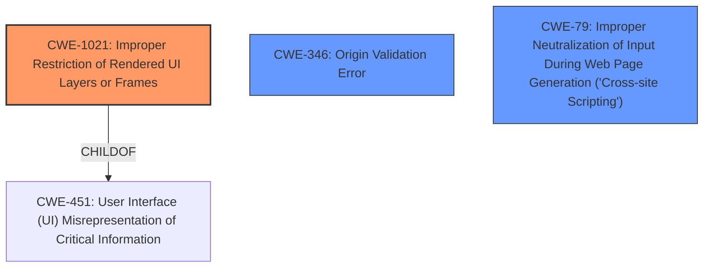

# Final Resolution for CVE-2021-1403

# Summary
| CWE ID | CWE Name | Confidence | CWE Abstraction Level | CWE Vulnerability Mapping Label | CWE-Vulnerability Mapping Notes |
|---|---|---|---|---|---|
| CWE-1021 | Improper Restriction of Rendered UI Layers or Frames | 0.85 | Base | Allowed | Primary CWE |
| CWE-346 | Origin Validation Error | 0.65 | Class | Allowed-with-Review | Secondary Candidate |
| CWE-79 | Improper Neutralization of Input During Web Page Generation ('Cross-site Scripting') | 0.50 | Base | Allowed | Secondary Candidate |
| CWE-20 | Improper Input Validation | 0.40 | Class | Discouraged | Secondary Candidate |

## Evidence and Confidence

*   **Confidence Score:** 0.80
*   **Evidence Strength:** MEDIUM

## Relationship Analysis
The primary CWE, CWE-1021, is a Base level weakness, making it a good candidate. Although there are no direct relationships in the provided data, it is a child of CWE-451, which highlights the UI aspect. CWE-346 is a class and could be made more specific. The chain of events starts with a configuration issue that leads to lack of origin validation and then CSWSH which results in DoS.

## Vulnerability Chain
The vulnerability chain starts with **insufficient HTTP protections** in the web UI, leading to a Cross-Site WebSocket Hijacking (CSWSH) attack. This allows an attacker to corrupt memory, causing a denial-of-service (DoS) condition.
  - **Root Cause:** **Insufficient HTTP Protections**
  - **Weakness 1:** CWE-1021 Improper Restriction of Rendered UI Layers or Frames (due to lack of frame restrictions, user is tricked).
  - **Weakness 2:** CWE-346 Origin Validation Error (as a contributing factor).
  - **Impact:** Denial of Service (DoS) condition.

## Summary of Analysis
The initial analysis and criticism provided a good foundation. The selection of CWE-1021 as the primary CWE is appropriate, as it directly relates to the **insufficient HTTP protections** and the ability to trick a user into following a crafted link. The criticism correctly points out that CWE-1021 addresses the lack of restrictions on UI layers. The vulnerability description states that "An attacker could exploit this vulnerability by persuading an authenticated user of the web UI to follow a crafted link," which directly aligns with CWE-1021's focus on UI-based deception.

The relationships influenced the selection by highlighting the UI aspect through CWE-451 (Parent of CWE-1021). While CWE-346 is a valid secondary consideration, its class level suggests that a more specific CWE might be better. However, without more information, CWE-346 serves as a reasonable secondary weakness.

The selected CWEs are at the optimal level of specificity given the available evidence. CWE-1021 is a Base level weakness that directly addresses the UI-related aspect of the vulnerability. CWE-20 is too general and discouraged.