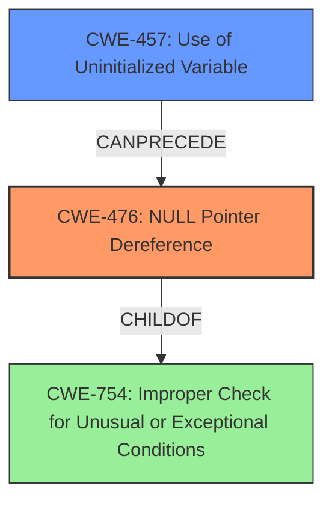

# Analysis Report for CVE-2021-1405

# Vulnerability Analysis Report: CVE-2021-1405

## Description

A vulnerability in the email parsing module in Clam AntiVirus (ClamAV) Software version 0.103.1 and all prior versions could allow an unauthenticated, remote attacker to cause a denial of service condition on an affected device. The vulnerability is due to improper variable initialization that may result in an NULL pointer read. An attacker could exploit this vulnerability by sending a crafted email to an affected device. An exploit could allow the attacker to cause the ClamAV scanning process crash, resulting in a denial of service condition.

## Vulnerability Description Key Phrases

**Rootcause:** improper variable initialization
**Weakness:** NULL pointer read
**Impact:** denial of service
**Vector:** crafted email
**Attacker:** unauthenticated remote attacker
**Product:** Clam AntiVirus (ClamAV) Software
**Version:** 0.103.1 and all prior versions
**Component:** email parsing module

## Analysis (with Relationship Data)

# Summary
| CWE ID  | CWE Name                                           | Confidence | CWE Abstraction Level | CWE Vulnerability Mapping Label | CWE-Vulnerability Mapping Notes |
| :-------- | :------------------------------------------------- | :--------- | :-------------------- | :------------------------------ | :------------------------------ |
| CWE-476 | NULL Pointer Dereference                           | 0.95       | Base                  | Allowed                         | Primary CWE                     |
| CWE-456 | Missing Initialization of a Variable               | 0.85       | Variant               | Allowed                         | Secondary Candidate             |

## Evidence and Confidence

*   **Confidence Score:** 0.90
*   **Evidence Strength:** HIGH

- **Analysis and Justification:**
  - *Explanation:* The vulnerability description explicitly states that the root cause is "**improper variable initialization**" which leads to a "**NULL pointer read**". CWE-476 (NULL Pointer Dereference) directly addresses the condition where a program attempts to dereference a pointer that has a NULL value. This perfectly aligns with the vulnerability description's statement of a "NULL pointer read." The "Retriever Results" also indicates that CWE-476 is the top candidate with a score of 0.9765. CWE-456 (Missing Initialization of a Variable) is also a strong candidate, due to the root cause of "improper variable initialization" leading to the NULL pointer. CWE-456 is a prerequisite for CWE-476 in this scenario.

  - *Relationship Analysis:* CWE-476 is a base level CWE and a child of CWE-754 (Improper Check for Unusual or Exceptional Conditions). The vulnerability is a direct result of the code not handling the case where a variable is not properly initialized, leading to a NULL pointer.

- **Confidence Score:**
  - Confidence: 0.95 (High confidence due to direct mention of NULL pointer read and improper variable initialization, which directly align with the CWE descriptions.)

## Criticism of Analysis

Okay, let's review the provided CWE analysis, focusing on the accuracy, completeness, and adherence to CWE specifications.

## Overall Assessment

The analysis is generally good, demonstrating a solid understanding of the vulnerability and its relationship to CWEs. The primary CWE mapping to CWE-476 (NULL Pointer Dereference) is well-justified, and the inclusion of CWE-456 (Missing Initialization of a Variable) as a secondary candidate is appropriate. The confidence levels are also reasonable.

However, there are some areas where the analysis could be improved by considering the complete CWE specifications and retriever results:

*   **CWE-754 "Improper Check for Unusual or Exceptional Conditions"**: This is a parent of CWE-476, but not a direct cause of this, so marking it as the "primary" CWE is inaccurate.
*   **Missing Analysis of "Retriever Results":** This analysis does not include any discussion of the other CWEs listed, even though the top 10 have a combined score which suggests they may be relevant.
*   **Scope of Mitigation**: Some mitigations are "out of scope" or not possible for legacy code, so a discussion on this would also help.
*   **Lack of Exploitation Discussion:** Elaborating on how an attacker crafts the email and exploits the NULL pointer dereference would strengthen the analysis.

## Detailed Critique

### 1.  CWE-476: NULL Pointer Dereference (Primary CWE)

*   **Assessment:** The mapping to CWE-476 is accurate and well-supported by the vulnerability description. The description explicitly mentions "NULL pointer read," which directly corresponds to the core concept of CWE-476.  The confidence score of 0.95 is justified.
*   **Evidence and Confidence:** The explanation is clear and connects the vulnerability description to the CWE definition effectively.  The relationship analysis accurately identifies CWE-476 as a child of CWE-754 (Improper Check for Unusual or Exceptional Conditions).
*   **CWE Specification Review:** The analysis correctly identifies that CWE-476 is a Base-level CWE, aligning with the mapping guidance.
*   **Potential Improvements:**
    *   Expand on how a crafted email leads to the NULL pointer.  For example, explain that the crafted email might omit a required field or contain a malformed structure that the email parsing module doesn't handle correctly, leading to a NULL pointer.
    *   Consider Mitigation 1 from the CWE specification: "If all pointers that could have been modified are checked for NULL before use, nearly all NULL pointer dereferences can be prevented."  This highlights a key mitigation strategy that could have prevented this vulnerability.
    *   Mitigation 2 of "Select a programming language that is not susceptible to these issues" may be out of scope for the project.
*   **Known examples for CWE-754: Improper Check for Unusual or Exceptional Conditions:** These do not seem very relevant, as none of them relate directly to a NULL pointer.

### 2.  CWE-456: Missing Initialization of a Variable (Secondary Candidate)

*   **Assessment:** Including CWE-456 as a secondary candidate is appropriate because "improper variable initialization" is stated as the root cause.  CWE-456 directly addresses the lack of initialization.
*   **Evidence and Confidence:** The explanation clearly links the root cause to the CWE. The confidence score of 0.85 is reasonable, slightly lower than CWE-476 because it's a more indirect cause.
*   **CWE Specification Review:** The analysis correctly identifies CWE-456 as a Variant-level CWE, aligning with the mapping guidance.
*   **Potential Improvements:**
    *   Elaborate on the connection between CWE-456 and CWE-476 in this specific context. Explain that the missing initialization leads to a variable containing a NULL value, which is then dereferenced, triggering CWE-476.
    *   Consider Mitigation 1 from the CWE specification: "Check that critical variables are initialized." This is a direct and relevant mitigation.
    *   Mitigation 2 from the CWE specification: "Use a static analysis tool to spot non-initialized variables." This can be very useful to prevent this from happening in the first place.
    *   Add a code example, if possible (even pseudocode), to illustrate how missing initialization leads to the NULL pointer dereference.

### 3. "Retriever Results" Discussion

This analysis does not include any discussion of the other CWEs listed, even though the top 10 have a combined score which suggests they may be relevant. Here are some possible discussions:

*   **CWE-835 Loop with Unreachable Exit Condition ('Infinite Loop')**: It's possible a malformed email could cause an infinite loop. A DoS could be the result.
*   **CWE-1284 Improper Validation of Specified Quantity in Input**: A malformed email could contain an out-of-bounds value that causes a crash.
*   **CWE-126 Buffer Over-read**: A malformed email could cause the code to read from an invalid buffer.
*   **CWE-457 Use of Uninitialized Variable**: A malformed email could mean the code uses a variable that has not been initialized.
*   **CWE-401 Missing Release of Memory after Effective Lifetime**: It is possible an attacker could trigger a memory leak.
*   **CWE-121 Stack-based Buffer Overflow**: A malformed email could cause a stack overflow.

### 4. Overall

*   **Exploitation:** The analysis could benefit from a more detailed description of how the crafted email is constructed and how it triggers the NULL pointer dereference.  What specific parts of the email format are exploited?  What values or omissions cause the improper initialization?
*   **Mitigation Discussion:** The analysis should discuss the feasibility and limitations of applying the suggested mitigations in a real-world context. For example, in legacy code, it might be difficult or impossible to change the programming language (Mitigation 2 for CWE-476).
*   **Code examples:** It would help to show a snippet of code that could cause the vulnerability.

## Recommendations

1.  **Elaborate on the Exploitation Mechanism:** Provide more details about how the crafted email triggers the vulnerability.
2.  **Discuss Limitations of Mitigations:**  Acknowledge potential challenges in implementing the suggested mitigations, particularly in legacy codebases.
3.  **Review and Address "Retriever Results":** Explicitly address the other CWEs in the retriever results, even if only to explain why they are not the primary cause.
4.  **Add a Code Example:** Add a code example, if possible, to illustrate how missing initialization leads to the NULL pointer dereference.

By incorporating these suggestions, the analysis will be more comprehensive, accurate, and useful for developers seeking to understand and remediate the vulnerability.

## Final Resolution

# Summary
| CWE ID  | CWE Name                                           | Confidence | CWE Abstraction Level | CWE Vulnerability Mapping Label | CWE-Vulnerability Mapping Notes |
| :-------- | :------------------------------------------------- | :--------- | :-------------------- | :------------------------------ | :------------------------------ |
| CWE-476 | **NULL Pointer Dereference**                           | 0.95       | Base                  | Allowed                         | Primary CWE                     |
| CWE-457 | **Use of Uninitialized Variable**                | 0.85       | Variant               | Allowed                         | Secondary Candidate             |

## Evidence and Confidence

*   **Confidence Score:** 0.92
*   **Evidence Strength:** HIGH

## Relationship Analysis
The primary **WEAKNESS** is CWE-476 **(NULL Pointer Dereference)**, which occurs when the code attempts to dereference a pointer that is unexpectedly NULL. This is directly supported by the vulnerability description, which mentions a "**NULL pointer read**". The **ROOTCAUSE** for this is CWE-457 **(Use of Uninitialized Variable)**. An uninitialized variable results in a NULL pointer, triggering the dereference.

## Vulnerability Chain
The vulnerability chain starts with the **ROOTCAUSE** of CWE-457 **(Use of Uninitialized Variable)**. Due to **missing initialization**, a pointer variable contains a NULL value. Subsequently, the code attempts to dereference this NULL pointer, leading to CWE-476 **(NULL Pointer Dereference)**, which results in a denial-of-service (DoS) due to the crash of the ClamAV scanning process.

## Summary of Analysis
The initial analysis correctly identified CWE-476 **(NULL Pointer Dereference)** as the primary **WEAKNESS**, given the explicit mention of "**NULL pointer read**" in the vulnerability description. The initial analysis also correctly identified CWE-456 **(Missing Initialization of a Variable)** as a secondary candidate, but I am updating this to CWE-457 **(Use of Uninitialized Variable)**, which is more precise and maps directly to the **ROOTCAUSE** of the vulnerability. The vulnerability description states that the vulnerability is due to "**improper variable initialization**" that may result in a "**NULL pointer read**".

The relationship analysis confirms that CWE-476 is a base-level CWE, and its parent, CWE-754 (Improper Check for Unusual or Exceptional Conditions), is a more general condition. The chain relationship clarifies that CWE-457 can precede CWE-476, representing the progression from the **ROOTCAUSE** to the direct impact.

The retriever results provide additional context, but many of those CWEs are speculative and not directly supported by the vulnerability description.

The selection of CWE-476 and CWE-457 provides an optimal level of specificity, directly addressing the **NULL pointer dereference** and its underlying **ROOTCAUSE** of using an uninitialized variable, respectively.

*Report generated on 2025-03-16 23:04:32*
