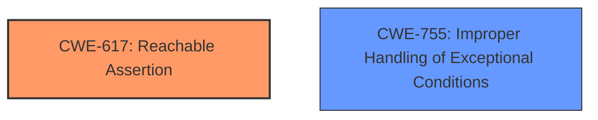

# Final Resolution for CVE-2021-1422

# Summary

| CWE ID  | CWE Name                        | Confidence | CWE Abstraction Level | CWE Vulnerability Mapping Label | CWE-Vulnerability Mapping Notes |
|---------|---------------------------------|------------|-----------------------|---------------------------------|---------------------------------|
| **CWE-617** | **Reachable Assertion**             | 0.80       | Base                  | Primary CWE                      | Allowed                         |
| CWE-755 | Improper Handling of Exceptional Conditions       | 0.50       | Class                 | Secondary Candidate             | Discouraged                     |

## Evidence and Confidence

*   **Confidence Score:** 0.80
*   **Evidence Strength:** HIGH

## Relationship Analysis
The selection of **CWE-617 (Reachable Assertion)** as the primary weakness is influenced by its Base abstraction level, which is preferred for root cause analysis. The analysis correctly dismisses **CWE-755 (Improper Handling of Exceptional Conditions)** because it is a Class-level CWE, making it less specific than CWE-617. There are no direct relationships for CWE-617.

## Vulnerability Chain
The vulnerability chain starts with a **logic error** in the software cryptography module's handling of decryption errors. This **logic error** leads to the triggering of a **CWE-617 (Reachable Assertion)**, which results in an unexpected device reload and a **denial of service (DoS)** condition. The assertion acts as a direct cause of the crash.

## Summary of Analysis
The initial analysis and the criticism both align in identifying **CWE-617 (Reachable Assertion)** as the most appropriate primary weakness. The vulnerability description states that a "**logic error in how the software cryptography module handles specific types of decryption errors**" causes the device to crash. This aligns directly with the definition of **CWE-617 (Reachable Assertion)**, where an assertion is triggered due to a **logic error**, leading to a program exit or unexpected behavior.

The decision is based on the provided evidence, specifically the mention of a **logic error** triggering a crash. The graph relationships, or lack thereof, support the choice of CWE-617 due to its base level of abstraction. The selected CWE is at the optimal level of specificity because it directly addresses the root cause of the vulnerability, which is the triggering of an assertion due to a **logic error** in the decryption process.