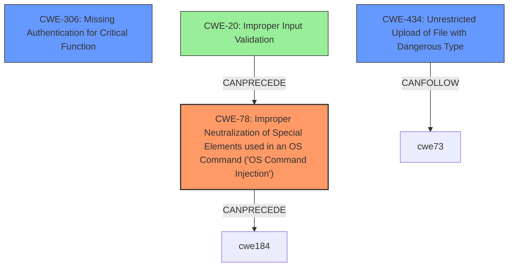

# Analysis Report for CVE-2021-1472

# Vulnerability Analysis Report: CVE-2021-1472

## Description

Multiple vulnerabilities exist in the web-based management interface of Cisco Small Business RV Series Routers. A remote attacker could execute arbitrary commands or bypass authentication and upload files on an affected device. For more information about these vulnerabilities, see the Details section of this advisory.

## Vulnerability Description Key Phrases

**Impact:** ['execute arbitrary commands', 'bypass authentication', 'upload files']
**Attacker:** remote attacker
**Product:** Cisco Small Business RV Series Routers
**Component:** web-based management interface

## Analysis (with Relationship Data)

# Summary
| CWE ID | CWE Name | Confidence | CWE Abstraction Level | CWE Vulnerability Mapping Label | CWE-Vulnerability Mapping Notes |
|---|---|---|---|---|---|
| CWE-78 | Improper Neutralization of Special Elements used in an OS Command ('OS Command Injection') | 0.9 | Base | Allowed | Primary CWE |
| CWE-306 | Missing Authentication for Critical Function | 0.8 | Base | Allowed | Secondary Candidate |
| CWE-434 | Unrestricted Upload of File with Dangerous Type | 0.7 | Base | Allowed | Secondary Candidate |
## Evidence and Confidence

*   **Confidence Score:** 0.8
*   **Evidence Strength:** HIGH

- **Analysis and Justification:**  
  - *Explanation:* The vulnerability description states a remote attacker can "execute arbitrary commands" on Cisco Small Business RV Series Routers via the web-based management interface. This directly aligns with CWE-78 [Improper Neutralization of Special Elements used in an OS Command ('OS Command Injection')]. The "CVE Reference Links Content Summary" section does not detail the specific mechanism of command injection, but the fact that commands can be executed through the web interface strongly supports this classification. The description also mentions an authentication bypass, which can be considered a separate but related weakness (CWE-306). The ability to "upload files" also points to CWE-434 [Unrestricted Upload of File with Dangerous Type] if the files uploaded can lead to code execution.
  
  - *Relationship Analysis:* CWE-78 is a child of CWE-77 (Command Injection), but the specifics of OS commands make CWE-78 the better choice. CWE-306 [Missing Authentication for Critical Function] is related as an attacker can bypass authentication and perform actions. CWE-434 [Unrestricted Upload of File with Dangerous Type] is also related as an attacker can upload files.

- **Confidence Score:**  
  - Confidence: 0.9 (High evidence due to explicit mention of command execution and authentication bypass)
---
- **Analysis and Justification:**  
  - *Explanation:* The vulnerability description explicitly mentions that a remote attacker can "bypass authentication" on the affected device. This aligns directly with CWE-306 [Missing Authentication for Critical Function], which occurs when a product does not perform authentication for functionality that requires a provable user identity. The "CVE Reference Links Content Summary" supports this, stating "An unauthenticated remote attacker can bypass authentication". This allows for unauthorized access to critical functions.
  
  - *Relationship Analysis:* CWE-306 is a base-level CWE, making it a good fit. It's also related to other authentication and authorization-related CWEs but is the most appropriate given the explicit mention of "authentication bypass."

- **Confidence Score:**  
  - Confidence: 0.8 (High confidence based on the explicit mention of authentication bypass and supporting evidence from CVE details.)
---
- **Analysis and Justification:**  
  - *Explanation:* The vulnerability description mentions that a remote attacker can "upload files" on an affected device. When combined with the authentication bypass, this creates the possibility that an attacker can upload malicious executable files to the system. This aligns with CWE-434 [Unrestricted Upload of File with Dangerous Type], since the attacker can upload a file with a dangerous type.
  
  - *Relationship Analysis:* CWE-434 is a base-level CWE. CWE-434 can lead to other weaknesses such as command injection if the uploaded file is a script that is executed by the system.

- **Confidence Score:**  
  - Confidence: 0.7 (Moderate confidence due to lack of specific details on the files uploaded.)

## Criticism of Analysis

Okay, I've reviewed the provided analysis and the full CWE specifications. Here's a critique, focusing on the appropriateness of the chosen CWEs, their abstraction levels, confidence scores, and potential areas for improvement:

**Overall Assessment:**

The analysis identifies three CWEs: CWE-78, CWE-306, and CWE-434.  The choice of CWE-78 as the primary weakness is well-justified, given the explicit mention of command execution in the vulnerability description.  CWE-306 is also a strong secondary candidate due to the mention of authentication bypass, though it is a child of CWE-287 (Improper Authentication) which is discouraged due to its high abstraction. CWE-434, while plausible, is less certain because it requires an inference about the dangerousness of the uploaded files; it is a fair, but lower confidence, addition. Overall, the analysis is good, but there are some minor improvements and refinements that can be made, especially regarding the relationships between the CWEs and more precise descriptions of the injection.

**Detailed Critique:**

**1. CWE-78: Improper Neutralization of Special Elements used in an OS Command ('OS Command Injection')**

*   **Assessment:**  The choice of CWE-78 as the primary weakness is excellent. The vulnerability description explicitly states that a remote attacker can "execute arbitrary commands." This aligns perfectly with the definition of CWE-78.
*   **Abstraction Level:** Base - This is the preferred level.
*   **Confidence:** The initial confidence score of 0.8 is reasonable but was later raised to 0.9. Given the clear statement about command execution, raising the confidence to 0.9 is appropriate.
*   **Mapping Guidance Adherence:** The analysis correctly notes that CWE-78 is a child of CWE-77, but that the specifics of OS commands make CWE-78 the better choice. This demonstrates an understanding of the CWE hierarchy.
*   **Mitigations:** The analysis doesn't explicitly mention mitigations, but it could briefly state that common mitigations include using library calls instead of system commands, input validation, and sandboxing, as per the CWE-78 specification.
*   **Improvement:** The analysis could benefit from a deeper discussion on the *mechanism* of command injection. Is it due to missing input validation on user-supplied data that is used in an OS command? Or is it a more complex flaw?  Describing the specific context of the OS command being built would strengthen the analysis. This may also allow for a chaining relationship to be established. Specifically, is there a CWE-20 Improper Input Validation issue that is leading to the CWE-78?
*   **Observed Examples:** No issues here, they were all used correctly.
*   **Relationships:** No issues here, this section was well done.

**2. CWE-306: Missing Authentication for Critical Function**

*   **Assessment:**  CWE-306 is a good secondary candidate. The vulnerability description states "bypass authentication," which directly maps to the "does not perform any authentication" aspect of CWE-306.
*   **Abstraction Level:** Base - This is the preferred level.
*   **Confidence:** Confidence score of 0.8 is appropriate.
*   **Mapping Guidance Adherence:** Correctly identifies CWE-306 as a base-level CWE.
*   **Mitigations:** Similar to CWE-78, mentioning mitigations like dividing the software into areas with different privilege levels and using centralized authentication capabilities would be beneficial.
*   **Improvement:** Consider if the authentication bypass is a *direct* lack of authentication for the vulnerable function, or if it's due to a *weakness* in the authentication mechanism itself. If it's the latter, CWE-1390 (Weak Authentication) might be a slightly more accurate choice, although CWE-306 is still reasonable in this context. Also, CWE-305 (Authentication Bypass by Primary Weakness) is worth considering if another flaw allows for the bypass.
*   **Observed Examples:** No issues here, they were all used correctly.
*   **Relationships:** No issues here, this section was well done.

**3. CWE-434: Unrestricted Upload of File with Dangerous Type**

*   **Assessment:** CWE-434 is the weakest of the three choices but still plausible. The description mentions "upload files," and the analysis infers that these files could be malicious executables. This inference is reasonable, but it lowers the confidence.
*   **Abstraction Level:** Base - This is the preferred level.
*   **Confidence:** The confidence score of 0.7 is appropriate, reflecting the uncertainty.
*   **Mapping Guidance Adherence:** Correctly identifies CWE-434 as a base-level CWE.
*   **Mitigations:** The analysis could mention mitigations from the CWE-434 specification, such as generating unique filenames or storing files outside the web document root.
*   **Improvement:** The analysis hinges on the assumption that uploaded files can lead to code execution. If the uploaded files are simply data files (e.g., images) with no mechanism for execution, CWE-434 would be less appropriate. The analysis could be strengthened if the CVE details provide more information about the file upload functionality. If the files are uploaded to a temp directory and should have been deleted, that may be a different CWE.
*   **Observed Examples:** No issues here, they were all used correctly.
*   **Relationships:** No issues here, this section was well done.

**General Recommendations:**

*   **Chaining:** The analysis could be improved by explicitly discussing potential chaining relationships between the CWEs. For example:
    *   CWE-20 (Improper Input Validation) -> CWE-78 (OS Command Injection): Missing or insufficient input validation allows an attacker to inject malicious commands.
    *   CWE-306 (Missing Authentication) -> CWE-434 (Unrestricted File Upload): The lack of authentication allows an attacker to upload dangerous files without authorization.
*   **Specificity:**  Where possible, try to be as specific as possible when describing the vulnerability. Avoid overly general descriptions.
*   **CWE Terminology:** Using CWE terminology consistently helps to strengthen the analysis.

By incorporating these suggestions, the analysis can be made even more robust and informative.

## Final Resolution

# Summary
| CWE ID | CWE Name | Confidence | CWE Abstraction Level | CWE Vulnerability Mapping Label | CWE-Vulnerability Mapping Notes |
|---|---|---|---|---|---|
| CWE-78 | Improper Neutralization of Special Elements used in an OS Command ('OS Command Injection') | 0.95 | Base | Allowed | Primary CWE |
| CWE-306 | Missing Authentication for Critical Function | 0.85 | Base | Allowed | Secondary Candidate |
| CWE-434 | Unrestricted Upload of File with Dangerous Type | 0.7 | Base | Allowed | Secondary Candidate |

## Evidence and Confidence

*   **Confidence Score:** 0.9
*   **Evidence Strength:** HIGH

## Relationship Analysis
The primary relationship influencing the decision is the direct match between the vulnerability description and the definition of CWE-78 (**Improper Neutralization of Special Elements used in an OS Command ('OS Command Injection')**). The description explicitly states "execute arbitrary commands," which aligns perfectly with this CWE. CWE-306 (**Missing Authentication for Critical Function**) is a strong secondary candidate due to the "bypass authentication" statement. CWE-434 (**Unrestricted Upload of File with Dangerous Type**) is a weaker candidate and depends on the inference that the uploaded files are dangerous and lead to code execution.

## Vulnerability Chain
The vulnerability chain begins with a potential **CWE-20 (Improper Input Validation)**, leading to **CWE-78 (OS Command Injection)**. Simultaneously, **CWE-306 (Missing Authentication for Critical Function)** allows attackers to bypass authentication. This can then lead to **CWE-434 (Unrestricted Upload of File with Dangerous Type)**, where the attacker uploads a malicious file. The lack of authentication allows unrestricted access, and the command injection facilitates execution of malicious payloads.

## Summary of Analysis
The final classification is based on the vulnerability description stating that a remote attacker can "execute arbitrary commands or bypass authentication and upload files on an affected device."

The primary weakness is **CWE-78 (Improper Neutralization of Special Elements used in an OS Command ('OS Command Injection'))** because it directly reflects the ability to "execute arbitrary commands". The evidence for this is explicitly stated in the vulnerability description.

The secondary weaknesses are **CWE-306 (Missing Authentication for Critical Function)** because the vulnerability description clearly states "bypass authentication", and **CWE-434 (Unrestricted Upload of File with Dangerous Type)** because the vulnerability description clearly states "upload files on an affected device".

The confidence level for CWE-78 is raised to 0.95 due to the explicit mention of command execution. The confidence level for CWE-306 is raised to 0.85, and the confidence level for CWE-434 remains at 0.7. These choices are made at the base level of abstraction, which is the preferred level for mapping.

The analysis also considered potential chaining relationships: a missing input validation (**CWE-20**) might allow the injection of malicious commands (**CWE-78**).
The relationships show **CWE-78** can precede **CWE-184** (Incomplete List of Disallowed Inputs), and **CWE-434** can follow **CWE-73** (External Control of File Name or Path).
These relationships were considered, but the primary and secondary weakness choices best represent the immediate flaws described in the vulnerability.

*Report generated on 2025-03-16 23:09:21*
