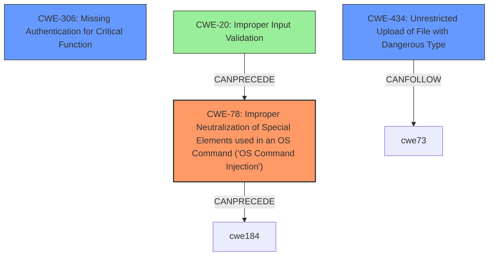

# Final Resolution for CVE-2021-1472

# Summary
| CWE ID | CWE Name | Confidence | CWE Abstraction Level | CWE Vulnerability Mapping Label | CWE-Vulnerability Mapping Notes |
|---|---|---|---|---|---|
| CWE-78 | Improper Neutralization of Special Elements used in an OS Command ('OS Command Injection') | 0.95 | Base | Allowed | Primary CWE |
| CWE-306 | Missing Authentication for Critical Function | 0.85 | Base | Allowed | Secondary Candidate |
| CWE-434 | Unrestricted Upload of File with Dangerous Type | 0.7 | Base | Allowed | Secondary Candidate |

## Evidence and Confidence

*   **Confidence Score:** 0.9
*   **Evidence Strength:** HIGH

## Relationship Analysis
The primary relationship influencing the decision is the direct match between the vulnerability description and the definition of CWE-78 (**Improper Neutralization of Special Elements used in an OS Command ('OS Command Injection')**). The description explicitly states "execute arbitrary commands," which aligns perfectly with this CWE. CWE-306 (**Missing Authentication for Critical Function**) is a strong secondary candidate due to the "bypass authentication" statement. CWE-434 (**Unrestricted Upload of File with Dangerous Type**) is a weaker candidate and depends on the inference that the uploaded files are dangerous and lead to code execution.

## Vulnerability Chain
The vulnerability chain begins with a potential **CWE-20 (Improper Input Validation)**, leading to **CWE-78 (OS Command Injection)**. Simultaneously, **CWE-306 (Missing Authentication for Critical Function)** allows attackers to bypass authentication. This can then lead to **CWE-434 (Unrestricted Upload of File with Dangerous Type)**, where the attacker uploads a malicious file. The lack of authentication allows unrestricted access, and the command injection facilitates execution of malicious payloads.

## Summary of Analysis
The final classification is based on the vulnerability description stating that a remote attacker can "execute arbitrary commands or bypass authentication and upload files on an affected device."

The primary weakness is **CWE-78 (Improper Neutralization of Special Elements used in an OS Command ('OS Command Injection'))** because it directly reflects the ability to "execute arbitrary commands". The evidence for this is explicitly stated in the vulnerability description.

The secondary weaknesses are **CWE-306 (Missing Authentication for Critical Function)** because the vulnerability description clearly states "bypass authentication", and **CWE-434 (Unrestricted Upload of File with Dangerous Type)** because the vulnerability description clearly states "upload files on an affected device".

The confidence level for CWE-78 is raised to 0.95 due to the explicit mention of command execution. The confidence level for CWE-306 is raised to 0.85, and the confidence level for CWE-434 remains at 0.7. These choices are made at the base level of abstraction, which is the preferred level for mapping.

The analysis also considered potential chaining relationships: a missing input validation (**CWE-20**) might allow the injection of malicious commands (**CWE-78**).
The relationships show **CWE-78** can precede **CWE-184** (Incomplete List of Disallowed Inputs), and **CWE-434** can follow **CWE-73** (External Control of File Name or Path).
These relationships were considered, but the primary and secondary weakness choices best represent the immediate flaws described in the vulnerability.