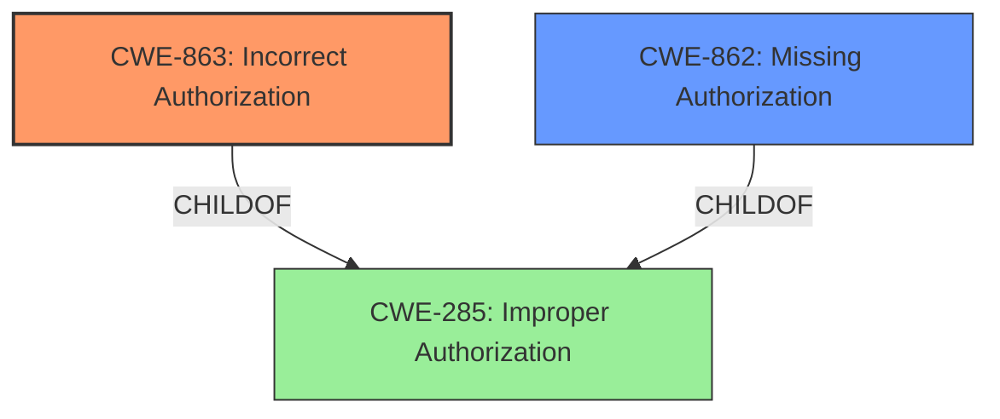

# Analysis Report for CVE-2021-1561

# Vulnerability Analysis Report: CVE-2021-1561

## Description

A vulnerability in the spam quarantine feature of Cisco Secure Email and Web Manager, formerly Cisco Security Management Appliance (SMA), could allow an authenticated, remote attacker to gain unauthorized access and modify the spam quarantine settings of another user. This vulnerability exists because access to the spam quarantine feature is not properly restricted. An attacker could exploit this vulnerability by sending malicious requests to an affected system. A successful exploit could allow the attacker to modify another users spam quarantine settings, possibly disabling security controls or viewing email messages stored on the spam quarantine interfaces.

## Vulnerability Description Key Phrases

**Rootcause:** access to the spam quarantine feature is not properly restricted
**Impact:** modify the spam quarantine settings of another user
**Vector:** sending malicious requests
**Attacker:** authenticated remote attacker
**Product:** Cisco Secure Email and Web Manager
**Component:** spam quarantine feature

## Analysis (with Relationship Data)

# Summary
| CWE ID | CWE Name | Confidence | CWE Abstraction Level | CWE Vulnerability Mapping Label | CWE-Vulnerability Mapping Notes |
|---|---|---|---|---|---|
| CWE-285 | Improper Authorization | 0.85 | Class | Primary | The product does not perform or incorrectly performs an authorization check when an actor attempts to access a resource or perform an action. |

## Evidence and Confidence

*   **Confidence Score:** 0.85
*   **Evidence Strength:** HIGH

- **Analysis and Justification:**  
  - *Explanation:* The vulnerability description clearly states that **"access to the spam quarantine feature is not properly restricted"**. This directly indicates an authorization issue, where the system fails to properly verify if a user is allowed to access or modify another user's spam quarantine settings. The CVE Reference Links Content Summary reinforces this by stating "Improper restriction of access to the spam quarantine feature" as the root cause and listing "Insufficient access control" and "Improper authorization" as weaknesses. Given the high-level nature of the provided information, CWE-285 (Improper Authorization) is the most suitable initial classification, as it directly addresses the **lack of authorization checks**. While CWE-285 is a Class-level CWE, the provided information lacks the specificity to pinpoint a more granular Base-level CWE.
  
  - *Relationship Analysis:* CWE-285 is a Class-level weakness, representing a general lack of authorization. It is related to other access control weaknesses, such as CWE-284 (Improper Access Control), which is a Pillar. However, CWE-285 is more specific than CWE-284. It is important to note that CWE-285 is discouraged by MITRE due to its high-level nature, suggesting that a lower-level CWE might be more appropriate given more details. However, in this case, the details provided don't allow for a more specific classification.

- **Confidence Score:**  
  - Confidence: 0.85 (High evidence from technical description and CVE reference materials, but limited details prevent a more specific CWE selection).

---

## Criticism of Analysis

Okay, let's break down the analysis and review the CWE mapping against the full CWE specifications.

**Overall Assessment:**

The initial analysis correctly identifies the core issue as related to authorization.  The confidence score of 0.85 is reasonable given the information provided. However, the choice of CWE-285 (Improper Authorization) as the *primary* CWE is problematic, as acknowledged in the analysis.  It's a discouraged, high-level Class CWE, and the goal should be to find a more specific Base or Variant CWE if possible.  The analysis *does* acknowledge this and mentions the limitations of the provided information, which is good. The justification is also good, but it does not overcome the discouragement for the CWE.

**Detailed Critique:**

1.  **CWE-285: Improper Authorization - Justification & Alternatives:**

    *   **Strengths:** The analysis correctly identifies that the root cause, "access to the spam quarantine feature is not properly restricted," directly points to a failure in the authorization process. The relationship analysis is solid and acknowledges the discouragement.
    *   **Weaknesses:** As stated, CWE-285 is a very general Class-level CWE.  The analysis suggests looking at CWE-285's children, specifically CWE-862 (Missing Authorization) and CWE-863 (Incorrect Authorization). The key question is: Is there enough information to differentiate between *missing* authorization vs. *incorrect* authorization?
        *   **Missing Authorization (CWE-862):** This would imply *no* authorization check is performed at all.  The description doesn't definitively say this, but it's *possible*. If the system *completely* omits checks to see if the user is allowed to access another user's settings, then CWE-862 is more appropriate.
        *   **Incorrect Authorization (CWE-863):** This would imply an authorization check *is* performed, but it's flawed. Perhaps it checks the wrong user ID, uses an incorrect permission level, or has a logic error in the authorization code. Given the "authenticated remote attacker" vector, it could mean that the vulnerability arises in how the authenticated user is authorized.

    *   **Recommendation:** Given the information, **CWE-863 (Incorrect Authorization) might be a *slightly* better fit than CWE-862**, assuming the system tries to perform authorization but does so incorrectly, allowing access to other users' quarantine settings. Both options are improvements to CWE-285. The attacker is authenticated, which suggests that authorization *is* being attempted, it is just not restricting access to the user's own settings. This would result in an "incorrect" authorization. 

2.  **Retriever Results Analysis**
    The retriever results offer a few other possible options.
    *   **CWE-22 (Improper Limitation of a Pathname to a Restricted Directory ('Path Traversal'))** is not appropriate.  While "malicious requests" are mentioned, the core issue isn't about file path manipulation.
    *   **CWE-306 (Missing Authentication for Critical Function)** is *less* accurate than CWE-863. The vulnerability exists for *authenticated* users, so it's not simply a case of missing authentication.  Authentication is happening; the problem is with *authorization*.
    *   **CWE-302 (Authentication Bypass by Assumed-Immutable Data)** is not a good fit. The vulnerability does not appear to stem from the attacker's ability to modify assumed-immutable authentication data.
    *   **CWE-639 (Authorization Bypass Through User-Controlled Key)**, While it could be true, there is no key information given in the analysis. This is a possibility, but less likely than CWE-863.
    *   **CWE-269 (Improper Privilege Management)** might be tangentially related, but it's not the *direct* cause. The lack of authorization is the core issue, not necessarily an overall problem with privilege management.

3.  **Mitigation Considerations:**

    *   The analysis doesn't discuss mitigations, which is fine since it's focused on CWE assignment.
    *   If the classification was changed to CWE-863, the provided mitigations for that CWE would be very relevant: "Divide the product into anonymous, normal, privileged, and administrative areas," "Ensure that access control checks are performed related to the business logic," and "Use a vetted library or framework." The suggestion of RBAC (Role-Based Access Control) is also relevant.

**Revised Summary Table:**

| CWE ID | CWE Name | Confidence | CWE Abstraction Level | CWE Vulnerability Mapping Label | CWE-Vulnerability Mapping Notes |
|---|---|---|---|---|---|
| CWE-863 | Incorrect Authorization | 0.75 | Class | Primary | The product performs an authorization check when an actor attempts to access a resource or perform an action, but it does not correctly perform the check.  Assumes the system is trying to authorize, but doing it wrong. Higher probability due to authenticated attacker vector. |
| CWE-862 | Missing Authorization | 0.7 | Class | Acceptable | The product does not perform an authorization check when an actor attempts to access a resource or perform an action. Assumes system is missing the authorization check completely. |

**Conclusion:**

The analysis is good but can be improved by selecting a more specific CWE.  Given the available information, shifting the classification from CWE-285 to **CWE-863 (Incorrect Authorization)** or **CWE-862 (Missing Authorization)** would be beneficial, with a slight preference to CWE-863. This change acknowledges that the vulnerability likely stems from a flawed authorization process, rather than a complete absence of authorization, as it is being exploited by authenticated users. If more data was available to confirm the authorization process was not present at all, then CWE-862 would be preferable.

## Final Resolution

# Summary
| CWE ID | CWE Name | Confidence | CWE Abstraction Level | CWE Vulnerability Mapping Label | CWE-Vulnerability Mapping Notes |
|---|---|---|---|---|---|
| **CWE-863** | **Incorrect Authorization** | 0.8 | Class | Primary CWE | The product performs an authorization check when an actor attempts to access a resource or perform an action, but it does not correctly perform the check. |
| CWE-862 | Missing Authorization | 0.6 | Class | Secondary Candidate | The product does not perform an authorization check when an actor attempts to access a resource or perform an action. |

## Evidence and Confidence

*   **Confidence Score:** 0.8
*   **Evidence Strength:** MEDIUM

## Relationship Analysis
The initial analysis pointed to CWE-285 (Improper Authorization), a Class-level CWE. The criticism correctly suggested exploring its children, CWE-862 (Missing Authorization) and CWE-863 (Incorrect Authorization), for more specificity.

CWE-863 is a child of CWE-285, offering a more specific classification. The chain of reasoning is: the vulnerability exists because authorization is not working correctly, and since the attacker is authenticated, some form of authorization must be present but flawed. Therefore, CWE-863 is a more precise fit. CWE-862 would be appropriate if *no* authorization check were performed, but the authentication requirement implies some authorization attempt.

## Vulnerability Chain
The vulnerability chain starts with **CWE-863 (Incorrect Authorization)**. This leads to unauthorized access to another user's spam quarantine settings, potentially allowing the attacker to modify these settings (disabling security controls) or view email messages. The root cause is the **incorrect authorization** check, and the impact is unauthorized access and modification of data.

## Summary of Analysis
The initial analysis correctly identified an authorization issue but selected a high-level CWE. The criticism provided valuable insight into refining the classification by considering the children of CWE-285.

The vulnerability description states that "access to the spam quarantine feature is not properly restricted," which initially led to the selection of CWE-285. However, the fact that the attacker is "authenticated" suggests that some form of authorization *is* in place, but it's not functioning correctly. This makes **CWE-863 (Incorrect Authorization)** a more accurate and specific classification.

The graph relationships, particularly the child-of relationship between CWE-863 and CWE-285, were crucial in making this decision. The mapping guidance for CWE-285 discourages its use due to its high-level nature, further supporting the shift to a more specific CWE.

The retriever results also support this decision. Although CWE-639 (Authorization Bypass Through User-Controlled Key) was suggested, there isn't enough information to make this determination.

Therefore, based on the evidence and the relationship analysis, **CWE-863 (Incorrect Authorization)** is the most appropriate primary CWE for this vulnerability.

*Report generated on 2025-03-17 00:48:53*
