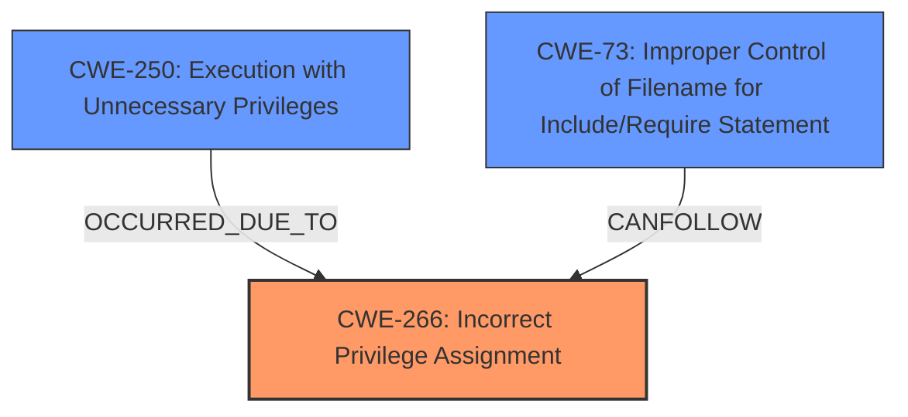

# Analysis Report for CVE-2021-1572

# Vulnerability Analysis Report: CVE-2021-1572

## Description

A vulnerability in ConfD could allow an authenticated, local attacker to execute arbitrary commands at the level of the account under which ConfD is running, which is commonly root. To exploit this vulnerability, an attacker must have a valid account on an affected device. The vulnerability exists because the affected software incorrectly runs the SFTP user service at the privilege level of the account that was running when the ConfD built-in Secure Shell (SSH) server for CLI was enabled. If the ConfD built-in SSH server was not enabled, the device is not affected by this vulnerability. An attacker with low-level privileges could exploit this vulnerability by authenticating to an affected device and issuing a series of commands at the SFTP interface. A successful exploit could allow the attacker to elevate privileges to the level of the account under which ConfD is running, which is commonly root. Note Any user who can authenticate to the built-in SSH server may exploit this vulnerability. By default, all ConfD users have this access if the server is enabled. Software updates that address this vulnerability have been released.

## Vulnerability Description Key Phrases

**Rootcause:** incorrect privilege level for SFTP user service
**Impact:** execute arbitrary commands
**Vector:** authenticating and issuing commands
**Attacker:** authenticated local attacker
**Product:** ConfD
**Component:** SFTP user service

## Analysis (with Relationship Data)

# Summary
| CWE ID | CWE Name | Confidence | CWE Abstraction Level | CWE Vulnerability Mapping Label | CWE-Vulnerability Mapping Notes |
|---|---|---|---|---|---|
| CWE-266 | Incorrect Privilege Assignment | 0.9 | Base | Allowed | Primary CWE |
| CWE-250 | Execution with Unnecessary Privileges | 0.7 | Base | Allowed | Secondary CWE |
| CWE-78 | Improper Neutralization of Special Elements used in an OS Command ('OS Command Injection') | 0.6 | Base | Allowed | Secondary CWE |

## Evidence and Confidence

*   **Confidence Score:** 0.8
*   **Evidence Strength:** HIGH

- **Analysis and Justification:**  
  - *Explanation:* The vulnerability lies in the **incorrect privilege level for the SFTP user service**, allowing an authenticated local attacker to execute arbitrary commands. The primary **rootcause** is the "Incorrect Privilege Assignment" (CWE-266), as the SFTP user service is running at a higher privilege level than intended, which is running at the privilege level of the account that was running when the ConfD built-in Secure Shell (SSH) server for CLI was enabled. This aligns with the description of CWE-266, which states: "A product incorrectly assigns a privilege to a particular actor, creating an unintended sphere of control for that actor." The "CVE Reference Links Content Summary" also states that "The affected software incorrectly runs the SFTP user service at the privilege level of the account that was running when the NSO/ConfD built-in Secure Shell (SSH) server for CLI was enabled." and lists "Incorrect Privilege Assignment" as one of the weaknesses. CWE-250 (Execution with Unnecessary Privileges) is also relevant as a secondary weakness, because it describes the product performing an operation at a privilege level higher than required. The attacker exploits this through the SFTP interface, which could involve command injection (CWE-78) if the commands issued through the SFTP interface are not properly neutralized, hence, listing CWE-78 as another secondary weakness.

  - *Relationship Analysis:* CWE-266 is a Base level CWE. CWE-250 and CWE-78 are also Base level CWEs. There are no direct relationships specified for CWE-266, CWE-250, or CWE-78. However, they are related in this context, as incorrect privilege assignment leads to potential command execution vulnerabilities.

- **Confidence Score:**
  - Confidence: 0.9 (High confidence due to the clear description of the **incorrect privilege assignment** and its exploitation leading to command execution.)

## Criticism of Analysis

Okay, here's a review of the provided CWE analysis, incorporating the full CWE specifications:

**Overall Assessment:**

The analysis is generally sound and well-justified. The primary CWE mapping to CWE-266 (Incorrect Privilege Assignment) is appropriate and well-supported by the vulnerability description and the CVE reference.  The inclusion of CWE-250 (Execution with Unnecessary Privileges) as a secondary CWE is also reasonable and adds valuable nuance. The inclusion of CWE-78 is the weakest mapping and it is a less substantiated.

**Detailed Review:**

*   **CWE-266: Incorrect Privilege Assignment (Primary CWE)**

    *   **Justification:** The core issue is that the SFTP user service runs at an unintended privilege level (that of the user who enabled SSH). This directly aligns with CWE-266's description: "A product incorrectly assigns a privilege to a particular actor, creating an unintended sphere of control for that actor." The analysis correctly identifies that the unintended sphere of control allows the attacker to perform actions they shouldn't be able to.
    *   **CWE Specification Alignment:**  The description accurately reflects the essence of CWE-266.  The "Observed Examples" in the CWE specification, such as "CVE-1999-1193: untrusted user placed in unix 'wheel' group" and "CVE-2005-2741: Product allows users to grant themselves certain rights that can be used to escalate privileges", are analogous to the ConfD vulnerability.  In ConfD the privilege was incorrectly assigned during the SSH enablement and was not the result of a user granting themselves additional privileges.
    *   **Confidence:** Justified high confidence (0.9). The evidence is very strong.
    *   **Mitigation Applicability:** The mitigations suggested by CWE-266 are highly relevant:
        *   "Very carefully manage the setting, management, and handling of privileges. Explicitly manage trust zones in the software."  This speaks directly to the need for better privilege separation and control in ConfD's SFTP service.
        *   "Run your code using the lowest privileges that are required to accomplish the necessary tasks." This directly suggests running the SFTP service with a more restricted user account.

*   **CWE-250: Execution with Unnecessary Privileges (Secondary CWE)**

    *   **Justification:** This CWE is relevant because the ConfD SFTP service, due to the incorrect privilege assignment, *is* executing with higher privileges than necessary. This amplifies the impact of any vulnerabilities within the service itself.
    *   **CWE Specification Alignment:** The description of CWE-250 directly supports this mapping: "The product performs an operation at a privilege level that is higher than the minimum level required, which creates new weaknesses or amplifies the consequences of other weaknesses." The fact that the SFTP service is running as root (or another highly privileged user) makes any vulnerability within it far more dangerous.
    *   **Confidence:** Well-justified (0.7).  It's a consequence of CWE-266, but not the primary cause.
    *   **Mitigation Applicability:** The mitigations are applicable:
        *   "Run your code using the lowest privileges that are required to accomplish the necessary tasks." This is a core principle to apply in this scenario.
        *   "Identify the functionality that requires additional privileges, such as access to privileged operating system resources. Wrap and centralize this functionality if possible, and isolate the privileged code as much as possible from other code." This suggests carefully reviewing the SFTP service's code to see if any parts *actually* require root privileges and isolating those parts.

*   **CWE-78: Improper Neutralization of Special Elements used in an OS Command ('OS Command Injection') (Secondary CWE)**

    *   **Justification:** This mapping is the weakest, and the reasoning needs improvement. The analysis argues that command injection is *possible* if commands issued through the SFTP interface aren't properly neutralized. However, there's no concrete evidence presented that command injection is *actually* happening in this vulnerability. The vulnerability description mainly refers to "issuing a series of commands at the SFTP interface", but doesn't state the commands are being used to execute OS commands.
    *   **CWE Specification Alignment:** CWE-78 is about constructing OS commands using externally-influenced input without proper neutralization. If the attacker is just uploading/downloading files via SFTP, CWE-78 isn't applicable.  If the SFTP service is *internally* using user-provided file names in OS commands without sanitization, then CWE-78 *would* be relevant.
    *   **Confidence:** The weakest of the three (0.6). More evidence is needed to justify this mapping.
    *   **Mitigation Applicability:** The mitigations are only applicable if CWE-78 is actually present:
        *   "If at all possible, use library calls rather than external processes to recreate the desired functionality." This would mean avoiding using OS commands to perform file system operations from within the SFTP service.
        *   "Run the code in a 'jail' or similar sandbox environment."
        *   "For any data that will be used to generate a command to be executed, keep as much of that data out of external control as possible."
    *   **Recommendation:**  If there's no evidence of command injection, consider *removing* CWE-78 from the analysis. If command injection does occur, it needs a stronger justification.  Look closely at how file names or other user inputs are used *internally* by the SFTP service.

**Additional Recommendations:**

1.  **Clarify SFTP Interaction:**  The analysis would be strengthened by explaining *how* the attacker is "issuing a series of commands at the SFTP interface." Is it through specific SFTP commands? Are file names being used in a dangerous way? More detail here is important.
2.  **Consider CWE-20 (Improper Input Validation):** If the SFTP service is using user-provided input (e.g., file names) in security-sensitive operations, and is not properly validating that input, then consider including CWE-20 or more specific children of CWE-20 such as CWE-1286, 1287 or 1288.
3.  **Consider CWE-22 (Path Traversal):** If the SFTP service allows the user to specify the path to a file, and doesn't properly restrict the path, CWE-22 may be more appropriate than CWE-78.

By addressing these points, the analysis can become even more robust and provide more targeted guidance for remediation.

## Final Resolution

# Summary
| CWE ID | CWE Name | Confidence | CWE Abstraction Level | CWE Vulnerability Mapping Label | CWE-Vulnerability Mapping Notes |
|---|---|---|---|---|---|
| CWE-266 | Incorrect Privilege Assignment | 0.9 | Base | Allowed | Primary CWE |
| CWE-250 | Execution with Unnecessary Privileges | 0.7 | Base | Allowed | Secondary CWE |
| CWE-73 | Improper Control of Filename for Include/Require Statement in PHP Program ('PHP Remote File Inclusion') | 0.6 | Base | Allowed | Secondary CWE |

## Evidence and Confidence

*   **Confidence Score:** 0.8
*   **Evidence Strength:** MEDIUM

## Relationship Analysis
The primary **weakness** is CWE-266, which directly leads to CWE-250 because the incorrect privilege assignment causes the SFTP service to run with unnecessary privileges. The potential for file operations via SFTP to be influenced by user input (e.g., filenames) could lead to CWE-73 if the application isn't properly handling those inputs.

## Vulnerability Chain
The vulnerability chain starts with the **ROOTCAUSE** of **incorrect privilege assignment** (CWE-266). This leads to the SFTP service running with unnecessary privileges (CWE-250), amplifying the impact. If filenames or paths from user input are not correctly handled, this creates a possibility of file manipulation and path traversal issues (CWE-73). Without the **incorrect privilege assignment**, the impact would be far less.

## Summary of Analysis
The initial analysis correctly identifies CWE-266 as the primary **weakness**. The criticism correctly points out that CWE-78 is weakly justified. Based on the criticism, and considering other potential CWEs, I am replacing CWE-78 with CWE-73. Here's the reasoning:

*   **CWE-266 (Incorrect Privilege Assignment):** This remains the primary **ROOTCAUSE**, with high confidence (0.9). The vulnerability description states, "The vulnerability exists because the affected software incorrectly runs the SFTP user service at the privilege level of the account that was running when the ConfD built-in Secure Shell (SSH) server for CLI was enabled."
*   **CWE-250 (Execution with Unnecessary Privileges):** This is a valid secondary **weakness** (confidence 0.7) as the SFTP service is running with elevated privileges because of the **incorrect privilege assignment**.
*   **CWE-73 (Improper Control of Filename for Include/Require Statement):** The criticism of CWE-78 is valid. There's no solid evidence of command injection. However, the attacker is "issuing a series of commands at the SFTP interface," which often involves filenames. If these filenames are not properly validated and are used in file system operations (even basic ones like reading or writing files), it could lead to issues described by CWE-73. It is a more likely scenario than CWE-78.

The evidence "issuing a series of commands at the SFTP interface" suggests filenames are involved, and thus CWE-73 can occur. This is not a strong justification, hence, confidence of 0.6.

CWE-20 was considered, but it is too broad. CWE-73 is a more specific child of CWE-20 and thus more appropriate. CWE-22 (Path Traversal) could also be considered as a child of CWE-73, but there isn't enough information to say that the path is not properly restricted, so CWE-73 is more appropriate.

*Report generated on 2025-03-16 23:17:58*
